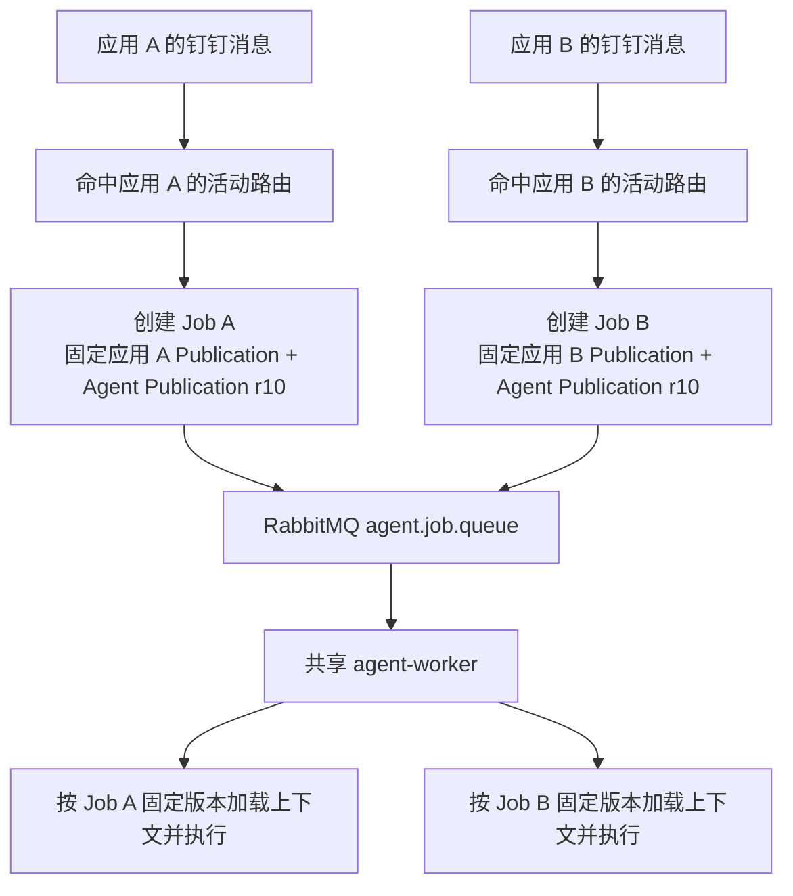
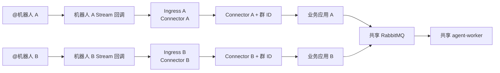

# 多业务应用共享 Agent Worker 与钉钉多机器人路由

## 1. 结论

当前系统不是“每个业务应用启动一个 Agent 进程”，而是：

```text
多个 Business Application
        ↓ 各自固定
Business Application Publication
        ↓ 引用
Agent Publication
        ↓ 生成独立 Job
RabbitMQ 统一队列
        ↓
共享 agent-worker
```

因此，多个业务应用可以引用同一个 Agent Profile 的同一个 Agent
Publication，也可以引用该 Profile 的不同历史 Publication。`agent-worker`
只是通用执行器，不归属于某个业务应用。

当前只有一个 `agent-worker` 容器时：

- 所有应用创建的 Job 都进入同一个 `agent.job.queue`；
- Worker 使用 `prefetch_count=1`，一次只领取一个 Job；
- 当前执行是同步阻塞的，因此一个 Worker 同时只运行一个 Agent Job；
- 其他应用的 Job 在 RabbitMQ 中等待，不会混用应用配置；
- 增加应用数量不会自动增加 Agent 的并发能力。

钉钉多机器人是另一条独立边界。一个钉钉 Stream 接入进程当前只连接一个
`DINGTALK_STREAM_CONNECTOR_ID`。因此，同一群两个机器人分别绑定两个应用时，
需要两个不同的 Connector，并需要两个对应的 Stream 接入实例。当前
`docker-compose.yml` 只定义了一个 `dingtalk-stream-ingress`，所以第二个机器人
不能只靠 Web 配置完成真实接入。

## 2. Agent Profile、Agent Publication 与 Worker 的区别

### 2.1 Agent Profile 是配置定义

Agent Profile 描述：

- Agent 的业务角色与业务指令；
- 可用 Skill 和只读工具；
- 模型连接；
- Agent 自身的最大轮次和超时限制；
- 允许使用的入口与投递 Connector。

它不是常驻进程，也不会独占 CPU、内存或容器。

### 2.2 业务应用实际绑定的是 Agent Publication

业务应用草稿保存的是 `agent_publication_id`，发布业务应用时会把 Agent
Publication 的 ID、revision、config hash 和 Agent code 固定到不可变快照中。

这意味着：

1. 应用 A 和应用 B 可以引用同一个 Agent Publication。
2. 两个应用仍然拥有不同的 Trigger、Session Policy、Execution Policy 和
   Delivery 配置。
3. 后续发布新的 Agent Publication，不会自动切换已经激活的业务应用。
4. 某个应用要升级 Agent，必须重新选择 Agent Publication，保存、发布并激活新的
   Business Application Publication。
5. 已经创建的 Job 继续使用创建时固定的业务应用和 Agent 版本。

### 2.3 Agent Worker 是通用执行器

Worker 从消息中只接收：

```json
{
  "job_id": "agent_job_xxx",
  "correlation_id": "trace_xxx"
}
```

Worker 领取 Job 后，再从 PostgreSQL 读取该 Job 固定的：

- Business Application ID、Publication ID、Deployment ID、Route ID；
- Agent Publication ID、revision 和 config hash；
- 模型连接 revision；
- Session Policy 和 Execution Policy；
- 当前发送人的内部用户身份；
- 原会话投递路由。

因此 Worker 不需要提前知道“自己属于应用 A 还是应用 B”。每次执行都由 Job
携带的固定版本决定。

## 3. 多个应用共享一个 Agent Profile 时的执行过程

假设：

```text
应用 A：生产诊断助手
应用 B：质量诊断助手

二者都引用：
default-diagnostic-agent · Agent Publication r10
```

请求链路如下：



虽然 Agent Publication 相同，Job 仍然不会混淆，因为每个 Job 都保存独立的
应用归因、会话、发送人、Execution Policy 和回复地址。

### 3.1 Execution Policy 如何合并

当前实现中：

- `max_turns`：取业务应用请求值和 Agent Publication 限制中的较小值；
- `timeout_seconds`：取业务应用请求值和 Agent Publication 限制中的较小值；
- `max_tool_calls`：使用业务应用设置的值，并受系统允许范围校验；
- 有效策略会作为不可变快照保存到 Job。

所以两个应用即使共用同一 Agent Publication，也可以拥有不同的执行预算。

### 3.2 当前吞吐能力

当前一个 Worker 的处理方式是：

```text
Job A 执行中
    ↓
Job B、Job C 在 RabbitMQ 等待
    ↓
Job A 完成并 ACK
    ↓
Worker 领取下一个 Job
```

这保证了 MVP 行为简单，但也意味着一次长时间模型调用会阻塞后面的应用任务。

如果以后需要并发，可以运行多个 `agent-worker` 副本。多个副本会作为 RabbitMQ
竞争消费者从同一队列领取不同 Job；数据库的原子 Job claim 会阻止同一 Job
同时被两个 Worker 执行。

扩容 Worker 不需要复制业务应用或 Agent Profile，但需要同步考虑：

- 模型 Provider 并发和限流；
- RabbitMQ 队列积压；
- PostgreSQL 连接数；
- 内部 API 平台的并发限制；
- 单用户、单应用是否需要额外的并发配额。

## 4. 同一钉钉群中两个机器人如何区分应用

### 4.1 当前群聊路由键

钉钉群消息的活动路由唯一键是：

```text
local
+ dingtalk_group
+ source_connector_id
+ conversation:<conversation_id>
```

其中：

- `source_connector_id` 表示由哪个钉钉 Stream Connector 收到消息；
- `conversation_id` 优先取钉钉 callback 的 `conversationId`，缺失时才回退到
  `openConversationId`；
- 群聊路由当前不使用 `robotCode` 作为路由键的一部分。

数据库通过以下组合保证一条入口只能归属一个活动应用：

```text
environment
+ trigger_type
+ connector_id
+ normalized_routing_key
```

### 4.2 可以成立的配置

同一群的机器人 A 和机器人 B 必须使用两个不同 Connector：

```text
应用 A
  Trigger:
    type = dingtalk_group
    connector = connector-dingtalk-stream-bot-a
    routing_key = conversation:<同一个群 conversation_id>

应用 B
  Trigger:
    type = dingtalk_group
    connector = connector-dingtalk-stream-bot-b
    routing_key = conversation:<同一个群 conversation_id>
```

虽然群 ID 相同，但 Connector 不同，因此是两条不同的确定性路由。



### 4.3 不能成立的配置

以下配置不受当前系统支持：

```text
应用 A：Connector X + conversation:group-1
应用 B：Connector X + conversation:group-1
```

第二个应用激活时会触发 `route_conflict`，因为同一活动入口不能同时归属于两个
应用。系统不会用应用优先级、创建时间或随机规则选择其中一个。

这项唯一约束是有意设计的：一条消息必须确定性地归属一个应用，不能由两个应用
争抢。

## 5. 两个机器人进入系统后的完整链路

假设用户在同一个群里只 `@机器人 A`：

1. 钉钉把消息发送给机器人 A 对应的 Stream 连接。
2. Ingress A 使用自己的 `source_connector_id` 解析消息。
3. 系统组合 `Connector A + conversation:<群 ID>` 查找活动路由。
4. 路由命中应用 A，系统固定应用 A 和 Agent Publication，创建 Job A。
5. Job A 进入公共 RabbitMQ 队列。
6. 任意空闲 `agent-worker` 领取 Job A。
7. Worker 加载 Job A 的固定配置并执行 Agent。
8. 执行完成后，使用该次 Stream 回调携带的 `sessionWebhook` 回复原会话。

机器人 B 不会因为“也在这个群”就自动执行。只有钉钉同时向机器人 B 的 Stream
连接投递了回调，系统才会为应用 B 创建独立 Job。

如果用户同时 `@` 两个机器人，并且钉钉分别向两个 Stream 连接投递消息，则当前
系统会把它们当作两个独立入口事件：

- 幂等键包含 Connector ID，因此不会跨机器人合并；
- 两个应用各创建一个 Job；
- 两个 Job 都可能执行并分别回复；
- 当前没有“同一群只允许一个机器人回答”的跨机器人仲裁机制。

## 6. 会话是否会混在一起

不会。业务应用会参与会话键计算。

在群聊的 `conversation_mode=channel` 下，会话键包含：

```text
business_application_id
+ source_channel
+ source_connector_id
+ project_code
+ conversation_type
+ conversation_mode
+ conversation_id
```

因此，即使两个机器人位于同一群：

- 应用 A 与应用 B 的会话不同；
- Connector A 与 Connector B 的会话不同；
- 两边的最近消息和连续对话上下文不会互相读取；
- 两个应用共享 Agent Publication 不等于共享会话记忆。

## 7. 当前实现边界

| 能力 | 当前状态 |
|---|---|
| 多个业务应用共享一个 Agent Publication | 已支持 |
| 单个 Worker 执行所有应用的 Job | 已支持 |
| 一个 Worker 并发执行多个 Job | 不支持，当前一次一个 |
| 多 Worker 竞争消费同一队列 | 架构支持，需部署多个副本并验证容量 |
| 同一群按不同 Connector 绑定不同应用 | 路由模型支持 |
| 一个 Stream Ingress 进程同时连接多个 Connector | 不支持 |
| 当前 Compose 同时连接两个钉钉机器人 | 不支持，只定义一个 Ingress 实例 |
| 同一 Connector、同一群绑定两个活动应用 | 不支持，激活时拒绝冲突 |
| 两个机器人同时触发时只选择一个回答 | 不支持 |
| 两个应用共享同一群的连续对话 | 不共享，按应用和 Connector 隔离 |

## 8. MVP 推荐部署方式

如果近期确实要在同一群使用两个机器人，稳健的 MVP 方案是：

```text
dingtalk-stream-ingress-bot-a
  DINGTALK_STREAM_CONNECTOR_ID=connector-dingtalk-stream-bot-a
  使用机器人 A 的 Client ID / Secret

dingtalk-stream-ingress-bot-b
  DINGTALK_STREAM_CONNECTOR_ID=connector-dingtalk-stream-bot-b
  使用机器人 B 的 Client ID / Secret

两个 Ingress
  ↓
共享 PostgreSQL 和 RabbitMQ
  ↓
一个或多个 agent-worker
```

两个机器人必须分别建立 Connector、凭据和 Agent Publication 的 ingress
授权，并在业务应用中选择正确的 Connector。

后续更完整的 Channel 管理应提供：

1. 一个机器人对应一个 Connector 的明确模型；
2. Connector 的运行实例状态；
3. 已发现群会话及其来源 Connector；
4. 创建 Trigger 时从“Connector 下发现的群”中选择；
5. 检测“Connector 已配置但没有 Ingress 实例运行”；
6. 同一群多机器人的冲突提示；
7. 是否允许同时响应的群级仲裁策略。

在上述管理能力完成前，不应把“应用已经激活”解释为“第二个机器人已经建立
Stream 长连接”。业务应用激活只建立路由；机器人能否收到消息，还取决于对应
Connector 的 Ingress 实例是否正在运行。

## 9. 当前实现依据

- `backend/app/modules/channel/application/channel_ingress_service.py`
  - 解析活动业务应用路由；
  - 私聊按 `bot:<bot_identity>` 路由；
  - 群聊按 `conversation:<conversation_id>` 路由；
  - 创建 Job 时固定应用和 Agent Publication。
- `backend/app/modules/business_application/infrastructure/repository.py`
  - 活动路由唯一投影；
  - 冲突激活返回 `route_conflict`。
- `backend/app/modules/job/application/create_agent_job_service.py`
  - 固定 Agent Publication、模型连接、会话和执行策略；
  - 创建 Job 后投递统一 RabbitMQ 队列。
- `backend/app/modules/message_bus/infrastructure/rabbitmq_consumer.py`
  - `prefetch_count=1`；
  - ACK/NACK 和共享队列消费。
- `backend/app/workers/agent_job_worker.py`
  - 通用 Worker 按 `job_id` 读取并执行任务。
- `backend/app/workers/dingtalk_stream_ingress_worker.py`
  - 一个进程只启动一个 `DINGTALK_STREAM_CONNECTOR_ID`。
- `backend/app/modules/dingding/application/dingtalk_stream_service.py`
  - 从 callback 提取群 ID、机器人身份和 `sessionWebhook`；
  - 使用回调提供的原会话 Webhook 投递结果。
- `docker-compose.yml`
  - 当前仅有一个 `dingtalk-stream-ingress` 和一个 `agent-worker` 服务实例。
