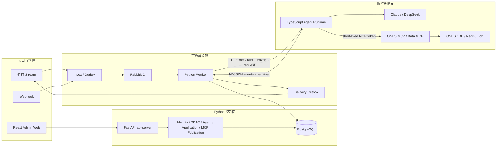

# 当前系统架构

> 状态：对应 `migrate-agent-runtime-to-typescript` 当前实现；真实 canary 和生产切换尚未完成。

## 总体视图

## 职责边界

- Python API/Worker 拥有身份、授权、Publication、Job claim、retry、持久化和 Delivery。
- TypeScript Runtime 拥有一次冻结 invocation 的 SDK 执行、MCP allowlist、取消和单一 terminal。
- MCP Server 独立部署，代码拥有 Tool catalog；控制面只能从 catalog 创建受治理 Publication。
- Agent Publication 冻结模型连接 Revision、执行限制、Skill 和 MCP Tool 最大集合。
- Application Publication 冻结一个 Agent Publication、其 MCP/Resource 子集、Trigger、Delivery 和 Runtime contract。
- PostgreSQL 是事实源；RabbitMQ 只传输稳定 ID，不持有业务真相。

## Secret 与网络

- `agent-worker` 没有 Master Key、Node/Claude CLI 或 Provider egress；只签发短期 Runtime Grant/MCP Token。
- `agent-runtime` 独占 Provider egress，使用 Master Key 解密固定模型连接 Revision。
- ONES/Data MCP 只访问各自固定后端，Agent 不知道数据库 IP、用户名或密码。
- 前端只接收状态、版本、hash、脱敏 host 和安全 provenance；不接收 Secret ref/value、完整连接地址或认证材料。

## 控制面

保留：

- 统一账户登录、Session、CSRF、RBAC；
- 钉钉用户、系统用户、ONES 用户身份映射；
- Agent Definition/Draft/Validation/Publication/rollback/lifecycle；
- Business Application Draft/Publication/test-production deployment；
- MCP Tool Publication、模型连接版本/凭据轮换/短时测试；
- 本人 Job、MCP Tool provenance 和 Delivery 历史。

已彻底退役且不得恢复：API Capability、Handler/Connection 目录、Internal API Platform、旧 Resource Composition、任意 URL/SQL/脚本执行器。数据库对象由 migration `040` 不可恢复删除。

## 进程

| 服务 | 责任 |
| --- | --- |
| `api-server` | 认证管理 API、控制面和本人历史 |
| `admin-web` | 登录、历史、Agent Publication、Application 工作台 |
| `dingtalk-runtime` | 多钉钉 Stream Client 和受信 Inbox 提交 |
| `job-dispatch-worker` | PostgreSQL Job Outbox → RabbitMQ |
| `agent-worker` | Job 所有权、Runtime 调用、持久化和 retry |
| `agent-runtime` | TypeScript Claude Agent SDK 执行 |
| `ones-mcp-server` / `data-mcp-server` | 受控只读业务 Tool |
| `delivery-dispatch-worker` | Delivery Outbox → 外部渠道 |

切换、版本和回滚详见 [TypeScript Agent Runtime 切换与运维手册](../typescript-agent-runtime-cutover.md)。
