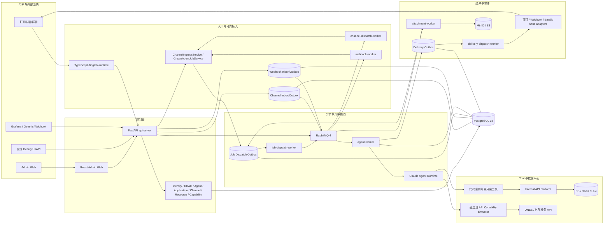

# 系统架构

## 总体视图



PostgreSQL 是配置、发布快照、身份、运行状态、Inbox/Outbox 和审计的事实源。RabbitMQ 只承担传输，不承担业务真相；消息体尽量只包含稳定 ID 和 correlation ID。

## 四个架构平面

### 1. 管理控制面

控制面负责创建和治理事实，不直接执行诊断：

- 内部用户、外部身份、角色、授权和 Web Session；
- Agent、模型连接、Business Application、Workflow；
- 钉钉企业、应用连接、Webhook Trigger；
- 平台 Secret、工具资源、Handler Publication；
- API Connection、Authentication Profile、API Capability；
- 草稿、验证、发布、激活、回退和运行记录查询。

管理端页面通过 capability gate 控制可见性，后端仍必须重复执行 Session、CSRF、RBAC 和资源范围校验。前端隐藏按钮不是授权边界。

### 2. 入口与投递适配面

- `dingtalk-runtime` 只管理多个 DingTalk SDK Client、租约、回调标准化和 Inbox 提交；不选 Agent、不创建 Job、不投递最终答案。
- `managed_channel` 和 `webhook` 模块负责受治理 Connector／Trigger、认证、映射和可靠 Inbox/Outbox。
- `channel-dispatch-worker` 与 `webhook-worker` 把持久化入口事实转换成标准 `ChannelIngressService` 调用。
- `delivery-dispatch-worker` 按冻结的 Delivery Binding 和当前授权重新校验后调用 adapter。

入口和出口都在 Agent executor 之外，因此渠道故障不会污染模型执行核心，Delivery 重试也不会重新运行 Agent。

### 3. Agent 异步执行面

`CreateAgentJobService` 在一个受控事务中完成：

- 身份和应用访问检查；
- 权限与业务授权检查；
- 选择并冻结 Agent／Application Publication；
- 冻结模型连接 provenance、执行策略、外部主体和执行范围；
- 创建 Session、Message、Job、Attachment 和 Job Dispatch Outbox；
- 写入安全审计。

`job-dispatch-worker` 从 PostgreSQL claim outbox，再向 RabbitMQ 发布最小消息。`agent-worker` 消费 `job_id`，从 PostgreSQL 重建执行上下文，并在 Worker start、Tool call 和 Delivery 前再次校验实时撤销条件。

### 4. Tool 与内部数据平面

平台故意保留两条互不混淆的 Tool 来源：

| 类型 | 定义位置 | 管理员可配置内容 | 执行边界 |
| --- | --- | --- | --- |
| 内置只读工具 | Python 代码 Handler Registry | 发布状态、资源绑定、Agent 分配、访问范围 | 固定代码实现 + Internal API Platform |
| API Capability | 受治理 Connection/Capability Draft | 公开 Schema、相对路径、固定请求规则、受限 Mapping | 固定 `http-json-v1` Executor |

内置工具用于数据库、Redis、Loki、ER 和业务流等平台诊断。API Capability 用于外部业务系统，例如 ONES。两者都不能退化成任意 URL、脚本或原始 SQL 执行目录。

## 后端模块边界

后端采用 DDD 风格的模块化单体加独立 worker。每个主要模块通常包含 `api`、`application`、`domain` 和 `infrastructure`：

| 模块 | 主要职责 |
| --- | --- |
| `identity` | 登录、Session、内部用户、外部身份和 ONES 个人凭据 |
| `authorization_center` | 角色、管理能力、应用访问和范围授权 |
| `agent_config` | Agent 草稿、校验、Publication 和 Tool／Skill 绑定 |
| `model_connection` | Provider 配置、模型发现、测试和 Secret 轮换 |
| `business_application` | 应用装配、发布、环境 deployment 和 active route |
| `managed_channel` | 钉钉企业／应用连接、Runtime 控制面、Channel Inbox/Outbox |
| `webhook` | Trigger 发布、Bearer 认证、映射、Webhook Inbox/Outbox |
| `channel` | 与渠道无关的标准入站契约和 Job 创建入口 |
| `job` | Job 创建、状态、持久化重试、Job Dispatch Outbox |
| `agent` | 上下文构建、模型 Tool Catalog 和执行结果持久化 |
| `internal_tools` | 内置只读 Tool service 和 Handler 解析 |
| `internal_api_platform` | 结构化寻址、只读 DB／Redis／Loki 策略和访问审计 |
| `api_capability` | Connection、Capability、发布链和受治理 HTTP Executor |
| `delivery` | Delivery Outbox、分片、幂等、授权复核和 adapters |
| `attachments` | 下载凭证、对象存储、格式校验和受限文本提取 |
| `platform_config` | Secret、runtime config、工具资源、generation 和 reset |
| `workflow` | 确定性 workflow 图和 Publication |
| `audit` | 有界、脱敏审计和摘要 |

跨模块调用优先通过 application service、port 或 adapter，不允许 Webhook／Channel 直接导入 Agent executor 或内部数据源实现。

## 进程与服务职责

| Compose 服务 | 类型 | 职责 |
| --- | --- | --- |
| `postgres` | 状态基础设施 | 唯一持久化事实源 |
| `migrator` | one-shot | 独占执行 schema migration；业务进程只校验 head |
| `rabbitmq` | 传输基础设施 | Job、Webhook、Channel、附件等最小消息传输 |
| `api-server` | FastAPI | 公共／管理／内部控制 API 和控制面装配 |
| `admin-web` | Nginx + React | 静态管理端，同源代理 `/api` |
| `dingtalk-runtime` | TypeScript | 固定进程内管理多个 DingTalk Stream Client |
| `channel-dispatch-worker` | Python | Channel Outbox → 标准入站服务 |
| `webhook-worker` | Python | Webhook Outbox → 标准入站服务 |
| `job-dispatch-worker` | Python | Job Dispatch Outbox → RabbitMQ Agent queue |
| `agent-worker` | Python | Agent Job 执行、Tool 调用、结果和审计 |
| `delivery-dispatch-worker` | Python | Delivery Outbox claim、分片和外部投递 |
| `attachment-worker` | Python | 下载、校验、提取、S3 写入和 Job 解锁 |
| `internal-api-platform` | FastAPI | 真实只读工具数据面 |
| `minio` / `minio-init` | 对象存储 | 私有附件 bucket 与幂等初始化 |

`mock-internal-api-platform` 和 `local-internal-api-platform` 是开发／验证替代服务，不应与正式拓扑化平台混为生产能力。

## 发布快照架构

配置对象普遍采用以下模式：

```text
Stable Identity
  -> mutable Draft with expected_revision
  -> server-side Validate / Test / Verify
  -> immutable Revision or Publication + content hash
  -> explicit environment activation / dependency selection
  -> Job freezes exact IDs, revisions and hashes
```

核心效果：

- 草稿编辑不会影响运行；
- 发布不等于激活；
- 新 Agent Publication 不会自动改变已激活 Business Application；
- Connection／Capability 新版本不会自动升级已有应用；
- 历史快照可以审计和显式回退；
- 已创建 Job 不读取“最新配置”。

## 依赖方向与禁止事项

允许的主要依赖方向：

```text
API / Worker
  -> Application Service
  -> Domain Policy / Port
  -> Infrastructure Adapter / Repository
```

禁止设计漂移：

- 不让前端提交任意 Tool 名、URL、SQL、LogQL、Shell 或 Secret；
- 不让业务应用直接绑定 Handler、Connection 或 Credential；
- 不让 Runtime 从草稿或“最新版本”动态解析执行依赖；
- 不让 RabbitMQ 成为任务状态事实源；
- 不让 Delivery 失败触发 Agent 重跑；
- 不让 DingTalk Runtime 动态创建容器或挂载 Docker Socket；
- 不让外部 payload 覆盖 actor、Agent、Tool、Scope、Connector 或 Delivery target；
- 不把外部身份映射、个人凭据和平台授权合并成一个对象。

## 关键源文件

- `docker-compose.yml`
- `backend/app/bootstrap.py`
- `backend/app/main.py`
- `backend/app/workers/*.py`
- `backend/app/modules/message_bus/infrastructure/rabbitmq_topology.py`
- `dingtalk-runtime/src/runtime-manager.ts`
- `frontend/src/app/router/app-router.tsx`
