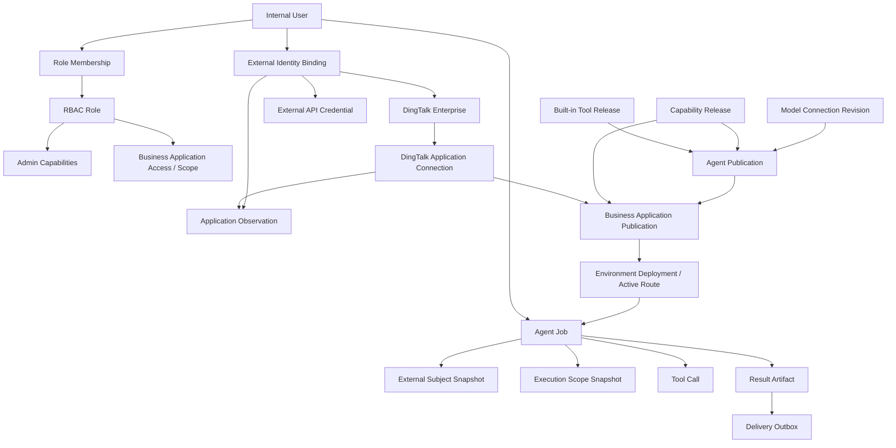

# 核心领域模型

## 领域关系总览



图中“发布版本”和“运行快照”是核心：身份、权限和 Secret 的实时撤销仍然生效，但一个 Job 不会因为后来修改草稿、切换默认 Team 或发布新版 Agent 而静默漂移到另一个执行配置。

## 1. 内部用户、身份与凭据

### Internal User

`app_user` 是所有平台授权的主体。Web 用户、钉钉发送者和 Webhook 服务账号最终都必须解析到内部用户，外部 ID 不能直接参与 RBAC。

主要账号类型：

- 人员账号：可登录 Web 或通过外部身份发起请求；
- 服务账号：用于 Webhook 等机器入口，通常不可交互登录；
- 平台管理角色不会自动获得业务应用访问权。

### External Identity Binding

`user_external_identity` 只证明“某外部系统主体属于某内部用户”。它不保存密码，不等于个人 Token，也不自动授予应用、Tool 或数据权限。

当前重要 Provider：

- DingTalk：按“钉钉企业 + Staff ID”形成身份；
- ONES：第一版每个内部用户最多一个当前有效 ONES 身份。

### DingTalk Enterprise 与 Application Connection

- `dingtalk_enterprise` 以验证后的 Corp ID 建立身份命名空间；名称可治理，Corp ID 不可原地修改。
- 一个企业可有多个钉钉应用连接；一个应用连接只属于一个企业。
- 人员身份属于企业，不属于某个机器人。
- `dingtalk_identity_application_observation` 记录某身份曾从哪些应用被观察到，只是来源证据，不是应用授权。
- 未绑定用户先进入 `dingtalk_identity_candidate`，不会自动创建人员或 Job。

企业生命周期：

```text
PENDING_VERIFICATION -> ACTIVE -> DISABLED -> ARCHIVED
        ^                 |
        +--- 恢复需重新验证 +
```

### External API Credential

`external_api_credential` 保存内部用户对某个已发布 Authentication Profile／Connection Revision 的加密 Token。身份映射和凭据是独立事实：

- 用户密码只用于短时验证 Challenge，不持久化；
- 浏览器不接触外部 Token；
- 管理员可以查看安全状态、停用或解绑，但不能代用户输入密码、查看 Token 或重新验证；
- ONES 默认 Team 必须来自本次真实验证结果，不能由消息或应用配置任意指定。

## 2. 角色与授权

主要事实：

- `rbac_role`：角色元数据和状态；
- `rbac_user_role`：带状态、有效期和 revision 的成员关系；
- `rbac_role_admin_capability`：控制面操作能力；
- `rbac_role_application_access`：业务应用访问；
- `rbac_role_application_capability`：应用允许的业务动作上限；
- `rbac_role_application_scope`：数据资源范围；
- `permission_policy`、`platform_access_grant`：旧授权／高级例外事实，处于逐步收敛过程中。

控制面管理权限与业务运行权限是两套不同问题。能配置 API Capability 的管理员不因此能调用它；用户访问一个应用后，也只能使用该 Application Publication 已冻结的能力子集。

## 3. Agent、模型连接与业务应用

### Model Connection

```text
model_connection
  -> model_connection_revision
  -> encrypted active Secret version
```

Revision 保存 Provider Base URL、模型映射、effort 和 hash，不保存 API Key。Agent Publication 固定连接 revision；同一连接轮换 Key 不要求重发 Agent，但每个新 attempt 会解析当前 active Secret version。

### Agent

```text
agent_definition
  -> agent_revision (draft)
  -> agent_publication (immutable snapshot)
     ├─ tool bindings
     ├─ skill bindings
     ├─ channel bindings
     ├─ model connection revision
     └─ API capability envelope
```

Agent Publication 定义模型、系统业务指令、执行上限、内置工具、Skill、渠道上限和 API Capability Release 上限。业务指令不能关闭平台外层安全策略。

### Business Application

```text
business_application
  -> business_application_revision
     ├─ trigger bindings
     ├─ delivery bindings
     ├─ capability subset
     └─ session / execution policy
  -> business_application_publication
  -> business_application_deployment
  -> business_application_active_route
```

Business Application 是装配与发布单元：

- 必选一个精确 Agent Publication；
- 可选一个 Workflow Publication；
- 绑定入口、投递、会话与执行策略；
- 从 Agent Capability Envelope 中选择应用能力子集；
- 发布和激活分离；当前运行环境固定为 `local`。

应用不保存 Connector Secret、数据库连接、Redis／Loki 地址、任意 URL 或原始 SQL。

## 4. 内置只读工具与平台资源

内置只读工具相关事实分为三层：

1. 代码注册的 Handler：定义不可由 Web 修改的执行实现；
2. `handler_installation`／`handler_publication`：固定 Handler 版本及运维状态；
3. `platform_resource` → Draft → Verification → Revision：数据库、Redis、Loki 等受治理资源；
4. Business Application Publication 解析并冻结 Handler 与 Resource Binding；
5. Job 创建时生成 `agent_job_execution_scope` 和 `agent_job_execution_binding`。

内置工具发布状态：

- `ACTIVE`：可新选择和运行；
- `DEPRECATED`：既有发布可运行，禁止新选择；
- `DISABLED`：新 Tool 调用立即失败关闭；
- `ARCHIVED`：只保留历史，存在活动依赖时不能归档。

## 5. 受治理 API Capability

### Connection 层

```text
api_connection
  -> api_connection_draft
  -> api_connection_verification
  -> api_connection_revision

api_authentication_profile
  -> draft
  -> immutable revision
```

Connection Revision 冻结 scheme、host、port、超时、响应大小和认证协议。Handler 只能引用相对路径，不能改变 Origin。

### Capability 层

```text
api_capability
  -> api_capability_draft
  -> verification evidence
  -> api_capability_revision
  -> api_handler_revision
  -> api_compiled_mapping_plan
  -> api_capability_release
```

- Capability 拥有模型可见的公开 Input／Output Schema 和业务描述；
- Handler 实现该契约，但不是 Agent／应用直接选择的对象；
- Mapping Plan 是受限类型化投影，不是脚本或模板语言；
- Release 原子冻结 Capability、Handler、Mapping、Connection 和 Auth Revision；
- Capability Identifier 同时作为业务标识、模型 Tool 名和审计键，例如 `cap__ones__work_item__search`。

Release 运维状态：

```text
ACTIVE -> DEPRECATED -> DISABLED -> ARCHIVED
```

`DEPRECATED` 不立即中断既有 Application Publication；`DISABLED` 用于紧急阻断新调用；不存在自动升级到 replacement 的行为。

## 6. 运行事实与证据

### Session、Message 与 Job

- `agent_session`：按渠道、连接器、项目、群／私聊主体隔离的会话；
- `agent_message`：有界消息和上下文事实；
- `agent_job`：执行状态、冻结 publication、策略、路由和 correlation；
- `agent_job_external_subject`：外部 User／Team 快照，不冻结 Token；
- `agent_job_execution_scope`／`binding`：内置工具资源执行范围；
- `agent_step`：执行步骤；
- `agent_tool_call`：模型 Tool 调用和规范化结果；
- `agent_artifact`：最终诊断报告等产物；
- `audit_event`：脱敏动作和决策证据。

Job 状态机：

```text
WAITING_INPUT -> PENDING -> RUNNING -> SUCCEEDED
       |           |          |  +--> RETRY_WAIT -> RUNNING
       |           |          +-----> FAILED
       |           |          +-----> TIMEOUT
       |           +---------------> FAILED
       +---------------------------> FAILED
```

### 可靠 Outbox

- `channel_ingress_event` / `channel_ingress_outbox`
- `webhook_event` / `webhook_outbox`
- `job_dispatch_outbox`
- `delivery_outbox`

这些表把“业务事务已提交”和“RabbitMQ／外部投递已确认”分开，支持 claim、超时恢复、指数退避、dead、人工精确 replay 和幂等。

### Delivery

- `delivery_outbox`：冻结 binding、目标安全摘要和 artifact；
- `delivery_attempt`：每次投递尝试；
- `delivery_chunk`：长报告分片和每片幂等；
- 状态包括 `PENDING`、`RUNNING`、`RETRY_WAIT`、`SUCCEEDED`、`FAILED`、`DEAD`、`SKIPPED`。

Delivery 是独立结果分发流程。投递失败只重试投递，不重新执行 Agent。

## 7. 会话与附件

- `message_attachment`：附件元数据、状态、对象 key 和短时凭据密文；
- `attachment_content`：受限提取文本；
- MinIO／S3 保存原始对象，PostgreSQL 仍保存处理事实；
- RabbitMQ 只传 attachment ID；
- 有附件的 Job 初始为 `WAITING_INPUT`，全部附件进入终态后才原子转为 `PENDING`。

图片当前只做格式校验、去元数据和私有存储，不作为诊断证据；DOCX、XLSX、PPTX 和 Markdown 只做受限文本提取。

## 核心不变量

1. 所有授权主体最终都是 `app_user`，外部 ID 不直接授权。
2. 外部身份、个人凭据、默认 Team、应用访问和平台角色互相独立。
3. 草稿可变，发布快照不可变；发布不自动激活。
4. Agent 定义能力上限，Application 只能选择其子集。
5. Job 固定配置版本，但每个关键阶段仍检查用户、角色、身份、凭据和 Release 的实时撤销。
6. 原始外部响应不持久化，只有有界规范化输出可进入 Tool Call 和模型上下文。
7. RabbitMQ 只传稳定 ID；PostgreSQL 是状态事实源。
8. Delivery 重试不重新运行 Agent。
9. 内置工具实现不能由 Web 定义；API Capability Handler 也不能执行任意代码。
10. 历史 Job、Publication、Audit 和 Delivery 不因当前配置变化被改写。

## 关键迁移

- `007`：统一身份、RBAC、Agent 发布。
- `008`：Webhook Trigger。
- `010`–`013`：业务应用控制面、runtime routing、local-only、execution policy。
- `014`：模型连接。
- `015`–`016`：多 DingTalk Runtime 和身份候选。
- `017`：角色授权中心。
- `019`–`020`：Job Dispatch / Delivery Outbox。
- `022`–`023`：受治理工具资源和 runtime generation。
- `025`–`026`：受治理 API Capability 与明文 HTTP 显式授权。
- `027`：钉钉企业、身份观察和昵称审计。
