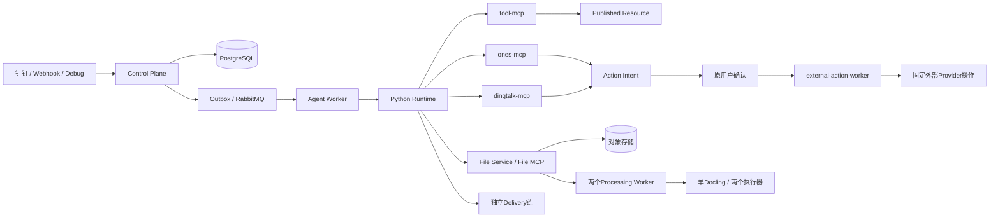

# Enterprise Agent 当前项目上下文

> 代码核对日期：2026-09-16（Asia/Shanghai）。本文是讨论用实现摘要，不是另一份主规格。
> 当前规范入口：[10个领域主规格](../../openspec/specs/README.md)。历史change与archive只在明确追溯时读取。
> 本次只重建文档，并以隔离内存SQLite核验迁移目录；未执行真实模型、ONES、钉钉、Oracle、部署或现网数据库验收。

## 1. 使用边界

先确定问题涉及的领域，再读取对应canonical spec和相关代码。不要从历史提案或旧验收截图推断当前功能。

- **Confirmed-current**：能定位到当前代码、迁移或本次运行证据的事实，注明证据是哪一种。
- **Documented-intent**：规范要求，不自动代表实现、部署和验收均完成。
- **Acceptance-gap**：实现或测试定义存在，但目标环境和完整业务链仍缺证据。
- **Proposed**：尚待评审的新要求。

用户要求按代码修正文档时，应记录旧文档与代码的冲突。普通开发任务发现代码与canonical不一致时，应明确提出差异并通过变更处理，不能由辅助文档覆盖规范。

## 2. 项目定位与领域

平台提供企业内部诊断、查询、文档处理、文件交付，以及需逐次确认的外部业务操作。一次Job固定主体、应用/Agent发布、工具集合、执行预算、上下文与回复来源；后续调用仍复核可撤销的权限和外部身份。

| 领域 | 责任 |
| --- | --- |
| identity-access | 用户、登录Session、角色、外部身份、加密Provider凭据、Principal |
| agent-model | 多Python Agent、模型连接、草稿/发布、Skill、Workflow配置 |
| business-application | 应用组合、Tool子集、策略、发布和local激活 |
| channel-conversation | 钉钉/Webhook入口、Connector、会话、消息和附件接收 |
| document-file-processing | 固定Docling/OCR Profile、处理运行、双槽位和表示 |
| execution-delivery | Job、Runtime、审计、重试、Delivery、Action Intent与确认执行 |
| builtin-tool-resource | DB/Redis/Loki、Resource技术验证与发布、授权资源发现 |
| governed-api-capability | ONES与钉钉固定业务MCP及Provider操作 |
| platform-operations | 配置、Secret、Compose、Schema、就绪、测试与离线知识存储 |
| task-file-workspace | Workspace、File/Version、Manifest、文件准入、工作集、Sandbox与提交 |

不提供任意URL、HTTP方法、Shell或动态Tool Handler。资源工具保持只读；沙盒文件写入和受确认的业务mutation分别有自己的授权与生命周期。旧动态API Capability、API Connection、Handler、Resource Mapping与Internal API Platform不再是当前运行机制。

## 3. 当前执行与服务边界

| 服务 | 当前责任 |
| --- | --- |
| api-server、admin-web | 管理面、身份授权、发布、Job和运行查询 |
| dingtalk-runtime | 多Client Stream连接与受信事件转交，不是Agent Runtime |
| channel-dispatch-worker、webhook-worker | 持久入口事件的幂等推进 |
| job-dispatch-worker、agent-worker | Job Outbox调度与固定Publication执行 |
| python-agent-runtime | Claude Agent SDK、固定协议、工具合同、Sandbox与运行审计 |
| tool-mcp | 已发布DB/Redis/Loki Resource及授权目录 |
| ones-mcp、dingtalk-mcp | 当前业务身份与固定Tool合同 |
| external-action-worker | 已确认意图的固定Provider分派和结果推进 |
| delivery-dispatch-worker | 独立投递、失败重试与精确文件版本交付 |
| file-service | 文件与对象存储唯一业务事实入口、File MCP和内部流接口 |
| file-worker | 来源附件导入、工作区/保留/提交暂存生命周期 |
| file-processing-worker、file-processing-worker-2 | 各单并发，消费独立processing队列并经File Service领取槽位 |
| docling-serve | 私网、固定模型、两个local execution workers，不暴露Agent Tool |

源码依赖声明Python >=3.12，Compose使用PostgreSQL 18和RabbitMQ 4。镜像与SDK版本分别以Dockerfile、pyproject.toml及锁文件为准，不能用旧文档中的版本代替构建事实。

## 4. 身份、授权与发布

内部用户是业务授权主体；钉钉企业/用户身份和ONES身份用于可信外部主体解析，绑定本身不授予Tool权限。管理页面展示不能替代后端Session、CSRF和RBAC。

ONES绑定通过本人验证Challenge与Team选择完成，登录材料与当前凭据加密保存；解绑、重新验证、凭据刷新和运行前复核均有独立状态。不能从管理摘要读取凭据原文。

Worker从Job事实签发面向具体业务MCP的短时Principal。ONES、钉钉、File Principal分别校验audience/scope与当前事实；JWT不是Provider凭据，也不能当成长期授权。Runtime只在受控内存上下文中转交凭据。

Agent支持创建多个`python-v1`定义；code与runtime kind不可变。草稿、不可变Publication和当前指针分离。合法的旧Python协议/工具策略Publication可标记`historical_read_only`以恢复管理；损坏快照仍拒绝。保留TypeScript历史身份不等于当前管理详情接口对所有旧TypeScript Publication都兼容，更不允许执行它们。

模型连接使用固定Anthropic-compatible合同：部署允许的官方HTTPS端点或内部网关、受控模型发现、无Tool短探测、显式保存。模型连接revision和非敏感配置冻结到Publication，凭据轮换不改写发布历史。

Workflow的规范化node/edge是草稿唯一事实源，发布生成确定性快照。当前Workflow仍是配置资产，保存/发布不会执行图，也不能据此声称已有Workflow运行引擎。

应用Publication冻结Agent/Workflow引用、MCP Tool子集、文件/会话/执行策略与入口。显式激活只使用部署环境`local`；工具调用的业务environment/base/workshop与部署环境分开。激活改变后续命中请求，已创建Job保留旧发布事实。

## 5. Job、Runtime、审计与交付

当前Runtime协议是**1.5，代码同时支持1.4**。新Job选择、冻结、传输、恢复和审计必须遵守具体代码合同，不能将旧Job原地改成新协议。管理就绪也不等于一个新Job完整运行成功。

有效max_turns和timeout_seconds受Agent/应用较严格限制；max_tool_calls支持到500，缺省30。当前应用保存函数对输入零值仍采用`value or 30`归一化，因此“应用填写0即可关闭工具”不是现实现事实；已冻结合法零值在Runtime中的拒绝语义需单独判断。

重试使用同一个Job及其冻结Publication和策略。TIMEOUT是终态并走失败投递；普通瞬时错误才按分类进入有界重试。Delivery重试只重试投递，不重新运行Agent。

工具事实区分Job冻结合同、实时MCP声明、Runtime实际注册、模型Prompt合同与实际ToolUse/ToolResult。错误时间线使用安全投影，完整运行审计通过独立授权、分块与有界正文查询保存实际暴露的上下文；不能把普通摘要与完整审计混成同一存储。代码不能恢复上游未暴露的隐藏推理，也不能把未运行的工具写成执行证据。

## 6. 资源工具与业务MCP

DB/Redis/Loki按每次显式调用目标实时复核范围，解析唯一启用Resource的最新Published Revision；不把Resource绑定到应用或冻结为Job资源。Draft连接、范围和资源角色变化需要重新技术验证和发布。资源角色不是RBAC角色；不凭名称猜测目标，不在多候选中取第一项。

资源目录提供授权绑定的有界分页，Schema和Redis SCAN按各自合同续查；任意SQL结果与Loki日志没有通用分页游标。SQL只读、Redis namespace、Loki selector/时间/行数/响应大小限制继续生效。Oracle当前合同为11.2.0.4与19c Thick客户端路径，真实技术验证仍需目标Oracle环境。

ONES不是两个只读Tool的旧MVP：当前目录包括基础查询、条件解析、用户摘要、工作项和测试资产、缺陷创建及更新。工作项搜索不接受模型limit/cursor；九类GraphQL集合在服务内有界收集，四类测试资产上限10000，其余相关集合上限1000。具体Tool和字段以代码合同及governed-api-capability为准。

钉钉固定目录包括通讯录、部门、待办、日历、AI表格、消息和工作通知；AI表格已包含代码固定的部分表/字段创建更新能力，不能再表述为完全禁止结构操作。当前来源群消息、批量指定userId机器人消息与工作通知是不同语义，不能隐式互换。

外部mutation先形成冻结请求和原主体绑定的Action Intent，逐次确认后由固定worker执行。确认不能扩大权限；执行前仍复核身份、授权和Provider条件。不确定外部结果不能当成可安全重发的失败。钉钉Connector按卡片用途治理确认模板，普通回复模板与外部操作确认模板分开。

## 7. 文件、准入与Docling

File Service管理Workspace、File、Version、配额、目录、表示、提交和对象位置。逻辑文件身份与物理Job Sandbox分离；原件、派生表示与最终投递版本不能混用。

当前直接文本规则为text-v2：TXT/Markdown可读写，LOG只读。PDF/Office/图片由固定docling-layout-ocr-v2处理，只有精确Markdown表示进入模型可读Sandbox；不能据OCR声称获得未提取的视觉语义。

本轮文件准入形成不可变决策与依赖：输出文件请求不因“生成文件”而等待输入附件；等待Job从冻结依赖恢复。目录发现、工作集选择、内容物化是不同步骤，具体上限与拒绝行为由task-file-workspace定义。

Docling拓扑是两个Processing Worker、单Docling容器内两个执行器、数据库两个全局槽位。模型按代码发布的多架构摘要固定，运行时校验而不把现场实算值变成配置。心跳、槽位、队列、Profile和Docling /ready全部符合才可报告完整就绪。

文件Workspace按实际Session关联。当前群聊Session key仍包含external_identity_id，不能承诺“同一群所有成员共享同一个Session或Workspace”。会话retention_days仍是stored_only；文件工作区的自然周期和清理链独立存在。

## 8. Schema、配置与知识存储

当前活动迁移目录为**100..132，共33项**。本次在全新内存SQLite执行当前Migrator并通过SchemaHeadValidator，得到head132；这是隔离本地证据，不能证明现网PostgreSQL已升级。

新空库使用当前catalog；精确legacy042的adoption必须使用只有100的独立artifact，通过manifest、备份与恢复核验后再推进后续迁移。当前包含101+的checkout不能直接代替baseline-only adoption。只有一次性Migrator执行DDL，业务服务只检查就绪；已应用migration不可原地改checksum。

平台配置、Secret、运行事实在同一PostgreSQL中按领域管理。Master Key、Provider凭据与各服务认证材料不进入普通日志、Prompt和工具摘要；工作区与模型等配置通过受控revision/hash和权限管理。健康检查不能隐式注册或更新Runtime Config Definition。

顶层部署开关为FEATURE_WEB_ADMIN、FEATURE_PUBLISHED_AGENT_RUNTIME、FEATURE_REAL_CLAUDE。更细粒度功能由领域策略和独立安全闸门决定；打开管理面不能隐式打开模型或执行能力。

knowledge提供source、document、document_revision、knowledge_base、knowledge_base_document、import_run、document_relation七类表。ONES离线导入先校验输入并默认只预检，显式commit才入库，检查schema而不建表；按输入/来源版本幂等恢复。不调用ONES、OCR、Embedding或Qdrant，不自动授予Agent知识读取能力。本次没有访问任何生产导出或执行正式导入。

## 9. 本次重建与验收边界

此前29个active change全部关闭归档，原22项未完成任务保持未勾选。它们涉及真实ONES、钉钉、Oracle、新Publication/Job、Runtime/文件链和跨架构Docling等验收；其中旧协议切换步骤可能已被当前代码取代，不能把历史命令直接作为今天的操作指令。

需要追溯时查看[重建记录](../../openspec/changes/archive/2026-09-16-rebuild-domain-canonical-baseline/README.md)和其中的关闭清单。普通任务不预载历史文件。本次没有重新发布应用、发送消息、写入Provider或重启服务。

后续验证分别记录：代码/静态合同、本地自动化、隔离数据库、构建、部署就绪、新Job真实链路。Mock或容器healthy不能替代真实环境验收。

## 10. 源码定位

| 主题 | 当前代码入口 |
| --- | --- |
| Agent与模型 | backend/app/modules/agent_config/、model_connection/ |
| 应用与Workflow | backend/app/modules/business_application/、workflow/ |
| 身份与授权 | backend/app/modules/identity/、authorization_center/、permission/ |
| 渠道与会话 | backend/app/modules/managed_channel/、channel/、job/、webhook/ |
| Runtime协议 | backend/app/modules/agent/infrastructure/runtime_protocol.py |
| Runtime审计 | backend/app/python_runtime/、backend/app/modules/agent/ |
| 工具与Provider | backend/app/modules/mcp_tool_runtime/、backend/app/shared/ones_tool_contracts.py、dingtalk_tool_contracts.py |
| 外部操作 | backend/app/modules/external_action/ |
| 文件与处理 | backend/app/modules/file_workspace/、document_processing/ |
| 配置与Schema | backend/app/modules/platform_config/、backend/app/shared/migrations.py、backend/migrations/ |
| 离线知识 | backend/app/modules/knowledge/、backend/app/cli/import_ones_knowledge.py |
| 部署与检查 | docker-compose.yml、Makefile、backend/tests/、scripts/check_markdown_links.py |

表中的省略模块路径均相对于同一行前一个目录。具体合同和测试依据优先查看对应canonical spec，不依赖固定工具总数、旧表清单或历史截图。
