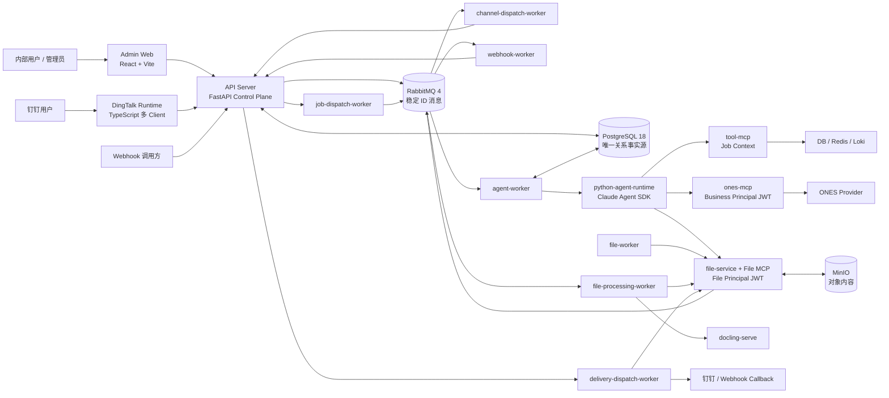
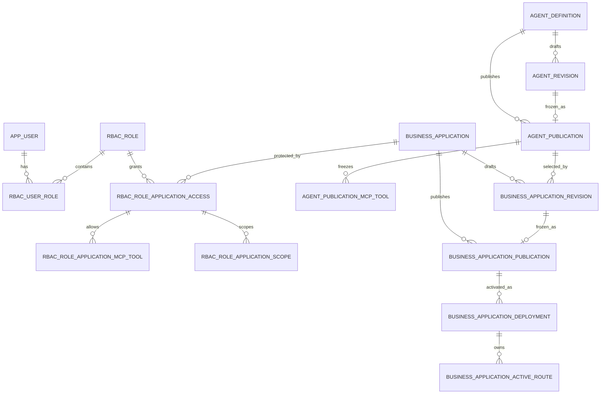
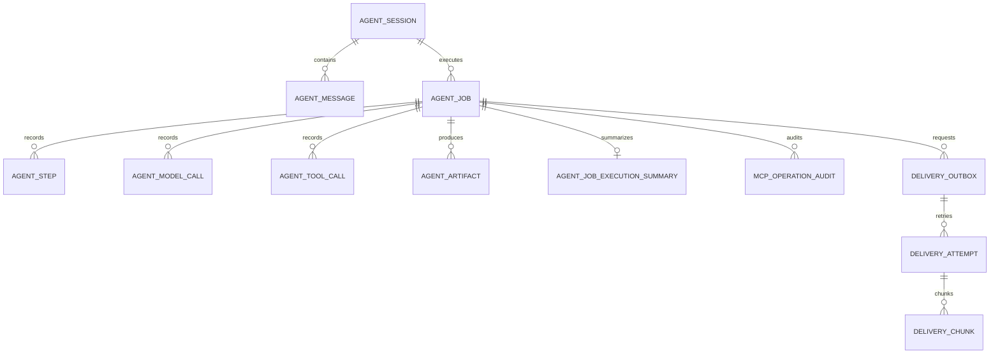
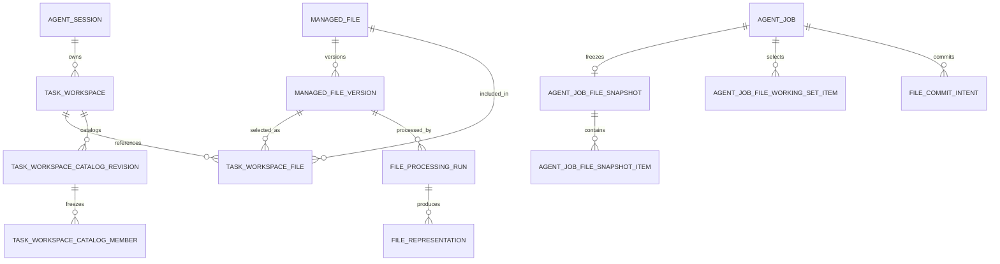
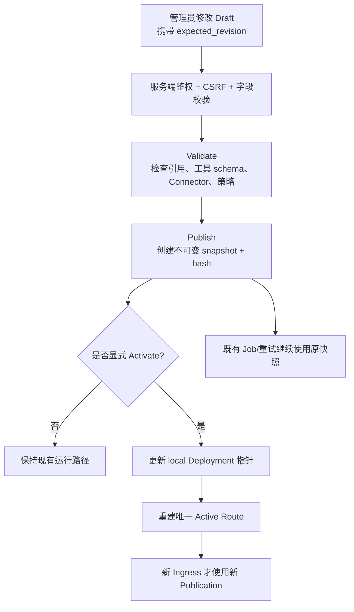
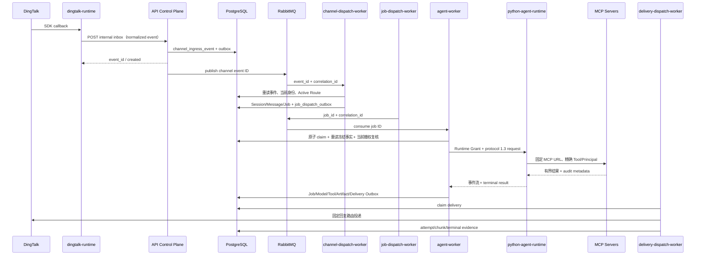
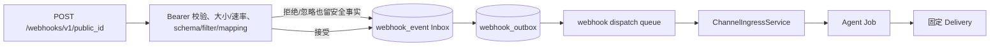
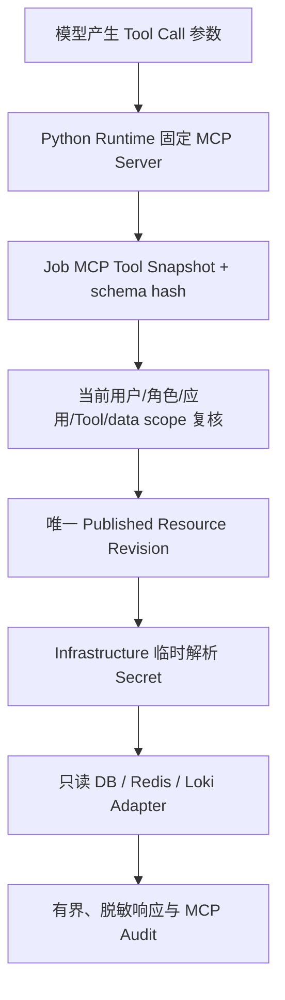
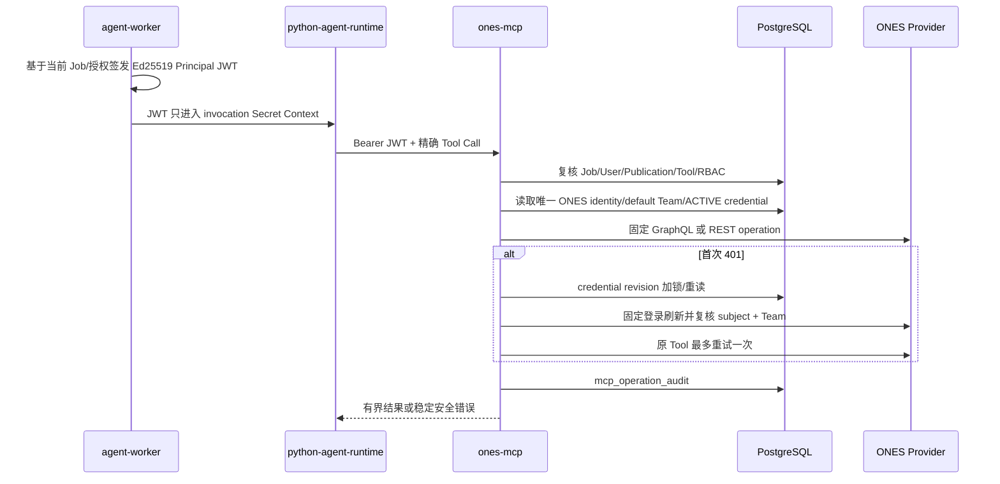
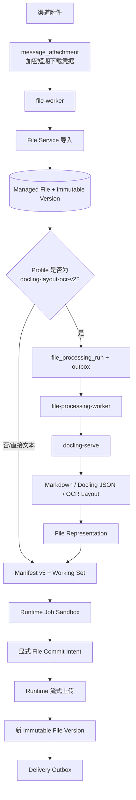

# Enterprise Agent 项目上下文（新规格讨论基线）

> 更新时间：2026-08-23（Asia/Shanghai）
>
> 用途：作为单文件上传到 ChatGPT，帮助讨论新的 OpenSpec 规格。
>
> 当前实现基线：Python 3.12、Node.js 22、PostgreSQL 18、RabbitMQ 4、迁移 `100..119`。
>
> 安全说明：本文不包含真实 Secret、Token、密码、Cookie、对象键或业务消息。

## 1. 如何使用本文

本文优先描述**当前代码事实**，同时说明已经接受的规范边界和仍需目标环境验收的能力。
上传本文后，建议先要求 AI：

1. 复述它理解的领域边界、事实源、权限交集和主链路；
2. 明确区分“当前已实现”“canonical 规范要求”“新提案”；
3. 新规格必须写成对现有领域的增量，不得把历史方案或未来设想冒充当前能力；
4. 不新增没有当前调用者的 Factory、Manager、Provider、Registry、Adapter、兼容层、配置项或扩展点；
5. 先复用现有 aggregate、Publication、Outbox、Principal 和审计能力，再讨论是否需要新模块。

### 1.1 事实优先级

判断冲突时使用以下顺序：

1. **当前实现事实**：代码、迁移、Compose、自动化测试和目标环境证据；
2. **Canonical specs**：仓库指定的 10 个已接受主规格；
3. **本文**：为讨论而制作的当前实现摘要，不替代主规格；
4. **ADRs、运行手册、验证快照**：辅助材料；
5. **OpenSpec active change / archive**：只有被明确指定时才读取，archive 只用于历史审计。

“规范已接受”不自动等于“目标环境已验收”。出现差异时应明确写出：

- `Confirmed-current`：当前代码、迁移或运行证据已确认；
- `Documented-intent`：canonical 规范已经要求，但仍需核对实现或部署；
- `Proposed`：本轮新规格提案；
- `Acceptance-gap`：实现存在，但缺少真实环境或完整链路证据。

### 1.2 Canonical specs

当前唯一 canonical baseline 是以下 10 个领域规格：

- `identity-access`
- `agent-model`
- `business-application`
- `channel-conversation`
- `document-file-processing`
- `execution-delivery`
- `builtin-tool-resource`
- `governed-api-capability`
- `platform-operations`
- `task-file-workspace`

## 2. 项目定位与非目标

Enterprise Agent 是面向企业内部诊断、查询、文档处理和渠道交付的受治理 Agent 平台。
平台核心不是“让模型任意调用系统”，而是把一次请求固定在可审计的身份、应用发布、
Agent 发布、工具集合、数据范围、文件版本和回复路由上。

当前主要能力：

- Web 管理内部用户、角色、Agent、模型连接、业务应用、渠道、资源、Secret 和运行状态；
- 钉钉 Stream、受管 Webhook 和受控 Debug API 创建 Agent Job；
- 共享 Agent Worker 调用唯一可执行的 `python-v1` Runtime；
- 通过固定 MCP Server 调用只读 DB/Redis/Loki、当前用户 ONES 和受治理文件能力；
- 使用 PostgreSQL 保存控制面、执行、授权、文件和审计事实；
- 使用 RabbitMQ 传递稳定 ID，不传业务正文、文件字节或凭据；
- 使用 File Service 作为唯一对象存储边界，异步调用 Docling 生成 Agent 可读表示；
- 通过独立 Delivery Outbox/Worker 投递最终文本或精确文件版本。

明确非目标：

- 不提供任意 URL、任意 HTTP 方法、用户自定义脚本、Shell 或动态 Tool Handler；
- 不允许 Agent、Worker 或 MCP 参数直接持有 MinIO 凭据和对象键；
- 不把 Web 页面可见性当成服务端权限；
- 不以最新草稿或最新 Publication 静默替换已经创建的 Job；
- 不在 Application 中保存 DB/Redis/Loki 连接或 Resource Revision 绑定；
- 不以容器 `healthy` 代替真实业务 E2E；
- 历史 `typescript-v1` 只读保留，不再创建或执行新 Job；
- 旧 API Capability、Handler、API Connection、Resource Mapping 和 Internal API Platform 已退役。

## 3. 总体架构



### 3.1 Compose 服务边界

| 服务 | 主要职责 | 允许直接访问的核心依赖 |
|---|---|---|
| `postgres` | 关系事实源 | 持久卷 |
| `migrator` | 唯一 schema 写入入口 | PostgreSQL、迁移目录 |
| `rabbitmq` | 异步传输稳定 ID | 持久卷 |
| `minio` / `minio-init` | 对象存储与本地 bucket 初始化 | 仅 File Service 使用业务凭据 |
| `api-server` | Web/API 控制面、公开入口、内部 Runtime 控制接口 | PostgreSQL、RabbitMQ |
| `admin-web` | 单一 React/Vite 管理前端 | 同源 `/api`；不直接访问数据库 |
| `dingtalk-runtime` | 一个进程管理多个钉钉 SDK Client | API 内部 Runtime 接口 |
| `channel-dispatch-worker` | 消费渠道入口事件并创建/路由 Job | RabbitMQ、PostgreSQL |
| `webhook-worker` | 消费 Webhook Inbox/Outbox | RabbitMQ、PostgreSQL |
| `job-dispatch-worker` | 从可靠 Outbox 发布 Agent Job ID | PostgreSQL、RabbitMQ |
| `agent-worker` | 原子领取 Job、组装运行请求、持久化事件与终态 | PostgreSQL、RabbitMQ、Python Runtime |
| `python-agent-runtime` | 唯一可执行 Agent Runtime；每 Job 隔离 Sandbox | 固定 Runtime/MCP HTTP 地址 |
| `tool-mcp` | 固定只读 DB/Redis/Loki 工具 | PostgreSQL、已发布 Resource、外部数据源 |
| `ones-mcp` | 当前用户身份感知的固定只读 ONES 工具 | PostgreSQL、ONES Provider |
| `file-service` | 文件领域与 MinIO 唯一入口；内置 File MCP | PostgreSQL、RabbitMQ、MinIO |
| `file-worker` | 附件导入、生命周期与清理任务 | RabbitMQ、File Service；不直接访问 MinIO |
| `file-processing-worker` | 文档处理编排、传输、重试和组装 | RabbitMQ、File Service、Docling |
| `docling-serve` | 内部文档解析/OCR 计算 | 只接受处理 Worker 的受控调用 |
| `delivery-dispatch-worker` | 文本和精确文件版本的渠道投递 | PostgreSQL、File Service、外部渠道 |

当前没有独立 `file-mcp` 容器，也没有按 Agent 或 Business Application 创建常驻 Runtime
进程。Compose 默认只有一个 `agent-worker`，其 RabbitMQ consumer 当前
`prefetch_count=1`；横向扩容属于部署行为，不改变领域模型。

## 4. 核心领域模型

### 4.1 关键概念

| 概念 | 含义 | 不是 |
|---|---|---|
| Internal User | RBAC、应用访问和数据范围的内部主体 | 外部渠道 ID |
| External Identity | 内部用户与钉钉/ONES 主体的受治理绑定 | 自动授权 |
| Agent Definition | Agent 的稳定身份 | 常驻进程 |
| Agent Revision | 可编辑、追加式草稿 | 当前运行配置 |
| Agent Publication | 不可变 Agent 配置快照 | 可原地修改的配置 |
| Business Application | 业务装配的稳定身份 | Agent 的副本 |
| Application Publication | 冻结 Agent、Trigger、Delivery、策略和 Tool 子集的不可变快照 | 最新草稿引用 |
| Deployment | 某环境当前激活的 Application Publication 指针 | Publication 本身 |
| Connector | 受治理的入口/出口连接身份 | Business Application |
| Agent Session | 连续对话边界 | 单次执行或文件隔离边界 |
| Agent Job | 一次异步执行请求，冻结执行来源和发布事实 | 长期会话 |
| Task Workspace | Session 内跨多个 Job 的持久文件上下文 | Runtime 本地目录 |
| Job Sandbox | 只属于一个 Job 的 Runtime tmpfs | 文件事实源 |
| Managed File | 稳定逻辑文件身份 | 可变文件内容 |
| File Version | 不可变内容版本 | 可原地覆盖的对象 |
| File Representation | 原始文档的不可变派生表示 | 原件或新 File Version |
| Platform Resource | DB/Redis/Loki 等受治理资源身份 | Application 内嵌连接 |
| Resource Revision | 已验证并发布的不可变连接与 scope 快照 | 草稿 |
| Principal JWT | 短期、用途绑定的调用身份和精确 scope | Provider 凭据或长期会话 |

### 4.2 控制面关系



### 4.3 执行与交付关系



### 4.4 文件关系



## 5. 后台数据库结构

### 5.1 Schema 基线

- 生产事实源是 PostgreSQL；SQLite 用于隔离测试和迁移合同验证。
- 当前迁移目录只有 `100..119` 共 20 个迁移，当前 deployable head 为 `119`。
- 空库按 `100 -> ... -> 119` 创建；业务进程不自行修改 schema。
- 精确 legacy `042` 的采纳必须使用专门的 baseline-only head 100 构建和冻结 manifest；
  当前 `100..119` checkout 不能被当成直接采纳工具。
- 迁移 `103` 对已采纳 legacy 数据库要求受控外部批准；不得绕过门禁。
- 当前空库最终有 126 张非 SQLite 内部表。

### 5.2 核心表与关键字段

下表只列对规格讨论最重要的字段；JSON 字段一般保存不可变 snapshot、有界配置或安全摘要，
不表示可以向其中塞入任意扩展配置。

| 领域 | 表 | 关键字段/关系 | 规则 |
|---|---|---|---|
| 身份 | `app_user` | `id, username, status, account_type, revision` | 人员和 service account 共用内部主体模型 |
| 身份 | `user_session` | `user_id, token_hash, csrf_hash, idle_expires_at, absolute_expires_at` | 只保存哈希；支持撤销 |
| 外部身份 | `user_external_identity` | `user_id, provider, tenant_code, external_subject_id, status, revision` | 钉钉/ONES 身份不是 RBAC 主体 |
| 外部凭据 | `external_identity_credential` | `external_identity_id, status, revision, ciphertext, nonce, key_id` | ONES 登录材料和 Token 使用 purpose-bound 加密 |
| RBAC | `rbac_role` / `rbac_user_role` | role、membership、状态、revision、有效期 | 只展开启用且当前有效的角色 |
| RBAC | `rbac_role_admin_capability` | `capability_code, resource_type, resource_code` | 管理面精确能力 |
| RBAC | `rbac_role_application_access` | `role_id, application_id, status` | 业务应用访问门禁 |
| RBAC | `rbac_role_application_mcp_tool` | `application_access_id, tool_identifier` | 应用内 Tool identifier 授权 |
| RBAC | `rbac_role_application_scope` | environment/base/workshop 外键与 `scope_key` | 明确业务数据范围；不保存 placement grant |
| Agent | `agent_definition` | `code, status, current_publication_id, runtime_kind` | 新 Definition 只能是 `python-v1` |
| Agent | `agent_revision` | `agent_id, revision, status, config_json, config_hash` | 追加式草稿 |
| Agent | `agent_publication` | `revision_id, snapshot_json, config_hash, runtime_kind` | 不可变发布快照 |
| Agent Tool | `agent_publication_mcp_tool` | 复合键 `agent_publication_id + server_code + tool_identifier`、`schema_hash` | 冻结 Agent Tool Envelope |
| Model | `model_connection` / `model_connection_revision` | protocol、config、hash、`api_key_secret_id` | Secret 通过平台引用，不回显明文 |
| Application | `business_application` | `code, project_code, owner_user_id, status, revision` | 稳定装配身份 |
| Application | `business_application_revision` | Agent/Workflow publication、session/execution policy、文件策略 | 可编辑草稿 |
| Application | `business_application_revision_trigger` | trigger、connector、routing key、actor policy | 入口绑定 |
| Application | `business_application_revision_delivery` | delivery type、connector、config | 出口绑定 |
| Application | `business_application_revision_mcp_tool` | Agent publication、server、tool、schema hash | 必须是 Agent Envelope 子集 |
| Application | `business_application_publication` | immutable snapshot/hash、文件与文档 Profile | 发布后不原地修改 |
| Deployment | `business_application_deployment` | `environment, publication_id, active, revision` | 当前只接受 `local` |
| Routing | `business_application_active_route` | deployment/application/publication + trigger/connector/routing key | 唯一约束保证活动入口唯一归属 |
| Channel | `integration_connector` | type、ingress/delivery 开关、`secret_ref`、revision、enterprise | 不保存业务应用配置 |
| DingTalk | `channel_connector_runtime` / `channel_runtime_lease` | Runtime 状态、loaded revision、heartbeat、租约 | 一个 Runtime 管理多个 Client |
| Ingress | `channel_ingress_event` / `channel_ingress_outbox` | external event、hash、安全摘要、status、job、attempt | Inbox/Outbox，正文不进 MQ |
| Webhook | `webhook_trigger_definition/revision/publication` | public ID、service account、配置 snapshot、Agent publication | `bearer_v1`，发布后运行 |
| Webhook | `webhook_event` / `webhook_outbox` | dedup、payload hash、安全摘要、status、job | `202` 只代表持久化接受 |
| Session | `agent_session` | 渠道、conversation、requester、application publication、session policy | 连续对话，不等于 Job/Workspace |
| Message | `agent_message` | session、job、role、sequence、content status、安全 metadata | 持久上下文按预算读取 |
| Job | `agent_job` | session、status、idempotency、publication、route、policy、runtime protocol、workspace | 一次执行的冻结事实 |
| Job Dispatch | `job_dispatch_outbox` | event/idempotency/job/correlation、attempt/replay/status | 可靠发布 Job ID |
| Runtime | `agent_runtime_invocation_claim` / `agent_runtime_terminal_ledger` | invocation、digest、owner、expiry、terminal events | 防重复执行与恢复终态 |
| Evidence | `agent_step`, `agent_model_call`, `agent_tool_call`, `agent_artifact` | Job 级模型、工具、步骤和产物证据 | 与最终回复/交付可追溯 |
| Delivery | `delivery_outbox` | 固定 publication、binding、target、file/version、principal、session | 投递与 Agent 执行分离 |
| Delivery | `delivery_attempt` / `delivery_chunk` | replay/attempt/idempotency/status/hash | 重试同一结果，不重跑 Agent |
| Resource | `platform_resource` / `platform_resource_draft` / `platform_resource_revision` | kind、scope、provider、config、secret refs、hash、verification | Draft -> Verify -> Publish |
| Secret | `platform_secret` / `platform_secret_version` | ref、purpose、active version、ciphertext、nonce、key ID | 明文不回显；版本化轮换 |
| Runtime Config | `platform_runtime_config_definition/value` | type、default、service、scope、value/secret ref | 只允许已登记且 scope-compatible 的定义 |
| File | `managed_file` / `managed_file_version` | owner、current version、parent/base version、hash、object key、format | File 稳定，Version 不可变 |
| Workspace | `task_workspace` | session、owner、application publication、retention、expiry、catalog revision | 同 Session 最多一个 ACTIVE |
| Catalog | `task_workspace_catalog_revision/member` | frozen revision、file/version、format、readability、valid range | 有界一致分页发现 |
| Job File | `agent_job_file_snapshot` / `snapshot_item` | Manifest v5、配额、精确 File/Version/Representation | 只接受 schema v5 |
| Working Set | `agent_job_file_working_set_item` | Job、catalog revision、精确版本、selection source、ordinal | 只追加，最多 40 项 |
| Commit | `file_commit_intent` | commit ID、base version、sandbox handle、intent、delivery mode、hash、status | 两阶段、严格幂等、精确版本冲突 |
| Processing | `file_processing_run` | source version、processor/profile、status、stage、attempt、deadline | 异步文档处理状态机 |
| Representation | `file_representation` | source、kind、hash、object key、profile hash、status | 与原件使用不同身份 |
| Attachment | `message_attachment` / `message_attachment_file_binding` | 消息来源、导入状态、加密下载凭据、readability、File/Version | 附件先导入再进入 Job 文件链 |
| Audit | `audit_event` / `mcp_operation_audit` | actor、Job、Tool、授权、资源、credential revision、有界摘要 | 不保存 Secret 或无界响应 |

### 5.3 完整表清单（126 张）

以下清单来自对空内存数据库执行 `100..119` 后的最终 schema，不包含迁移过程中已删除的
临时表。

**Schema、维护和通用审计（10）**

`schema_migration`, `schema_baseline_adoption`, `schema_consolidation_checkpoint`,
`schema_consolidation_contract_approval`, `identity_migration_audit`,
`job_dispatch_cutover_quarantine`, `resource_reset_operation`, `resource_reset_target`,
`platform_config_audit`, `audit_event`。

**统一身份与 RBAC（17）**

`app_user`, `user_password_credential`, `user_session`, `user_external_identity`,
`external_identity_credential`, `ones_identity_verification_challenge`, `dingtalk_enterprise`,
`dingtalk_identity_application_observation`, `dingtalk_identity_candidate`,
`dingtalk_identity_candidate_message`, `dingtalk_identity_nickname_audit`, `rbac_role`,
`rbac_user_role`, `rbac_role_admin_capability`, `rbac_role_application_access`,
`rbac_role_application_mcp_tool`, `rbac_role_application_scope`。

**Agent、模型和 Workflow（12）**

`agent_definition`, `agent_revision`, `agent_publication`, `agent_publication_mcp_tool`,
`agent_skill_binding`, `agent_channel_binding`, `model_connection`, `model_connection_revision`,
`agent_workflow_template`, `agent_workflow_node`, `agent_workflow_edge`,
`agent_workflow_publication`。

**Business Application（9）**

`business_application`, `business_application_revision`, `business_application_publication`,
`business_application_revision_trigger`, `business_application_revision_delivery`,
`business_application_revision_mcp_tool`, `business_application_publication_mcp_tool`,
`business_application_deployment`, `business_application_active_route`。

**Channel 与 Webhook（11）**

`integration_connector`, `channel_connector_runtime`, `channel_runtime_lease`,
`channel_ingress_event`, `channel_ingress_outbox`, `webhook_trigger_definition`,
`webhook_trigger_revision`, `webhook_trigger_publication`, `webhook_event`, `webhook_outbox`,
`webhook_replay_nonce`。

**执行、证据和 Delivery（18）**

`agent_session`, `agent_message`, `agent_job`, `agent_job_execution_summary`, `agent_step`,
`agent_tool_call`, `agent_model_call`, `agent_artifact`, `agent_runtime_event`,
`agent_runtime_invocation_claim`, `agent_runtime_invocation_event`,
`agent_runtime_terminal_ledger`, `agent_job_mcp_tool_snapshot`, `job_dispatch_outbox`,
`delivery_outbox`, `delivery_attempt`, `delivery_chunk`, `mcp_operation_audit`。

**平台拓扑、资源、Secret 与 Runtime Config（14）**

`platform_environment`, `platform_base`, `platform_workshop`, `platform_secret_reference`,
`platform_secret`, `platform_secret_version`, `platform_secret_change_event`,
`platform_resource`, `platform_resource_draft`, `platform_resource_revision`,
`platform_resource_verification`, `platform_runtime_config_definition`,
`platform_runtime_config_value`, `loki_resource_draft_test_session`。

**文件、附件和文档处理（35）**

`message_attachment`, `message_attachment_file_binding`, `managed_file`, `managed_file_version`,
`file_external_reference`, `task_workspace`, `task_workspace_file`,
`task_workspace_catalog_revision`, `task_workspace_catalog_member`,
`task_workspace_quota_reservation`, `agent_job_file_request`, `agent_job_file_snapshot`,
`agent_job_file_snapshot_item`, `agent_job_file_working_set_item`, `file_commit_intent`,
`file_conflict_candidate`, `file_object_staging`, `file_materialization_transfer`,
`file_representation`, `file_representation_transfer`, `file_processing_run`,
`file_readiness_blocked_turn`, `file_readiness_blocked_turn_version`, `file_retention_fact`,
`file_cleanup_fact`, `file_domain_outbox`, `document_processing_stage_outbox`,
`document_parent_artifact_transfer`, `document_picture_asset`, `document_picture_asset_transfer`,
`document_picture_cleanup_fact`, `document_picture_occurrence`,
`document_picture_processing_attempt`, `document_picture_processing_item`,
`document_picture_result_transfer`。

## 6. 主要业务流程与数据流

### 6.1 管理配置、发布和激活



通用规则：Definition/Revision/Publication/Deployment 分离。发布 Agent 不会自动切换
Business Application；发布 Application 也不会自动激活。回滚是把 current/deployment
指针移到已有历史 Publication，不修改历史快照。

### 6.2 钉钉消息到最终回复



同一群多个机器人只有在使用不同 Connector 时才能分别拥有相同 conversation route。
活动路由身份为：

```text
environment=local
+ trigger_type
+ source_connector_id
+ normalized_routing_key
```

同一 Connector + 同一 normalized route 只能归属一个活动应用；系统不做优先级或随机选择。

### 6.3 Webhook 到 Job



当前 Webhook 认证只有 `bearer_v1`，不实现 HMAC、timestamp 或 nonce 协议。外部 payload
不能覆盖 service account、Agent、Tool、Connector、Secret、URL 或 Delivery target。

### 6.4 Tool MCP 数据流



`tool-mcp` 固定发布 8 个代码工具：

- `get_schema_directory`
- `query_database`
- `query_redis_get`
- `query_redis_scan`
- `query_loki`
- `diagnose_loki_labels`
- `diagnose_loki_label_values`
- `diagnose_loki_probe`

它使用私有 Job Context 请求头，不接受 Bearer 凭据，也不建立第二套用户认证。数据库、
Redis、Loki 调用只解析当前已发布且唯一命中的 Resource Revision；零命中或多命中都失败。

### 6.5 ONES MCP 数据流



当前固定两个只读 Tool：

| Tool | 输入 | Provider 行为 |
|---|---|---|
| `ones_work_item_search` | `keyword`、`issue_type=demand|task|defect`、`limit=1..50` | 固定 GraphQL operation |
| `ones_list_project_role_members` | `project_uuid` | 固定项目角色 REST，再用固定 Team 用户 REST 补姓名 |

Tool scope 由代码生成，格式为 `mcp:<server_code>:<tool_identifier>:invoke`。模型不能传
Team、用户、Token、URL、Header、GraphQL 文档或任意 HTTP 方法/路径。第二次 401、身份
变化、Team 漂移或刷新失败会将凭据置为 `REAUTH_REQUIRED`。

### 6.6 文件、文档处理与交付



关键规则：

- File Service 是文件、版本、Workspace、Representation、配额和 MinIO 的唯一事实入口；
- File MCP 是 File Service 内的接口，不是第二个文件服务；
- 直接文本固定为 `text-v2`：TXT/MD 可读写，LOG 只读；`.markdown` 不支持；
- 文本和 Agent 可读 Markdown 单文件最大 15 MiB；Agent 输出必须是无 BOM UTF-8；
- `docling-layout-ocr-v2` 接受 PDF、DOCX、XLSX、PPTX、PNG、JPEG、WebP，最大 25 MiB，
  PDF 最多 300 页；Profile 为 `NONE` 时不处理；
- 原始 PDF/Office/图片不进入 Job Sandbox；Agent 只读取精确 Markdown Representation；
- Manifest 只接受 schema v5；目录发现与正文物化分离；Working Set 最多 40 个不同输入；
- Workspace 默认 200 个 ACTIVE 文件、2 GiB；tenant 覆盖硬上限 1000 个、10 GiB；
- Sandbox 固定 64 个普通文件、224 MiB：inputs 40、work/outputs 16、tmp 8；
- Agent 只能在 Sandbox 内使用受限 Read/Glob/Grep/Write/Edit，不能使用 Bash 或越界路径；
- 每个输出必须显式创建独立 commit intent；系统不扫描并自动提交全部 Sandbox 变化；
- 修改既有文件必须携带 File ID + base Version ID；过期 base 形成 Conflict Candidate；
- `DEFAULT` 提交可排队原路交付，`WORKSPACE_ONLY` 只保存；交付失败不回滚已提交版本。

File MCP 当前固定 8 个 Tool：

| Tool | 语义 |
|---|---|
| `task_workspace_get` | 当前 Job Workspace 安全摘要 |
| `task_workspace_list_files` | 有界列举当前 Workspace 文件元数据 |
| `task_workspace_search_files` | 在冻结 Catalog Revision 上有界搜索候选 |
| `file_get_metadata` | 查询初始 Manifest 内精确 File/Version 元数据 |
| `file_prepare_materialization` | 为精确文本或 Markdown Representation 创建受控物化意图 |
| `file_create_commit_intent` | 为单个 Sandbox TXT/Markdown 创建提交意图 |
| `file_retain_version` | 提升精确版本，重复调用不延长期限 |
| `file_deliver_version` | 将精确版本投递到冻结 reply route |

文件字节只通过 File Service 内部流式 API 传输，不进入 MCP JSON、模型上下文、RabbitMQ
或普通审计。

## 7. 业务规则与不变量

### 7.1 发布与运行

1. 新 Agent Definition 固定 `python-v1`；历史 `typescript-v1` 只能读取和审计。
2. Revision 是草稿，Publication 是不可变快照，Deployment 是活动指针，三者不得混用。
3. Job 创建后固定 Agent/Application Publication、config hash、Runtime kind/protocol、
   Tool Snapshot、执行策略和回复路由；发布、回滚或配置变化不改写旧 Job。
4. 保存、校验、发布、激活分离；任何一步失败都不回退到全局默认 Agent 或另一应用。
5. Business Application deployment 当前只有 `local`，不要在新规格中假设已有
   test/staging/production 多环境部署模型。
6. Application Publication 可选 Tool 必须属于 Agent Publication Envelope，且 schema
   hash 精确一致。

### 7.2 会话、入口与幂等

1. Session 是连续对话；Job 是单次执行；Workspace 是持久文件上下文；Sandbox 是单 Job 临时目录。
2. 私聊按当前内部用户隔离；群聊按企业 + Connector + conversation 隔离，并按当前发送人复核授权。
3. Channel/Webhook Inbox 和 Outbox 先落 PostgreSQL，再向 RabbitMQ 发布稳定 ID。
4. RabbitMQ consumer 必须从 PostgreSQL 重读事实并原子 claim，不能信任队列 payload 携带配置。
5. 重复外部事件、Job dispatch、Runtime invocation、File commit 和 Delivery 都有独立幂等边界。
6. Delivery 重试固定结果和目标，不重新执行 Agent。

### 7.3 文件与内容

1. File Version、Representation 和 Publication 均不可变；更新通过创建新记录完成。
2. 原件、派生 Representation、Sandbox 副本和交付事实是不同对象。
3. 文件目录候选不自动获得正文权限；Manifest/Working Set 冻结身份，但调用时仍复核当前授权。
4. 用户要求“分析/预览”不授权提交修改；明确要求“修改/生成”才授权对应版本提交。
5. 冲突是单个文件提交结果，不自动把整个 Job 改成 `PARTIAL` 或回滚其它成功提交。
6. Workspace 生命周期、消息附件保留、保留文件内容期限和外部钉盘文件生命周期相互独立。

### 7.4 Secret 与敏感数据

1. 新 Secret 绑定只接受 `secret://platform/<code>`；`env:` 必须先受控导入；
   `vault:` / `kms:` 当前未实现并拒绝。
2. 平台 Master Key 加密平台 Secret、ONES Challenge/当前凭据、附件下载凭据和渠道回复凭据。
3. Principal JWT、Runtime Grant、Model Probe Token 和平台 Master Key 是不同用途的边界。
4. Secret 明文、Provider Token、Cookie、Authorization Header、对象键和原始业务正文不得进入
   Job、RabbitMQ、普通日志、MCP JSON 或审计摘要。
5. 基础设施适配器只在调用时短暂解析 Secret，返回和持久化前必须有界、脱敏。

## 8. 权限设计

### 8.1 授权主体

- Web 管理员、钉钉发送人和 Webhook service account 最终都解析为 `app_user`；
- 钉钉 Staff ID、Corp ID、ONES User ID、昵称或邮箱不能直接成为 RBAC 主体；
- 未知、冲突、停用或未验证外部身份在创建 Session/Job 和发布队列消息前失败关闭；
- Webhook 使用 `account_type=service` 的不可登录内部账号，并显式授予角色。

### 8.2 权限交集

最终可调用 Tool 不是单点配置，而是以下交集：

```text
代码 MCP Manifest
∩ Agent Publication Tool Envelope
∩ Application Publication 显式 Tool 子集
∩ 当前用户启用角色的 Application Access
∩ 当前角色的精确 Tool Identifier 授权
∩ 当前 environment/base/workshop 数据范围
∩ 当前 Job / Session / Publication / Connector 状态
∩ Tool 专属资源、外部身份或文件门禁
```

Tool 专属附加条件：

- DB/Redis/Loki：调用目标必须唯一解析一个当前 Published Resource Revision；
- ONES：唯一启用 ONES identity、默认 Team 和 `ACTIVE` 当前凭据；
- File：Job 绑定 Workspace、精确 File/Version/Representation、允许动作和当前内容可用性。

placement 用于资源唯一解析，不是 RBAC grant。给 Agent 分配 Tool 不等于所有用户都有权调用；
Web 页面隐藏按钮也不等于服务端授权。

### 8.3 Web 管理安全

- 登录后使用 HttpOnly Session Cookie；数据库只保存 token hash；
- Session 同时受 idle 和 absolute expiry 限制；密码修改、用户停用和显式撤销会失效；
- 写请求要求可信 Origin、CSRF cookie/header 双提交和 `expected_revision`；
- 无应用读取权时可以按不存在返回，避免资源枚举；
- `FEATURE_WEB_ADMIN=false` 时管理路由不注册，`admin-web` 入口也退出；
- 管理权限、业务权限和 Secret 权限分离，管理员不能读取用户 ONES 密码/Token。

### 8.4 服务间身份

| 边界 | 身份方式 | 主要绑定 |
|---|---|---|
| Worker -> Python Runtime | Runtime Grant | Job、invocation、runtime kind/protocol、请求 digest |
| Runtime -> `tool-mcp` | 私有 Job Context Header | Job、user、project、Agent/Application Publication、invocation |
| Runtime -> `ones-mcp` | Ed25519 Business Principal JWT | Job、内部用户、精确 Tool scope、短期 jti |
| Runtime -> File MCP | Ed25519 File Principal JWT | Job、用户、tenant、Workspace、精确 Tool scope |
| Worker -> File Service internal API | Service Principal JWT | 角色和精确 internal scope |
| `dingtalk-runtime` -> API | Runtime 控制认证 + lease token | Runtime 实例、desired config、Connector revision |

## 9. 模块边界

| 模块/目录 | 拥有的职责 | 不应拥有 |
|---|---|---|
| `frontend/src` | 管理交互、路由、查询缓存、表单和能力展示 | 业务授权、Secret 解密、直接数据库访问 |
| `app.modules.identity` | 内部用户、Web Session、外部身份、Principal 签发 | Application 路由或 Provider Tool 实现 |
| `app.modules.authorization_center` | 角色、成员、管理能力、应用/Tool/scope 授权 | Tool 执行 |
| `app.modules.agent_config` | Agent Definition/Revision/Publication 生命周期 | 常驻 Runtime 进程 |
| `app.modules.model_connection` | 模型连接草稿测试、Secret 绑定和 revision | Agent 发布或渠道路由 |
| `app.modules.business_application` | 应用装配、发布、激活和活动路由 | Resource 连接、Secret 明文 |
| `app.modules.managed_channel` | Connector/企业治理、DingTalk Runtime desired state 和 lease | Agent 执行 |
| `app.modules.channel` | 规范化入口、身份/路由解析、Session/Message/Job 创建 | 直接模型调用 |
| `app.modules.webhook` | Webhook 定义、认证、映射、Inbox/Outbox | 直接导入 executor 或 Delivery adapter |
| `app.modules.job` | Job 状态、持久证据、执行与 dispatch 数据 | 动态选择最新 Publication |
| `app.modules.message_bus` | RabbitMQ topology、稳定消息合同和 consumer/publisher | 业务事实源 |
| `app.modules.delivery` | Delivery Outbox、attempt、chunk、重试 | 重新运行 Agent |
| `app.modules.platform_config` | topology、Resource、Secret、Runtime Config 治理 | 模型自定义执行器 |
| `app.modules.mcp_tool_runtime` | 固定 Manifest、Job Snapshot、Resource 解析与只读执行 | 动态 Handler/Registry 管理 API |
| `app.modules.file_workspace` | Workspace、File/Version、Manifest、commit、quota、lifecycle | 直接让 Agent 访问 MinIO |
| `app.modules.document_processing` | Processing Run、Representation、Docling 编排和恢复 | Agent 可调用的通用解析 MCP |
| `app.python_runtime` | Runtime HTTP、Claude Agent SDK、Sandbox、固定 MCP 客户端 | 控制面草稿、RBAC 写入、持久文件事实 |
| `app.services.tool_mcp` | 私有 Job-context 标准 MCP Server | 个人 Provider 凭据 |
| `services.ones_mcp_server` | 固定 ONES Tool、Principal、凭据刷新和 Provider 合同 | 任意 HTTP 代理 |
| `services.file_service` | File MCP、内部流式 API、MinIO 适配器 | 第二套文件授权模型 |
| `dingtalk-runtime` | 钉钉 SDK Client 生命周期和事件转交 | 业务路由和 Job 事实 |

## 10. 接口边界

接口按“公开入口、管理面、内部服务、MCP”分层。下表列稳定接口族和关键端点，不代表允许
外部调用所有内部路径。

### 10.1 API Server

| 层级 | 方法/路径 | 作用 |
|---|---|---|
| 健康 | `GET /api/health`, `GET /api/ready` | 进程和依赖就绪 |
| Web Auth | `/api/auth/login|me|logout|password|sessions` | Session 生命周期 |
| 本人身份 | `/api/me/external-identities`, `/api/me/external-identities/ones/*` | 查看本人身份、发起/确认 ONES、解绑 |
| Agent | `/api/admin/agents/*` | 列表、创建、草稿、校验、发布、回滚、effective config |
| Model | `/api/admin/model-connections/*` | discovery、draft test、configure、saved revision test |
| Application | `/api/admin/business-applications/*` | CRUD、draft、validate、publish、catalog、activate/deactivate、effective |
| Authorization | `/api/admin/authorization/*` | capabilities、roles、members、business access、explanations |
| Identity Admin | `/api/admin/users|roles|audit-events|mcp-operation-audits/*` | 人员、角色和审计治理 |
| Channel Admin | `/api/admin/managed-channels/*` | 企业、Connector、enable/disable/restart/test |
| Webhook Admin | `/api/admin/webhook-triggers/*` | revision、preview、validate、publish、rollback、事件查询 |
| Platform | `/api/platform/*` | topology、Secret、Runtime Config、Resource Draft/Verify/Publish/Lifecycle |
| Operations | `/api/admin/dashboard|queues|jobs|conversations|attachments|file-operations/*` | 只读运行诊断 |
| Debug Job | `/api/agent/jobs/*` | 受控创建、步骤、Tool、Model、Delivery、evidence 查询 |
| Public Webhook | `POST /webhooks/v1/{public_id}` | 受管 Bearer Webhook 入口 |
| DingTalk HTTP | `POST /webhooks/dingding/agent` | 默认关闭的兼容 HTTP Webhook；主路径是 Stream Runtime |
| Runtime Control | `/api/internal/dingtalk-runtime/lease/*`, `desired-config`, `states`, `inbox` | DingTalk Runtime 内部控制面 |
| Service Principal | `POST /api/internal/service-principal/token` | 角色本地 bootstrap token exchange |

管理接口只有 `FEATURE_WEB_ADMIN=true` 时注册；公开 Webhook、DingTalk Runtime internal
接口和 Service Principal 接口不随管理页面开关自动消失。

### 10.2 Python Agent Runtime

| 方法/路径 | 作用 |
|---|---|
| `GET /health`, `/version`, `/ready` | Runtime、Sandbox、SDK、固定 MCP 配置就绪 |
| `POST /internal/v1/executions` | 启动 protocol 1.3 execution |
| `POST /internal/v1/executions/{invocation_id}/cancel` | 取消执行 |
| `GET /internal/v1/executions/{invocation_id}/terminal` | 读取终态 ledger |
| `POST /internal/v1/model-probes` | 测试已保存模型 revision |
| `POST /internal/v1/model-probes/draft` | 无持久副作用的草稿模型探针 |

### 10.3 MCP

| 服务 | 路径 | 身份 | 当前 Tool |
|---|---|---|---|
| `tool-mcp` | `GET /health`, Streamable HTTP `/mcp` | 私有 Job Context；拒绝 Bearer | 8 个固定只读资源 Tool |
| `ones-mcp` | `GET /health`, Streamable HTTP `/mcp` | Business Principal JWT | 2 个固定 ONES Tool |
| `file-service` | `GET /health`, `GET /ready`, Streamable HTTP `/mcp` | File Principal JWT | 8 个固定 File Tool |

三个 MCP Server 都固定使用 `mcp==2.0.0` 的无状态 HTTP 服务端；Python Runtime 是客户端。
Runtime 不接受请求指定任意 MCP URL。

### 10.4 File Service 内部流式接口

核心接口族：

- `GET /internal/v1/file-transfers/{transfer_id}/content`
- `PUT /internal/v1/file-commits/{commit_id}/content`
- `POST /internal/v1/attachments/{attachment_id}/content`
- `GET /internal/v1/file-deliveries/{delivery_id}/content`
- `/internal/v1/file-maintenance/*`
- `/internal/v1/document-processing/runs/*`
- `/internal/v1/document-processing/transfers/*`
- `/internal/v1/document-processing/picture-items/*`

Job Principal 负责 materialization/commit；Service Principal 负责附件导入、清理、文档处理
和 Delivery。上传授权是用途绑定、短期且不透明的，不允许模型构造对象位置。

## 11. 队列与 Outbox

| 默认队列 | 生产者/消费者 | 内容原则 |
|---|---|---|
| `agent.channel.dispatch.queue` / `.dead.queue` | Channel Outbox -> channel worker | event ID + correlation |
| `agent.webhook.dispatch.queue` / `.dead.queue` | Webhook Outbox -> webhook worker | webhook event ID + correlation |
| `agent.job.queue` | Job Outbox -> agent worker | job ID + correlation |
| `agent.job.retry.delay.v1.queue` | Agent retry delay | 稳定 Job 标识和 attempt |
| `agent.job.dead.queue` | 耗尽/非法消息 | 安全错误摘要 |
| `agent.attachment.queue` / `.retry.queue` / `.dead.queue` | Channel/File domain -> file worker | attachment ID；兼容附件任务合同 |
| `agent.file.processing.queue` / `.retry.queue` / `.dead.queue` | File domain -> processing worker | run ID、source version、profile hash、attempt |

数据库 Outbox 是可靠事实，RabbitMQ 不是事实源。发布确认失败进入重试；消费重复先查数据库
状态和幂等键。任何队列 payload 都不得包含原始消息、文件正文、下载凭据、Secret 或对象键。

## 12. 关键状态机

### 12.1 Agent Job

```text
WAITING_INPUT -> PENDING -> RUNNING -> SUCCEEDED
                         \-> RETRY_WAIT -> RUNNING
                         \-> FAILED
                         \-> TIMEOUT
WAITING_INPUT -> FAILED
PENDING -> FAILED
```

终态不再迁移。单个文件冲突或 Delivery 重试不自动改变成功 Job 的执行语义。

### 12.2 Job Dispatch

```text
PENDING -> RUNNING -> PUBLISHED
                  \-> RETRY_WAIT -> RUNNING
                  \-> DEAD
PENDING -> DEAD
```

### 12.3 Delivery

```text
PENDING -> RUNNING -> SUCCEEDED
                  \-> RETRY_WAIT -> RUNNING
                  \-> FAILED | DEAD | SKIPPED
```

### 12.4 Document Processing

```text
QUEUED -> SUBMITTED/RUNNING -> SUCCEEDED | PARTIAL | NO_TEXT | FAILED
                         \-> RETRY_WAIT -> SUBMITTED/RUNNING
```

阶段为 `PARENT_PARSE -> PICTURE_OCR -> ASSEMBLING`。Representation kind 固定为
`MARKDOWN`, `DOCLING_JSON`, `OCR_LAYOUT_JSON`。

### 12.5 Workspace 与 File Commit

```text
Workspace: ACTIVE -> CLOSED/EXPIRED -> CLEANING -> CLEANED
Commit:    INTENT -> UPLOADING -> COMMITTED | CONFLICT | REJECTED | EXPIRED
```

## 13. 当前已知能力边界与验收缺口

### Confirmed-current

- 当前可执行 Runtime 只有 `python-v1`，协议为 1.3；
- 当前 migration catalog 为 `100..119`，空库最终 126 张表；
- Compose 已定义 File Service、File Worker、Docling、Processing Worker 和三个固定 MCP 边界；
- ONES MCP 代码已固定实现两个只读 Tool，并具有 scope、当前身份、凭据刷新和审计门禁；
- File Manifest v5、目录 Revision、40 输入、224 MiB Sandbox、tenant quota 和 Layout OCR
  表/服务合同已进入当前代码；
- Business Application deployment 只接受 `local`；
- Admin Web 是单一 `frontend/src` Vite/npm 应用，无 pnpm workspace 或 `admin` Compose profile。

### Acceptance-gap

- 两个 ONES Tool 的本地 Mock/合同测试不能证明真实 ONES Provider 的 TLS、路径、Header、
  权限和响应 schema；需要授权的真实只读账号分别验收；
- 当前没有覆盖所有已加密领域的平台 Master Key 在线/离线重加密工具，不能把旧草案当可执行手册；
- 钉钉、真实模型、PostgreSQL/RabbitMQ/MinIO、Docling、MCP、文件提交和 Delivery 的目标
  环境全链证据必须在具体部署重新采集；容器健康和仓库测试不能替代；
- exact legacy 042 adoption 需要专门构建和外部批准，不能直接在当前完整 catalog 上执行。

讨论新规格时，不能为了填补验收缺口而直接发明功能。若需求只是补验收，应新增证据和
验收任务，而不是新增运行时抽象、配置或兼容路径。

## 14. 新规格讨论模板

要求 AI 在给出方案前先回答以下问题；没有答案的部分应标记为待确认，不得自行扩展范围。

### 14.1 业务结果

- 用户是谁，入口是什么，明确想完成什么业务结果？
- 是管理配置、运行执行、文件处理、外部查询还是 Delivery？
- 哪些行为明确不在本次验收标准内？

### 14.2 领域归属

- 哪个现有 aggregate 拥有该事实？
- 是否已经有 Definition/Revision/Publication/Deployment 生命周期？
- 是否只是现有状态机的新合法迁移，而不是新服务/新表？
- 是否可以删除任何新类/文件而保持行为不变？

### 14.3 数据与接口

- 新增或修改哪些持久字段、唯一约束、外键和索引？
- schema migration 的前序头固定是什么，升级和回滚证据是什么？
- 接口的 actor、method/path、输入上限、幂等键、状态码和安全错误是什么？
- 异步动作是否复用现有 Inbox/Outbox/queue/worker，而不是建立第二条链？

### 14.4 权限与敏感数据

- 内部授权主体如何解析？
- 管理 capability、Application access、Tool identifier、data scope 如何求交集？
- 是 Runtime Grant、Business Principal、File Principal 还是 Service Principal？
- 哪些数据禁止进入模型、RabbitMQ、日志、审计和 API 响应？
- Secret 是否只通过 `secret://platform/<code>` 在基础设施层解析？

### 14.5 一致性、失败与恢复

- 事务内写哪些事实，事务外 I/O 在哪里发生？
- 重复请求、并发修改、响应丢失、Worker 重启和上游超时如何处理？
- 是否会影响已发布 Publication、排队 Job、历史审计或精确 File Version？
- 失败是否 fail closed，是否错误地回退默认 Agent/旧凭据/旧资源/另一实现？

### 14.6 验收

- 至少包含正常链、授权拒绝、重复请求、并发、上游失败、恢复和敏感数据负断言；
- 测试断言业务行为和持久事实，不绑定无必要的内部类、Factory 或调用顺序；
- 真实外部 Provider/渠道/对象存储能力必须有目标环境证据；
- 明确哪些是本次必须完成，哪些应拆成后续任务。

## 15. AI 讨论约束

请将以下内容作为上传本文后的协作指令：

```text
你正在讨论 Enterprise Agent 的新规格。

1. 先复述当前流程、领域归属、权限交集和受影响接口，再提出 delta。
2. 明确标记 Confirmed-current、Documented-intent、Proposed、Acceptance-gap。
3. 不提出验收标准之外的新功能。
4. 不为未来需求新增配置项、Provider、Registry、Factory、Adapter、Manager 或兼容层。
5. 只有一个实现或一个调用方时，默认保持直接依赖；若认为必须抽象，说明当前的第二个真实实现。
6. 优先复用现有 Definition/Revision/Publication/Deployment、Inbox/Outbox、Job、Principal、
   Resource Revision、File Version 和 Audit 边界。
7. 不允许任意 URL、动态 Handler、脚本、Shell、Secret 明文、对象键或凭据进入 Agent/MCP。
8. 任何权限方案都必须从内部用户、角色、应用、Tool identifier、data scope 和当前状态求交集。
9. 任何异步方案都必须说明数据库事实、幂等键、队列稳定 ID、重试、死信和恢复。
10. 输出必须分为：必须保留、可以简化、应当删除、建议拆分到后续任务；每个简化项给出更小替代方案。
```

## 16. 源码定位索引

| 主题 | 当前主要位置 |
|---|---|
| API composition | `backend/app/main.py`, `backend/app/bootstrap.py` |
| migrations | `backend/migrations/100_baseline_v1.sql` 到 `119_*.sql` |
| identity/RBAC | `backend/app/modules/identity/`, `authorization_center/` |
| Agent/model | `backend/app/modules/agent_config/`, `model_connection/` |
| Application | `backend/app/modules/business_application/` |
| Channel/Webhook | `backend/app/modules/channel/`, `managed_channel/`, `webhook/` |
| Job/Delivery | `backend/app/modules/job/`, `delivery/`, `message_bus/` |
| Python Runtime | `backend/app/python_runtime/` |
| tool-mcp | `backend/app/services/tool_mcp.py`, `backend/app/modules/mcp_tool_runtime/` |
| ONES MCP | `services/ones_mcp_server/` |
| File Service/MCP | `services/file_service/`, `backend/app/modules/file_workspace/` |
| document processing | `backend/app/modules/document_processing/`, `backend/app/workers/file_processing_worker.py` |
| DingTalk Runtime | `dingtalk-runtime/src/` |
| Admin Web | `frontend/src/` |
| Compose | `docker-compose.yml` |
| canonical specs | `openspec/specs/<domain>/spec.md`（仅上述 10 个领域） |

---

本文适合作为新规格讨论的**当前项目地图**，但新结论只有在形成明确 OpenSpec delta、通过
评审并同步到 canonical specs 后才成为已接受规范；只有代码、迁移、测试和目标环境证据
完成后，才能称为已实现并验收。
