# Enterprise Agent 系统设计上下文：架构、表设计与数据流

> 核对日期：2026-09-23（Asia/Shanghai）。依据：当前工作区代码（提交 `48e3f55` 加上未提交改动）、活动迁移目录、Compose 文件与测试。
> 用途：上传到 ChatGPT，作为讨论后续规格设计的单文件背景。本文是实现摘要，**不是**主规格；已接受规范以 `openspec/specs/` 下 10 个领域 `spec.md` 为准。
> 本文不包含任何 Secret、Token、口令、连接串或业务原文。

## 0. 阅读须知

### 0.1 事实标签

| 标签 | 含义 |
| --- | --- |
| 已实现 | 在已提交代码、迁移或测试中可以定位 |
| WIP | 只存在于当前未提交的工作区改动（迁移 141–144 及知识库同步相关代码） |
| 设计意图 | 只出现在 active change 的 proposal/design/tasks 中，代码尚未落地 |
| 验收欠账 | 代码与自动化测试存在，但目标环境或真实 Provider 的完整链路未验收 |

讨论新规格时请区分以上四类，不要把“代码存在”当成“已在生产可用”，也不要把“设计意图”当成“已实现”。

### 0.2 本次证据范围

- 在隔离内存 SQLite 上用当前 `Migrator` 从空库执行 `100..144` 共 45 项迁移，导出最终 schema（151 张表），附录 A 由此自动生成。
- 源码静态核对：服务入口、队列名、状态常量、工具合同、鉴权方式。
- **未做**：访问生产或现网数据库、调用真实 ONES/钉钉/模型、部署或重启任何服务。

### 0.3 与已有文档的关系

- [项目上下文（2026-09-16）](enterprise-agent-project-context-for-chatgpt.md) 是较短的概要，其中“迁移 100..132 共 33 项”已过时：已提交的 head 是 **140**，工作区 head 是 **144**。
- `CONTEXT.md` 记录的是领域语言；其中“每个工作区最多 20 个文件、100 MiB”与当前代码不符（见第 8 节）。

## 1. 项目定位与领域划分

平台面向企业内部的诊断、查询、文档处理、文件交付，以及需要**逐次确认**的外部业务操作。核心执行模型是：一次 Job 冻结调用主体、应用/Agent 发布、工具集合、执行预算、上下文与回复路由；每次工具调用时仍实时复核可撤销的权限和外部身份。

| 领域（canonical spec） | 责任 |
| --- | --- |
| identity-access | 内部用户、Web 登录 Session、RBAC、外部身份（钉钉/ONES）、加密 Provider 凭据、Principal JWT |
| agent-model | 多 Python Agent 定义、模型连接、草稿/发布、Skill、Workflow 配置资产 |
| business-application | 应用组合、MCP 工具子集、会话/执行/文件策略、发布与 `local` 激活、入口路由 |
| channel-conversation | Connector、钉钉与 Webhook 入口、会话、消息、附件接收 |
| document-file-processing | Docling/OCR 固定 Profile、处理运行、全局并发槽位、派生表示 |
| execution-delivery | Job、Runtime、工具事件、审计、重试、结果投递、外部操作确认执行 |
| builtin-tool-resource | DB/Redis/Loki 资源、技术验证与发布、只读工具、目标解析 |
| governed-api-capability | ONES 与钉钉业务 MCP、查询分页、受治理的外部写操作 |
| platform-operations | Compose、Schema 迁移、Secret、运行配置、就绪检查、测试、离线知识存储 |
| task-file-workspace | 任务工作区、File/Version、Job 文件清单、文件准入、工作集、Sandbox、提交与生命周期 |

**硬边界（已实现）**：

- 不提供任意 URL、任意 HTTP 方法、Shell、脚本或动态 Tool Handler；工具目录由代码 Manifest 固定。
- DB/Redis/Loki 资源工具只读；文件写入只能通过 File MCP 的提交意图；ONES/钉钉写操作只能先生成 Action Intent，经原用户确认后由独立 worker 执行。
- 已永久退役：API Capability、API Connection、Handler、Application Resource Mapping、Internal API Platform、TypeScript Agent Runtime（历史 `typescript-v1` 数据仅供只读审计）。

## 2. 系统架构

### 2.1 部署拓扑

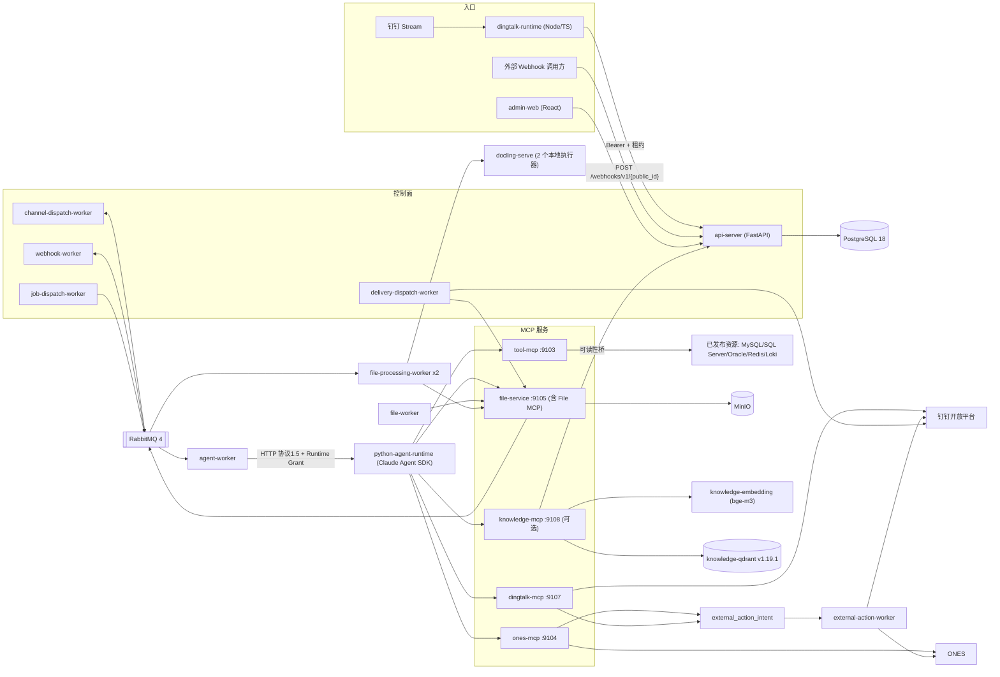

### 2.2 服务清单

| 服务 | 入口（镜像 target / 命令） | 容器端口 | 职责 |
| --- | --- | --- | --- |
| postgres | `postgres:18` | 5432（宿主 5433） | 唯一业务数据库；`public` schema 平台事实，`knowledge` schema 知识内容 |
| rabbitmq | `rabbitmq:4-management` | 5672 / 15672 | 渠道、Webhook、Job、附件、文档处理队列 |
| minio / minio-init | `minio/minio` | 9000（宿主 19000） | 文件对象存储；只有 file-service 持有凭据 |
| migrator | target `migrator`，`app.cli.migrate` | — | 一次性 schema 迁移；业务服务只检查就绪，不执行 DDL |
| api-server | `uvicorn app.main:create_app` | 8000 | 管理 API、内部 API（钉钉 Runtime 收件箱、服务身份、文件 Principal 刷新、知识可读性桥） |
| admin-web | `frontend/Dockerfile` | 80（宿主 8080） | 管理前端 |
| dingtalk-runtime | `dingtalk-runtime/`（Node/TS） | — | 多 Client Stream 长连接，受信事件转交 api-server；**不是** Agent Runtime |
| channel-dispatch-worker | `app.workers.channel_dispatch_worker` | — | 发布并消费渠道入口 Outbox，建会话/消息/Job |
| webhook-worker | `app.workers.webhook_dispatch_worker` | — | Webhook Outbox 推进，建 Job |
| job-dispatch-worker | `app.workers.job_dispatch_worker` | — | `job_dispatch_outbox` 发布到 `agent.job.queue` |
| agent-worker | `app.workers.agent_job_worker` | — | 消费 Job，签发 Grant/Principal，调用 Runtime，持久化事件与审计 |
| python-agent-runtime | `app.python_runtime.service` | 8091 | Claude Agent SDK 模型循环、MCP 桥、Job Sandbox（tmpfs） |
| tool-mcp | `app.services.tool_mcp` | 9103 | DB/Redis/Loki 固定只读工具 |
| ones-mcp | `services.ones_mcp_server` | 9104 | ONES 查询与受确认写操作 |
| dingtalk-mcp | `services.dingtalk_mcp_server` | 9107 | 钉钉查询与受确认写操作 |
| external-action-worker | `services.dingtalk_mcp_server.worker` | — | 发确认卡；执行已批准的 ONES/钉钉操作 |
| file-service | `services.file_service` | 9105 | 文件领域唯一事实入口 + File MCP + 内部流式 API |
| file-worker | `app.workers.file_worker` | — | 附件下载导入、生命周期维护、Outbox 投影 |
| file-processing-worker ×2 | `app.workers.file_processing_worker` | 9106 | 各单并发，经 file-service 领取 Docling 槽位 |
| docling-serve | 固定镜像 `docling-serve:v1.30.0-layout-ocr-v2` | 5001 | 私网文档解析/OCR，不暴露为 Agent 工具 |
| knowledge-embedding（可选） | `knowledge-embedding:bge-m3-v1` | 内部 | 固定 BGE-M3 向量模型，1024 维 |
| knowledge-qdrant（可选） | `qdrant/qdrant:v1.19.1@sha256:…` | 内部 | 向量库 |
| knowledge-ops / knowledge-model-prepare（可选） | 一次性任务 | — | 导入/分块/索引 CLI；模型文件准备 |
| knowledge-mcp（可选） | `services.knowledge_mcp_server.app` | 9108 | 在线知识检索 MCP |

知识库组件只在叠加 `knowledge/compose.yml`（离线）与 `knowledge/mcp.compose.yml`（在线）时启用，是根 Compose 的可选扩展。

### 2.3 网络分区

| 网络 | 成员 | 目的 |
| --- | --- | --- |
| default | 大多数服务 | 普通内部通信 |
| agent-runtime-control | postgres、api-server、agent-worker、channel/webhook worker、python-agent-runtime、tool/ones/dingtalk-mcp、file-service、knowledge-mcp | Runtime 与 MCP 的受控调用面 |
| provider-egress | python-agent-runtime（模型 API）、tool/ones/dingtalk-mcp、external-action-worker、knowledge-model-prepare | 访问外部 Provider 的唯一出网面 |
| document-processing | docling-serve、file-processing-worker ×2 | 文档处理私网 |
| knowledge-internal（`internal: true`） | postgres、api-server、knowledge-embedding、knowledge-qdrant、knowledge-ops、knowledge-mcp | 知识内网，无出网 |
| knowledge-storage-egress | knowledge-mcp | 访问管理员绑定的外部内容库/Qdrant |

### 2.4 代码结构

```text
backend/app/
  main.py                 FastAPI 工厂；按 FEATURE_WEB_ADMIN 决定是否挂管理路由
  modules/<领域>/          多数按 api / application / domain / infrastructure 分层
  workers/                各类 worker 进程入口
  services/tool_mcp.py    tool-mcp 入口
  python_runtime/         Agent Runtime（executor、job_sandbox、file_transfer、mcp_config、run_audit）
  shared/                 config、database、migrations、ones/dingtalk/knowledge 工具合同
  cli/                    migrate、bootstrap、知识导入/分块/索引/评测等运维命令
backend/migrations/       100_baseline_v1.sql 起的活动迁移（当前工作区到 144）
services/                 ones_mcp_server、dingtalk_mcp_server、file_service、knowledge_mcp_server、
                          knowledge_embedding、external_action_worker
frontend/src/contexts/<上下文>/{domain,application,infrastructure,presentation}
dingtalk-runtime/src/     Node/TS 钉钉 Stream 进程
knowledge/                知识库可选 Compose 扩展与评测数据
```

- 前端技术栈：React 19、Vite、TypeScript、react-router 7、TanStack Query/Table、Tailwind 4、Base UI/shadcn 风格组件、Zod。
- 前端页面：总览、应用列表/详情、渠道与触发器、Agent 配置列表/详情、调试、运行记录/Job 详情、会话详情、人员/用户详情、角色与授权、未绑定钉钉用户、我的外部身份、工具资源（含“知识库”Tab）、凭据中心、运行配置。
- `services/data_mcp_server`、`services/mcp_common` 只剩未跟踪的 `__pycache__` 残留，不是现有服务。
- `backend/Dockerfile` 仍有 `dingtalk-stream-ingress` target，但主 Compose 使用 Node 版 `dingtalk-runtime`。

### 2.5 鉴权模型矩阵

| 调用面 | 凭据形式 | 绑定事实 |
| --- | --- | --- |
| 浏览器 → api-server | 服务端 Session Cookie + `X-CSRF-Token`；库中只存 token/CSRF 哈希 | `user_session`，闲置与绝对过期；服务账号不能建交互 Session |
| dingtalk-runtime → api-server | `Authorization: Bearer`（部署注入）+ 请求体 `runtime_id` + `lease_token` | `channel_runtime_lease` 互斥租约；另有内部限流 |
| 外部 → Webhook | 仅 `bearer_v1`：Bearer 密钥常量时间比较 | Trigger Publication；**不是**请求体 HMAC 签名 |
| agent-worker → Runtime | Runtime Grant（EdDSA JWT，`aud=agent-runtime`） | job_id、invocation_id、publication、request_digest；TTL≈超时+60s，上限约 15 分钟 |
| Runtime → ones/dingtalk/knowledge-mcp | Principal JWT（EdDSA，`iss=enterprise-agent-identity`，`aud=<server_code>`） | Job、内部用户、Publication、工具 scope、authorization_hash；**不含** Provider 凭据 |
| Runtime → file-service | File Principal JWT（`aud=file-service`，头 `X-File-Principal-Token`） | Job、租户、工作区、精确工具 scope；不含 MinIO 凭据 |
| Runtime → tool-mcp | Job 上下文头（`x-job-id` 等），**不用** Principal JWT | 服务端按 RUNNING Job 与工具快照复核 |
| worker/MCP → api-server 内部 API | 服务身份（bootstrap token 兑换短期服务 Token） | 固定 scope；knowledge-mcp 另需当前 Knowledge Principal 双重校验 |

### 2.6 可靠消息模式

所有跨进程推进都用“业务表 + 同事务 Outbox + 幂等消费”。RabbitMQ 统一使用**默认交换机**，routing key 即队列名。

| Outbox 表 | 推进者 | 目标 |
| --- | --- | --- |
| `channel_ingress_outbox` | channel-dispatch-worker | `agent.channel.dispatch.queue` |
| `webhook_outbox` | webhook-worker（入口也会同步尝试一次） | `agent.webhook.dispatch.queue` |
| `job_dispatch_outbox` | job-dispatch-worker | `agent.job.queue` |
| `delivery_outbox` | delivery-dispatch-worker | **不走 MQ**，直接轮询数据库 |
| `external_action_card_outbox` | external-action-worker | 钉钉互动卡片 |
| `file_domain_outbox` | file-service 维护（由 file-worker 触发） | 仅 `file.processing.requested` 转发到 `agent.file.processing.queue`，其它事件主要进审计 |
| `document_processing_stage_outbox` | file-worker 维护循环 | 逐图 OCR 与 assembly 消息，同样进 `agent.file.processing.queue` |
| `platform_secret_change_event` | Secret 消费方 | 重载资源，失败保留 Last Known Good |

附件队列为 `agent.attachment.queue` 及其 `.retry` / `.dead`；文档处理队列有 `.retry` / `.dead`，三类处理消息共用主队列、以 `contract_version` 区分。

## 3. 核心数据流

### 3.1 控制面：配置、发布与激活

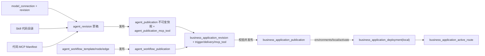

- Agent：`agent_definition` → 追加式 `agent_revision` → 不可变 `agent_publication`（快照 + config_hash）。新定义固定 `python-v1`，code 与 runtime kind 不可变。
- 应用 Publication 冻结 Agent/Workflow 引用、MCP 工具子集（必须是 Agent Publication 工具集的子集，由复合外键保证）、会话/执行/文件策略、文档处理 Profile、入口与投递绑定。
- **发布不改路由，激活才接线**。部署环境只有 `local`；工具调用中的业务 environment/base/workshop 是另一套概念。
- 激活只影响之后命中的请求；已创建 Job 保留旧发布事实。
- Workflow 目前只是配置资产，保存/发布不会执行图；没有 Workflow 运行引擎。

### 3.2 钉钉消息 → 会话 → Job

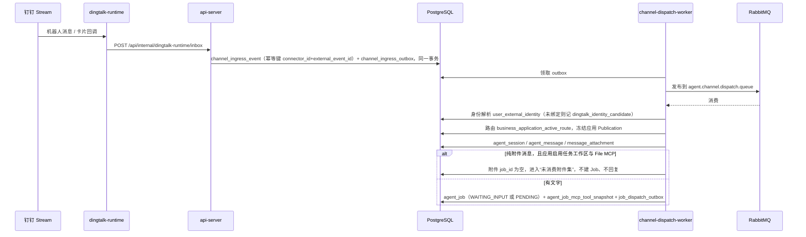

要点：

- 内部用户是唯一授权主体；钉钉身份绑定只证明对应关系，不授予工具权限。
- 回复所需的钉钉 session webhook 以密文存入 `channel_ingress_event.reply_credential_ciphertext`，投递时再解密。
- 第一条非空文字 Job 会原子认领此前的未消费附件；附件仍在导入时 Job 进入 `WAITING_INPUT`，全部附件到达安全终态后只释放一次。
- 企业 CorpId 验证事件只推进到 `ENTERPRISE_VERIFIED`，不进入 Agent 流水线。
- **Session 隔离键**（应用会话 v2）由应用 ID、应用 Publication ID、渠道、Connector、项目、会话类型、会话 ID、`external_identity_id`、执行范围哈希组成；群聊只去掉 requester_id。这意味着：群内每个成员实际是各自的 Session，发布新的应用 Publication 也会进入新 Session。

### 3.3 Webhook → Job

`POST /webhooks/v1/{public_id}` → 按 Trigger Publication 认证（Bearer）、限流、声明式字段提取 → `webhook_event`（`trigger_id + dedup_key` 幂等）与 `webhook_outbox` → `agent.webhook.dispatch.queue` → 复用渠道入口服务创建 Job。Webhook 不允许附件暂存。Trigger 绑定服务账号（`app_user.account_type=service`）作为主体，并固定具体 Agent Publication。

### 3.4 Job 调度 → Runtime → 工具

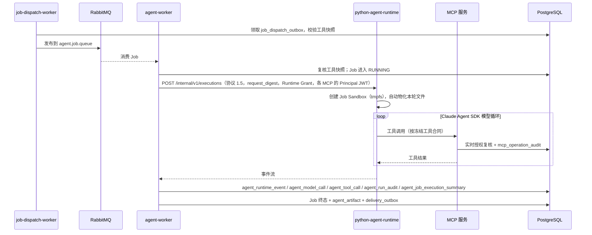

Job 冻结的事实：应用与 Agent Publication（ID、revision、config_hash）、`agent_job_mcp_tool_snapshot`（工具标识、schema_hash、授权摘要）、执行策略、模型运行来源、Runtime 协议版本、回复路由、任务工作区与文件依赖、Prompt 合同哈希。**不冻结**模型从自然语言推断出的 environment/base/workshop。

执行预算：`max_tool_calls` 默认 30，允许 0–500；有效 `max_turns`/`timeout_seconds` 取 Agent 与应用中更严格者。应用保存时使用 `value or 30` 归一化，因此填 0 实际会变成 30。

Runtime 协议：当前 1.5，同时支持 1.4；新 Job 用 1.5，旧 Job 保持原协议，不原地升级。

审计分层：

| 表 | 内容 |
| --- | --- |
| `agent_runtime_event` | 按 sequence 的归一化安全事件 |
| `agent_model_call` | SDK 可见的模型响应轮次与用量；不存 Prompt、完整回复或私有思考 |
| `agent_tool_call` | 工具调用请求与响应摘要 |
| `agent_run_audit` | 协议 1.5 的 invocation 级完整上下文与模型 I/O 审计（独立授权查询） |
| `agent_job_execution_summary` | 可重算的执行核算与安全失败诊断 |
| `mcp_operation_audit` | MCP 工具、Provider attempt 与凭据生命周期的有界审计 |

### 3.5 Job 状态机、重试与超时

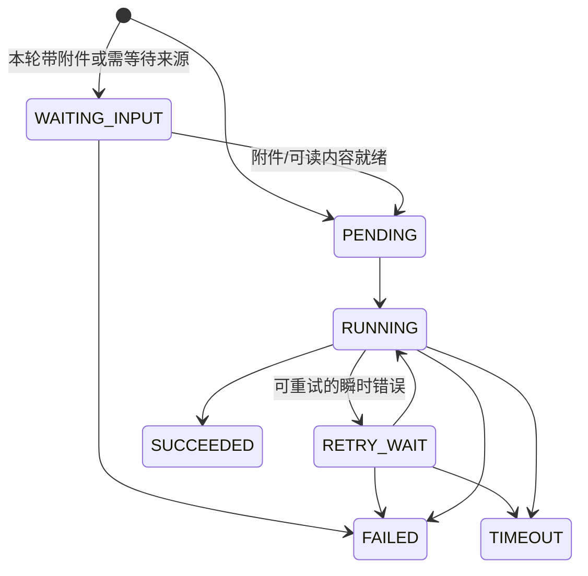

- 重试复用**同一个 Job**及其冻结 Publication，重新激活同一条 `job_dispatch_outbox`；`retry_count < max_retry_count`。
- `TIMEOUT` 是终态，走失败投递，不做普通重试。
- `WAITING_INPUT` 专指等待附件或文件可读内容，不是通用的“等待用户输入”；外部操作的人工确认在 `external_action_intent` 中，不阻塞 Job 状态。
- 文件提交部分失败不会让 Job 变成 `PARTIAL`：Runtime 正常完成并如实说明每个文件结果时，Job 仍为 `SUCCEEDED`。

### 3.6 结果投递

Job 终态后写 `agent_artifact` 与 `delivery_outbox`（结果或安全失败通知，文件版本交付另有 `delivery_kind`）→ delivery-dispatch-worker 轮询领取 → `delivery_attempt` → 按渠道限制拆分为 `delivery_chunk` → 钉钉适配器（会话 webhook 回复或文件交付）。

- 状态：`PENDING`、`RUNNING`、`RETRY_WAIT`、`SUCCEEDED`、`FAILED`、`DEAD`、`SKIPPED`。
- 投递重试或人工重放只重发已持久化的 artifact，**不重新运行 Agent**；分片按幂等键去重。
- 投递状态不回写 Job 成败。

### 3.7 外部写操作（Action Intent 确认链）

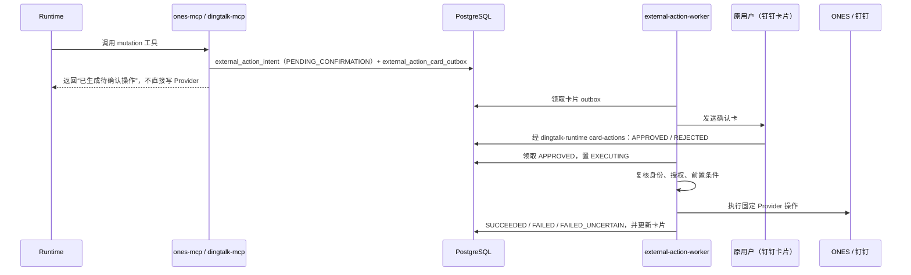

- 状态：`PENDING_CONFIRMATION` → `APPROVED` → `EXECUTING` → `SUCCEEDED` | `FAILED` | `FAILED_UNCERTAIN`；旁路 `REJECTED`、`EXPIRED`、`SUPERSEDED`。
- Intent 冻结参数与哈希、前置条件哈希、字段目录版本、确认摘要；同一 Job + 工具 + 参数哈希幂等；`supersedes_intent_id` 组成提案链。
- 确认不能扩大权限；`FAILED_UNCERTAIN` 不能当作可安全重发的失败。

### 3.8 附件与任务文件工作区

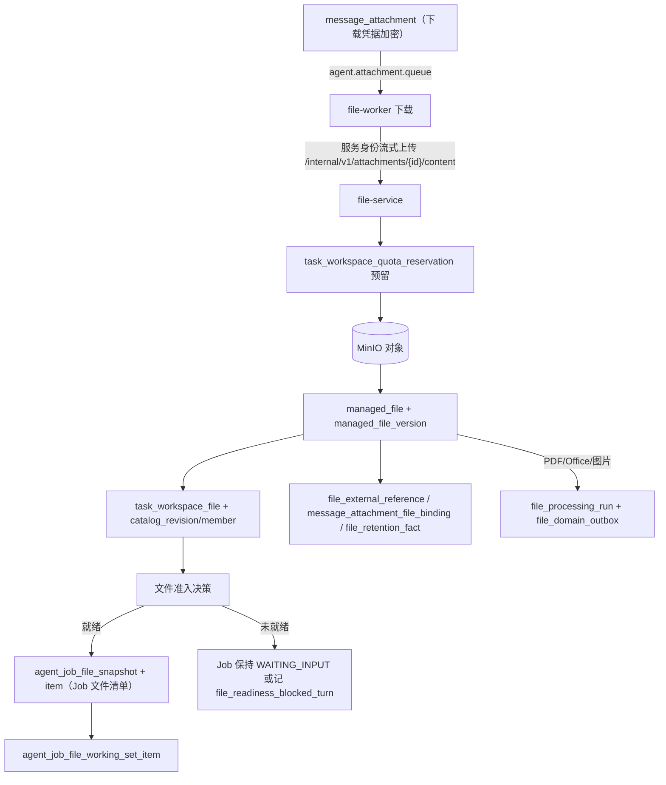

在 Runtime 中：

1. `file_prepare_materialization` 生成一次性 `file_materialization_transfer`，Runtime 通过内部流接口下载到 Sandbox `inputs/`，校验大小与 sha256。文档只物化 `MARKDOWN` 表示，原件和 JSON 表示不进 Sandbox。
2. Agent 在 Sandbox 内只能使用受限的 `Read`/`Grep`/`Write`/`Edit`。
3. 保存时逐个文件调用 `file_create_commit_intent`，Runtime 把 Sandbox 文件流式上传到 `PUT /internal/v1/file-commits/{id}/content` → `file_object_staging` → 校验基础版本、大小、配额 → 新 `managed_file_version`；基础版本已非当前版本则产生 `file_conflict_candidate`。
4. `DEFAULT` 模式成功提交后自动排队交付回当前会话；`WORKSPACE_ONLY` 需要显式 `file_deliver_version`。

当前容量常量（代码）：

| 维度 | 值 |
| --- | --- |
| 工作区活动配额 | 默认 200 个逻辑文件 / 2 GiB，可配，硬上限 1000 / 10 GiB |
| 单 Job 输入工作集 | 最多 40 个不同的文件版本 |
| 时间窗元数据候选 | 最多 20 |
| Job Sandbox（sandbox-v2） | 总计 128 个文件 / 512 MiB；inputs ≤40，work/outputs ≤80，tmp ≤8 |
| 单个文本文件 | ≤15 MiB |
| 文本格式 | 固定当前策略：TXT、Markdown 可读写，LOG 只读；UTF-8、禁止 NUL；Publication 级 text-v1/v2 列已在迁移 119 删除 |

生命周期：

- 工作区自然周期由创建时的应用 Publication 冻结（`DAY`/`WEEK`/`MONTH`，Asia/Shanghai，缺省 `WEEK`），活动不续期；状态 `ACTIVE` → `EXPIRED` → `CLEANING` → `CLEANED`（另有 `CLOSED`）。有非终态 Job/提交/交付时暂缓清理，但不改变到期时间。
- 消息附件、用户保存、成功交付的版本写 `file_retention_fact`，默认 360 天，重复读取或交付不重置。
- 清理统一走 `file_cleanup_fact`（`WORKSPACE`、`FILE_VERSION`、`STAGING_OBJECT`、`ATTACHMENT_CONTENT`），可重试，不在迁移事务里删对象。

### 3.9 文档处理（Docling / OCR）

1. 导入时如果应用 Publication 的 Profile 是 `docling-layout-ocr-v2`，创建 `file_processing_run`（`QUEUED`，阶段 `PARENT_PARSE`）并写 `file_domain_outbox`。
2. 两个 file-processing-worker（各单并发）消费 `agent.file.processing.queue`，通过 file-service 领取 `document_processing_docling_slot`（全局只有 slot 1、2）后调用 docling-serve。
3. 父文档解析产出 `document_parent_artifact_transfer`，提取 Office 内嵌图片为 `document_picture_asset` / `occurrence`，并通过 stage outbox 触发逐图 OCR（`document_picture_processing_item` / `attempt`，同样占用全局槽位）。
4. 全部图片到达终态后进入 assembly（不占槽位），经 `file_representation_transfer` 两阶段发布三种 `file_representation`：`MARKDOWN`、`DOCLING_JSON`、`OCR_LAYOUT_JSON`。
5. 处理终态更新附件与目录的可读状态，并可释放等待中的 Job。

运行状态：`QUEUED`、`SUBMITTED`、`RUNNING`、`RETRY_WAIT`、`SUCCEEDED`、`PARTIAL`、`NO_TEXT`、`FAILED`。完整就绪需要 worker 心跳、槽位、队列、Profile 和 Docling `/ready` 同时满足。

### 3.10 知识库

知识库分为已实现的“离线入库 → 分块 → 向量化 → 治理发布 → 在线检索”主链，以及 WIP 的“ONES 工作项增量同步”。

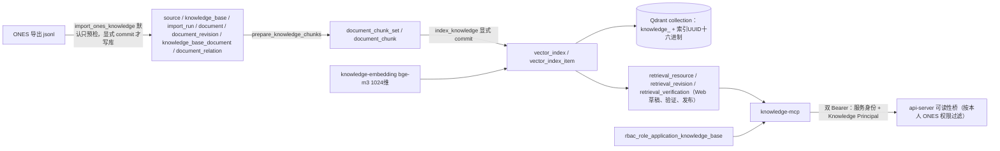

- **离线导入（已实现）**：幂等键为 `import_run(source_id, knowledge_base_id, input_hash)`；文档身份 `document(source_id, source_object_type, external_id)`；修订按内容哈希与来源时间戳判定 `created`/`revised`/`unchanged`/`stale`。导入不调用 ONES、OCR、Embedding 或 Qdrant，也不自动授予 Agent 读取权。
- **分块（已实现）**：`document_chunk_set(document_revision_id, profile_hash)` 唯一；证据文本 ≤1200 字，嵌入文本 ≤1800 字；块类型 `problem`/`solution`。缺陷使用 `ones-text-chunks/v1`，工单/需求（WIP）使用 `ones-work-item-chunks/v1`，两者刻意分开，避免重算已有缺陷向量。
- **向量化（已实现）**：Qdrant collection 名只由索引 UUID 派生，point id 为 `uuid5(index_id, chunk_id)`；索引状态 `BUILDING`/`READY`/`FAILED`（WIP 增加 `RETIRED`）。
- **检索治理（已实现）**：每个知识库至多一个 enabled 检索资源；草稿 → 技术验证 → 显式发布；`storage_config_json`（迁移 140）允许绑定独立的 PostgreSQL 内容库与 Qdrant，只存 Secret 引用。平台库始终持有逻辑知识库、授权、资源版本与审计。
- **在线检索（已实现，验收欠账）**：工具 `knowledge_list_bases`（每页 50）与 `knowledge_search`（`knowledge_base_id`、`query` 1–2000 字、`top_k` 1–20）。knowledge-mcp 使用固定最小权限数据库角色 `knowledge_mcp_reader`；候选结果必须经 api-server 可读性桥按**调用者本人**的 ONES 权限过滤；单次工具总预算最多 120 秒；审计只记计数与版本指针，不记查询与正文。`partial=true` 或零命中不代表知识库为空。
- **ONES 工作项同步（WIP / 设计意图）**：迁移 142 新增 `sync_binding`（默认停用，固定 3600 秒）、`sync_run`（阶段 `COLLECTING → STAGED → CHUNKING → INDEXING → VERIFIED → ACTIVATED`，另有 `CANCELLED`）、`sync_candidate`（冻结基线 + 候选修订引用，不复制正文），`document` 增加 `pending` 状态；143 增加向量索引代际字段与失引用清理；144 增加 `configuration_version`（4 表示按知识库成员计算摘要）。目前 `SyncService` 只实现到 `COLLECTING → STAGED`；同库短事务激活、ONES 采集适配器、定时 worker、正式数据与真实 ONES 验收都未完成。

### 3.11 一次工具调用的授权判定链

1. Job 必须为 `RUNNING`，且工具在 `agent_job_mcp_tool_snapshot` 中、属于对应 MCP Server 的 Manifest。
2. 用户与应用均启用；工具在应用 Publication 的工具上限内。
3. 调用者的角色对该应用有 `rbac_role_application_access`，且包含该工具（`rbac_role_application_mcp_tool`）。
4. 如果调用参数带 environment/base/workshop，必须落在 `rbac_role_application_scope` 中；知识库调用还要求 `knowledge_base_id` 在 `rbac_role_application_knowledge_base` 中。
5. tool-mcp：按资源类型 + environment（+ base/workshop）+ `placement`（资源角色）在各资源**最新 Published Revision** 中精确解析唯一资源；零个或多个候选都失败，不取第一个；再应用 table_prefix、Redis namespace、Loki selector 等范围绑定。Secret 只在适配器内解密。
6. ones/dingtalk/knowledge：再校验 Principal JWT 与当前外部身份凭据状态；mutation 转 Action Intent。

## 4. 表设计

### 4.1 总体约定

- 共 **151 张表**：`public` schema 133 张平台事实表，`knowledge` schema 18 张知识内容表。已提交 head 为 140；工作区 head 为 144，其中 3 张同步表和若干字段是 WIP。
- `public` schema 的 ID 为文本 UUID，时间为 ISO 文本，`*_json` 为 JSON 文本（未使用 JSONB/TIMESTAMPTZ）；`knowledge` schema 在 PostgreSQL 下使用 TIMESTAMPTZ、BIGINT 等原生类型。
- 迁移目录从 `100_baseline_v1.sql` 开始，版本单调递增、不可复用；已应用迁移不可改 checksum。baseline 同时包含 SQLite 与 PostgreSQL 两套 DDL 块。精确 legacy 042 数据库只能通过 manifest 校验的 adoption 接入。
- PostgreSQL 表和字段都有中文 `COMMENT`，附录 A 的表说明即来源于此。
- 反复出现的建模模式：

| 模式 | 典型表 | 说明 |
| --- | --- | --- |
| 稳定身份 + 追加式草稿 + 不可变发布 + 当前指针 | agent、business_application、model_connection、webhook_trigger、platform_resource、knowledge.retrieval_resource | 发布快照带 `snapshot_json` 与 `config_hash`；运行只读发布 |
| 乐观并发 | 多数可变表的 `revision` 列 | 更新时比较 revision |
| 同事务 Outbox | 见 2.6 | `status`、`attempt_count`、`next_attempt_at`、`claimed_by` 的统一租约结构 |
| 幂等键 | `idempotency_key`、`event_key`、`dedup_key`、`(connector_id, external_event_id)` | 重放返回既有结果 |
| 两阶段对象传输 | `file_object_staging`、`*_transfer` | 声明期望大小与哈希 → 暂存 → 校验 → 原子发布 |
| 冻结快照 | `agent_job_mcp_tool_snapshot`、`agent_job_file_snapshot` | Job 创建时固定，运行期不跟随变化 |
| 可重试清理事实 | `file_cleanup_fact`、`document_picture_cleanup_fact` | 删除对象与删除元数据分离 |
| 只存密文或引用 | `platform_secret_version`、`external_identity_credential`、`*_ciphertext` | AES-256-GCM + key_id；普通投影只返回状态 |

### 4.2 身份、外部身份与 RBAC（19 张）

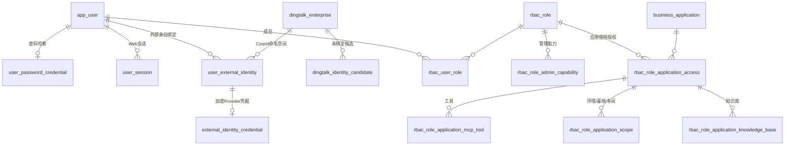

- 管理能力（`rbac_role_admin_capability`，能力码来自代码只读目录）与业务能力（`rbac_role_application_*`）完全分离。
- `rbac_role_application_scope` 只允许明确的 environment/base/workshop，不支持对未来资源通配。
- `rbac_role_application_knowledge_base` 无记录即未授权，没有显式拒绝。
- `user_external_identity` 钉钉按 `provider + tenant + subject` 与 `dingtalk_enterprise_id + external_subject_id` 唯一；ONES 绑定经 `ones_identity_verification_challenge` 本人验证后写 `external_identity_credential`。

### 4.3 Agent、模型与 Workflow（12 张）/ 业务应用（9 张）

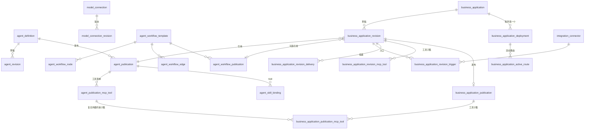

- `business_application_active_route` 在 `(environment, trigger_type, connector_id, normalized_routing_key)` 上唯一，保证一个入口只路由到一个应用。
- 应用 Publication 上有独立列：`task_workspace_retention_period`、`task_file_features_json`、`document_processing_profile_*`。
- `agent_channel_binding` 仍在 schema 中，但当前入口主模型是应用 Trigger + `integration_connector`。

### 4.4 渠道、会话与消息（15 张）/ Job、审计与投递（21 张）

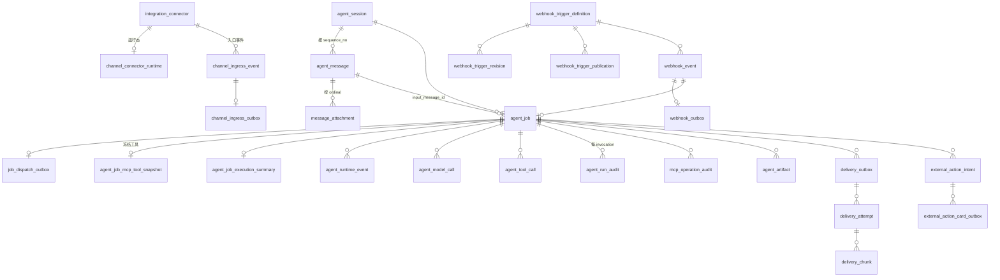

- `agent_job` 是最宽的表（55 列），同时承载来源、路由决策、冻结的 Publication/策略/协议版本与执行结果。
- `agent_session.session_key` 唯一，构成见 3.2；会话里有滚动摘要字段（`summary_text`、`summary_through_sequence`）与最近消息条数策略。
- `agent_runtime_invocation_claim` / `_event` / `agent_runtime_terminal_ledger` 是 Runtime 侧的有界恢复账本：重启后遗留占用失败关闭，**不重放模型调用**。
- `external_action_intent` 共 55 列，包含冻结参数、前置条件、字段目录、确认摘要、Provider attempt 事实与提案链。

### 4.5 任务文件工作区（21 张）/ 文档处理（14 张）

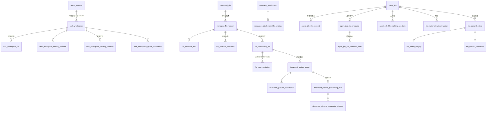

- `task_workspace` 在 `session_id` 上是**部分唯一索引**（仅 `status = 'ACTIVE'`），因此一个 Session 可以依次拥有多个工作区，但同时至多一个 ACTIVE；`task_workspace_file` 的逻辑文件名同样只在 ACTIVE 行内唯一。附录 A 中带“仅当”的唯一约束都是这类部分索引。
- `managed_file.current_version_id` 是唯一当前版本指针；版本通过 `parent_version_id`/`base_version_id` 组成版本链。
- `file_processing_run` 在 `(source_version_id, processor_build_digest, profile_hash)` 上唯一：同一版本、同一构建、同一 Profile 只处理一次。
- `document_processing_docling_slot` 的主键是 `slot_no`，全局只有两行。

### 4.6 工具资源（11 张）/ 平台配置、Secret 与 Schema（11 张）

- 业务数据范围目录：`platform_environment` → `platform_base` → `platform_workshop`（车间上带 `table_prefix`、`redis_key_prefix`、`loki_labels_json`）。
- 资源：`platform_resource`（稳定身份，含 `placement`）→ 至多一个 `platform_resource_draft` → `platform_resource_verification`（按 draft_revision + content_hash）→ 不可变 `platform_resource_revision`。Provider 类型为 mysql、sqlserver、oracle、redis、loki；`postgresql` 在合同中登记但 `available=False`，数据库 CHECK 也不含它。
- `resource_reset_operation` / `resource_reset_target`：四阶段受控重置与维护门禁。
- 配置：`platform_runtime_config_definition`（键、类型、默认值、敏感性、适用服务）+ `platform_runtime_config_value`（作用域值或 `secret_ref`）；审计写 `platform_config_audit`。
- Secret：`platform_secret`（元数据与当前版本）+ `platform_secret_version`（AES-GCM 密文、nonce、key_id）+ `platform_secret_reference`（env/vault/kms 引用）+ `platform_secret_change_event`。引用格式 `secret://platform/<code>`。
- Schema 治理：`schema_migration`（账本）、`schema_baseline_adoption`、`schema_consolidation_checkpoint`、`schema_consolidation_contract_approval`。

### 4.7 知识库 `knowledge` schema（18 张，其中 3 张 WIP）

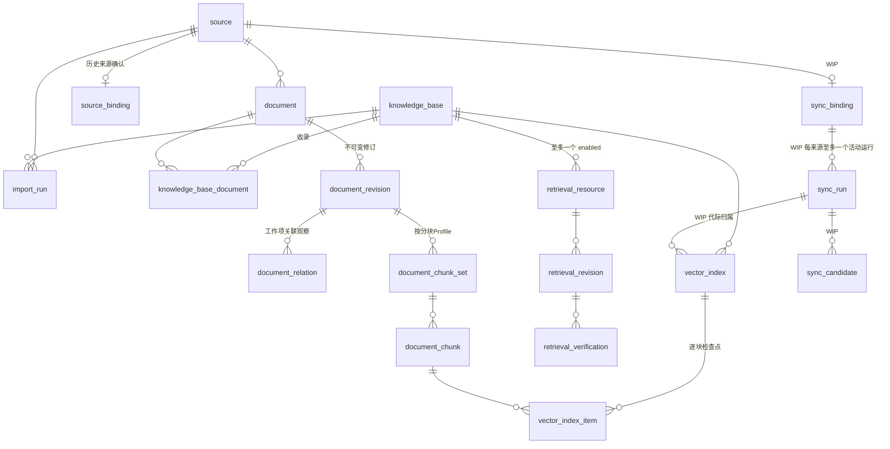

- `document.current_revision_id` 指向当前修订；WIP 的 `pending` 状态要求 `current_revision_id` 为空。
- `document_kind`：`defect`、`ticket`、`requirement`、`article`。
- 平台 `public.rbac_role_application_knowledge_base` 通过外键引用 `knowledge.knowledge_base`，这是两个 schema 之间唯一的授权连接。
- 使用独立内容库时，内容实例只需要 `source`、`knowledge_base`、`knowledge_base_document`、`document`、`document_chunk_set`、`document_chunk`、`vector_index`、`vector_index_item` 这些表，不需要平台迁移账本。

## 5. 状态机速查

| 对象 | 状态值 |
| --- | --- |
| `agent_job.status` | WAITING_INPUT、PENDING、RUNNING、RETRY_WAIT、SUCCEEDED、FAILED、TIMEOUT |
| `delivery_outbox.status` | PENDING、RUNNING、RETRY_WAIT、SUCCEEDED、FAILED、DEAD、SKIPPED |
| `external_action_intent.status` | PENDING_CONFIRMATION、APPROVED、EXECUTING、SUCCEEDED、FAILED、FAILED_UNCERTAIN、REJECTED、EXPIRED、SUPERSEDED |
| `message_attachment.status` | PENDING、DOWNLOADING、READY、REJECTED、FAILED |
| `message_attachment.readability_status` | NOT_REQUIRED、PENDING、AVAILABLE、PARTIAL、NO_TEXT、UNAVAILABLE |
| `task_workspace.status` | ACTIVE、CLOSED、EXPIRED、CLEANING、CLEANED |
| `task_workspace_file.role` | INPUT、WORKING、OUTPUT、CONFLICT |
| `file_commit_intent.status` | INTENT、UPLOADING、COMMITTED、CONFLICT、REJECTED、EXPIRED |
| `file_materialization_transfer.status` | READY、CONSUMED、EXPIRED |
| `file_object_staging.status` | UPLOADING、COMPLETE、PUBLISHED、CLEANUP_PENDING、DELETED |
| `file_conflict_candidate.status` | OPEN、RESOLVED、EXPIRED |
| `file_cleanup_fact.status` | PENDING、CLAIMED、RETRY、COMPLETED、DEAD |
| `file_processing_run.status` | QUEUED、SUBMITTED、RUNNING、RETRY_WAIT、SUCCEEDED、PARTIAL、NO_TEXT、FAILED |
| `file_processing_run.stage_code` | PARENT_PARSE、PICTURE_OCR、ASSEMBLING |
| `document_picture_processing_item.status` | QUEUED、CLAIMED、SUBMITTED、RETRY_WAIT、AVAILABLE、NO_TEXT、SKIPPED_LIMIT、FAILED |
| `document_processing_docling_slot.state` | AVAILABLE、OCCUPIED、QUARANTINED |
| `file_representation.status` | AVAILABLE、CONTENT_UNAVAILABLE、DELETED |
| `knowledge.import_run.state` | running、failed、completed |
| `knowledge.document.lifecycle_state` | active、unavailable、deleted（WIP：pending） |
| `knowledge.vector_index.state` | BUILDING、READY、FAILED（WIP：RETIRED） |
| `knowledge.retrieval_resource.status` | enabled、disabled、archived |
| `knowledge.source_binding.state` | PENDING、CONFIRMED、VERIFIED、REVOKED |
| `knowledge.sync_run.phase`（WIP） | COLLECTING、STAGED、CHUNKING、INDEXING、VERIFIED、ACTIVATED、CANCELLED |

## 6. 固定工具目录

| MCP Server | 只读工具 | 写操作（Action Intent） |
| --- | --- | --- |
| tool-mcp（9） | `list_available_tool_resources`、`get_schema_directory`、`query_database`、`query_redis_get`、`query_redis_scan`、`query_loki`、`diagnose_loki_labels`、`diagnose_loki_label_values`、`diagnose_loki_probe` | 无 |
| ones-mcp（19） | `ones_work_item_search`、`ones_list_project_role_members`、`ones_search_projects`、`ones_list_project_sprints`、`ones_list_issue_types`、`ones_query_work_items`、`ones_query_work_items_with_custom_options`、`ones_resolve_query_conditions`、`ones_get_work_item_detail`、`ones_list_work_item_messages`、`ones_search_team_users`、`ones_get_users_by_uuids`、`ones_list_testcase_libraries`、`ones_list_testcase_modules`、`ones_list_test_plans`、`ones_query_test_cases`、`ones_get_test_case_detail` | `ones_create_bug`、`ones_update_task` |
| dingtalk-mcp（35） | 通讯录：`dingtalk_search_users`、`dingtalk_get_user`、`dingtalk_list_department_users`、`dingtalk_search_departments`、`dingtalk_get_department`、`dingtalk_list_sub_departments`；待办/日历：`dingtalk_list_todos`、`dingtalk_get_calendar_event`、`dingtalk_list_calendar_events`、`dingtalk_list_calendar_attendees`；AI 表格：`dingtalk_search_aitables`、`dingtalk_get_aitable_supported_search_filters`、`dingtalk_get_aitable_supported_field_info`、`dingtalk_get_aitable_record_values_format`、`dingtalk_list_aitable_sheets`、`dingtalk_get_aitable_sheet`、`dingtalk_list_aitable_fields`、`dingtalk_list_aitable_records`、`dingtalk_get_aitable_record`；工作通知：`dingtalk_get_work_notification_progress`、`dingtalk_get_work_notification_result` | `dingtalk_create_todo`、`dingtalk_update_todo`、`dingtalk_complete_todo`、`dingtalk_create_calendar_event`、`dingtalk_update_calendar_event`、`dingtalk_create_aitable_sheet`、`dingtalk_update_aitable_sheet`、`dingtalk_create_aitable_field`、`dingtalk_update_aitable_field`、`dingtalk_insert_aitable_records`、`dingtalk_update_aitable_records`、`dingtalk_send_message_to_group_by_robot`、`dingtalk_batch_send_message_to_users_by_robot`、`dingtalk_send_work_notification` |
| file-service File MCP（8） | `task_workspace_get`、`task_workspace_list_files`、`task_workspace_search_files`、`file_get_metadata`、`file_prepare_materialization` | `file_create_commit_intent`、`file_retain_version`、`file_deliver_version`（受文件领域规则治理，不走 Action Intent） |
| knowledge-mcp（2，可选） | `knowledge_list_bases`、`knowledge_search` | 无 |

补充：

- ONES 工作项查询不接受模型传入的 limit/cursor，服务内有界收集；测试资产上限 10000，其余相关集合上限 1000。
- 钉钉删除、撤回、raw 调用等官方能力被显式排除，不进入平台 Manifest。
- 当前群消息、按 userId 批量发送机器人消息、工作通知是三种不同语义，不能互相替代。

## 7. 贯穿全系统的不变量

讨论新规格时，下列约束默认应保持；如需打破，应当作为明确的规格变更提出。

1. **主体唯一**：授权主体只有内部用户（含服务账号）；外部身份只用于解析主体，不直接授予权限。
2. **冻结与实时复核并存**：Job 冻结“用什么”（发布、工具合同、文件版本、策略），每次调用实时复核“能不能”（角色、范围、外部身份、资源发布状态）。
3. **发布不可变**：运行只读取不可变 Publication/Revision；修改只产生新草稿，激活是单独动作。
4. **不按名字猜目标**：资源、文件、知识库都必须精确解析为唯一对象，多个候选即失败。
5. **写操作分层**：资源工具永远只读；文件写入走提交意图 + 基础版本校验；外部业务写入走 Action Intent + 原用户确认 + 独立 worker。
6. **凭据不出边界**：模型、MCP 参数/响应、Job、审计中不出现 Provider 凭据、MinIO 凭据或 Secret 明文；JWT 只证明调用主体与 scope。
7. **可恢复但不重放**：Outbox、租约、幂等键保证恢复；Runtime 重启不重放模型调用；投递重试不重跑 Agent；结果不确定的外部操作不自动重发。
8. **迁移只进不退**：只有一次性 Migrator 执行 DDL；已应用迁移不可修改；expand/contract 分阶段。
9. **就绪不等于验收**：容器 healthy、`/ready`、`runtime_wired` 都不代表真实链路已通。

## 8. 代码与文档的差异、易踩坑

| 主题 | 代码事实 | 容易误解的说法 |
| --- | --- | --- |
| Webhook 鉴权 | 只有 `bearer_v1`；`webhook_replay_nonce` 表和 `register_nonce()` 存在，但入口没有调用，防重放靠 `dedup_key` | “Webhook 使用 HMAC 签名 + nonce 防重放” |
| 工作区配额 | 默认 200 文件 / 2 GiB，可配 | `CONTEXT.md` 写的“20 文件 / 100 MiB”（这只是清单表的旧列默认值） |
| 文本格式策略 | Publication 级 `text-v1/v2` 列已删除，固定当前策略 | “按 Publication 切换 text-v1/text-v2” |
| 群聊会话 | Session key 含 `external_identity_id` 与应用 Publication ID | “同一个群的所有成员共享一个 Session/工作区” |
| `max_tool_calls=0` | 保存时 `value or 30`，0 变成 30 | “填 0 即可关闭工具” |
| 部署环境 | 只有 `local` | test/staging/production 部署环境 |
| PostgreSQL 资源 | 合同登记但不可用 | “tool-mcp 支持查询 PostgreSQL 业务库” |
| 平台范围授权 | `AuthorizationEvaluator.decide_platform_scope` 恒失败，以 `BusinessAuthorizationService` 为准 | 旧的平台范围授权接口仍可用 |
| MQ 拓扑 | 默认交换机直投；投递不走 MQ | 存在业务交换机或投递队列 |
| 表注释 | `agent_runtime_event`、`agent_runtime_terminal_ledger` 的注释仍写“TypeScript Runtime” | TypeScript Runtime 仍在运行 |
| 知识库前端 | 在“工具资源”页的“知识库”Tab 中，没有独立路由 | 知识库没有管理界面 |
| 迁移范围 | 已提交 head 140，工作区 head 144 | 旧文档中的“当前迁移 132” |

## 9. 验收状态与未完成事项

- 2026-09-16 按代码重建 canonical 基线时关闭了此前 29 个 active change，其中 22 项未完成任务保持未勾选，涉及真实 ONES、钉钉、Oracle、新 Publication/Job、Runtime/文件链、跨架构 Docling 等验收。
- 知识库：本机于 2026-09-20 部署了在线 knowledge-mcp（schema 140），健康检查、服务身份兑换与无业务身份拒绝检查通过；但真实外部内容库、双用户 ONES 权限、Agent 新 Job 与人工召回质量评测都还没有验收。
- 当前 active change `sync-ones-knowledge-work-items` 对应未提交的 141–144 迁移与同步代码；同步闭环（采集适配器、定时 worker、激活事务）未完成，本机默认同步必须保持停用。
- 验证层级应分别记录：代码/静态合同 → 本地自动化 → 隔离数据库 → 构建 → 部署就绪 → 新 Job 真实链路。Mock 或容器 healthy 不能替代真实环境验收。

## 10. 后续规格讨论可以从这里切入

以下是从当前代码状态中观察到的**开放问题**，供讨论时选择，不代表已经决定要做。

1. **知识同步闭环**：激活事务的边界（同库短事务、CAS 水位）、独立内容库场景下是否允许自动激活、失败回退与代际清理策略、同步与离线 CLI 的职责切分。
2. **群聊会话与工作区共享**：是否要让群成员共享 Session/工作区；如果要，需要重新设计 Session key、工作区唯一约束、文件授权与“群共享副本”规则。
3. **工作区切换判定**：何时由 Agent 询问用户、何时自动关闭旧工作区开启新工作区，以及跨工作区引用已关闭工作区文件的规则。
4. **Webhook 安全**：是否需要请求体签名与 nonce 防重放，还是明确 Bearer + dedup 即为规范并清理未用的 nonce 表。
5. **Workflow 执行**：Workflow 目前只是配置资产，是否以及如何引入运行引擎，与现有 Job/Runtime 协议如何衔接。
6. **部署环境**：是否需要 `local` 之外的部署环境，以及它与业务 environment/base/workshop 的关系。
7. **工具资源扩展**：PostgreSQL 业务库 Provider、结果分页、跨资源查询是否纳入。
8. **执行预算语义**：`max_tool_calls=0` 的含义应当是“禁用工具”还是“使用默认值”。
9. **审计与保留**：`agent_run_audit` 保存完整上下文（不做应用层脱敏），其保留期限、访问授权与清理机制。
10. **钉盘文件按需同步**：领域语言中已描述但明确不在第一阶段，是否排期。

## 11. 源码定位

| 主题 | 入口 |
| --- | --- |
| 应用入口与路由注册 | `backend/app/main.py` |
| 身份、RBAC、Principal JWT | `backend/app/modules/identity/`、`authorization_center/`、`admin/domain/capabilities.py` |
| Agent、模型、Workflow | `backend/app/modules/agent_config/`、`model_connection/`、`workflow/` |
| 业务应用 | `backend/app/modules/business_application/`（`domain/policies.py`） |
| 渠道与钉钉 | `backend/app/modules/managed_channel/`、`channel/`、`dingding/`、`dingtalk-runtime/src/` |
| Webhook | `backend/app/modules/webhook/` |
| Job、调度、重试 | `backend/app/modules/job/`、`backend/app/workers/` |
| Runtime 协议与执行 | `backend/app/modules/agent/infrastructure/runtime_protocol.py`、`runtime_http_client.py`、`backend/app/python_runtime/` |
| 结果投递 | `backend/app/modules/delivery/` |
| 外部操作 | `backend/app/modules/external_action/`、`services/dingtalk_mcp_server/worker.py`、`services/external_action_worker/` |
| 工具资源与 tool-mcp | `backend/app/services/tool_mcp.py`、`backend/app/modules/mcp_tool_runtime/`、`platform_config/domain/provider_contracts.py` |
| ONES/钉钉/知识工具合同 | `backend/app/shared/ones_tool_contracts.py`、`dingtalk_tool_contracts.py`、`knowledge_tool_contracts.py` |
| 文件与工作区 | `backend/app/modules/file_workspace/`、`attachments/`、`services/file_service/` |
| 文档处理 | `backend/app/modules/document_processing/`、`backend/app/workers/file_processing_worker.py` |
| 知识库 | `backend/app/modules/knowledge/`、`backend/app/cli/*knowledge*.py`、`services/knowledge_mcp_server/`、`services/knowledge_embedding/`、`knowledge/` |
| 配置、Secret、迁移 | `backend/app/modules/platform_config/`、`backend/app/shared/migrations.py`、`backend/migrations/` |
| 部署 | `docker-compose.yml`、`knowledge/compose.yml`、`knowledge/mcp.compose.yml`、`backend/Dockerfile` |

## 附录A 全量表字段清单（按领域分组，自动导出）

由当前工作区迁移目录在隔离内存 SQLite 上执行到 head 144 后导出，共 151 张表。说明取自迁移中的 `COMMENT ON TABLE`；PK/FK/唯一约束取自 SQLite 元数据，复合外键合并显示，部分唯一索引附带其 WHERE 条件。标注〔WIP〕的表/字段来自尚未提交的 141–144 迁移。字段类型未逐列列出：public schema 全部以 TEXT/INTEGER 存储，ID 为文本 UUID，时间为 ISO 文本，`*_json` 为 JSON 文本；`knowledge` schema 在 PostgreSQL 中使用 TIMESTAMPTZ、BIGINT 等原生类型。

### A.1 身份、外部身份与RBAC（identity-access）（19 张）

- **`app_user`**（9列）：统一内部用户，Web和Channel身份均解析到该主体
  - PK：`id`
  - 唯一：`(username)`
  - 字段：id, username, display_name, email, status, revision, created_at, updated_at, account_type
- **`dingtalk_enterprise`**（10列）：钉钉企业 Corp ID 命名空间，独立治理企业身份归属
  - PK：`id`
  - FK：`created_by→app_user`
  - 唯一：`(corp_id)` 仅当 `corp_id IS NOT NULL`
  - 字段：id, name, corp_id, status, verification_event_id, verified_at, revision, created_by, created_at, updated_at
- **`dingtalk_identity_application_observation`**（9列）：企业范围内钉钉身份与应用之间的观测事实
  - PK：`id`
  - FK：`connector_id→integration_connector`；`external_identity_id→user_external_identity`；`last_ingress_event_id→channel_ingress_event`
  - 唯一：`(external_identity_id,connector_id)`
  - 字段：id, external_identity_id, connector_id, first_observed_at, last_observed_at, last_ingress_event_id, revision, created_at, updated_at
- **`dingtalk_identity_candidate`**（11列）：尚未绑定内部用户的钉钉身份候选及受限元数据
  - PK：`id`
  - FK：`dingtalk_enterprise_id→dingtalk_enterprise`
  - 唯一：`(dingtalk_enterprise_id,external_subject_id)` 仅当 `dingtalk_enterprise_id IS NOT NULL`；`(tenant_code,external_subject_id)`
  - 字段：id, tenant_code, external_subject_id, display_name, first_seen_at, last_seen_at, observation_count, revision, created_at, updated_at, dingtalk_enterprise_id
- **`dingtalk_identity_candidate_message`**（16列）：钉钉身份候选与已接收入口事件的关联记录
  - PK：`id`
  - FK：`candidate_id→dingtalk_identity_candidate`；`connector_id→integration_connector`；`source_ingress_event_id→channel_ingress_event`
  - 唯一：`(source_ingress_event_id)`
  - 字段：id, candidate_id, source_ingress_event_id, connector_id, robot_code, conversation_type, conversation_id, message_kind, safe_text, text_truncated, attachment_type, attachment_name, attachment_size, occurred_at, received_at, created_at
- **`dingtalk_identity_nickname_audit`**（8列）：钉钉身份昵称变化的最小审计事实，不保存消息正文或认证材料
  - PK：`id`
  - FK：`connector_id→integration_connector`；`external_identity_id→user_external_identity`；`source_ingress_event_id→channel_ingress_event`
  - 唯一：`(source_ingress_event_id)`
  - 字段：id, external_identity_id, connector_id, source_ingress_event_id, previous_nickname, current_nickname, observed_at, created_at
- **`external_identity_credential`**（20列）：外部身份当前 Provider 凭据；只保存 AES-256-GCM 密文和不可重放生命周期事实。
  - PK：`id`
  - FK：`external_identity_id→user_external_identity`
  - 唯一：`(external_identity_id)`
  - 字段：id, external_identity_id, provider, status, revision, login_material_ciphertext, login_material_nonce, token_ciphertext, token_nonce, key_id, algorithm, verified_at, token_refreshed_at, last_used_at, reauth_required_at, disabled_at, unbound_at, last_error_code, created_at, updated_at
- **`identity_migration_audit`**（8列）：统一身份迁移过程的追加式审计记录
  - PK：`id`
  - FK：`internal_user_id→app_user`
  - 字段：id, legacy_subject_type, legacy_subject_code, tenant_code, internal_user_id, status, reason, created_at
- **`ones_identity_verification_challenge`**（16列）：ONES 本人验证产生的短时单次 Challenge，只保存已验证主体和 Team 候选
  - PK：`id`
  - FK：`user_id→app_user`
  - 唯一：`(user_id)` 仅当 `status = 'PENDING'`
  - 字段：id, user_id, external_user_id, display_name, teams_json, verified_at, expires_at, status, created_at, consumed_at, login_material_ciphertext, login_material_nonce, token_ciphertext, token_nonce, credential_key_id, credential_algorithm
- **`rbac_role`**（15列）：统一RBAC角色
  - PK：`id`
  - 唯一：`(code)`
  - 字段：id, code, name, description, status, revision, created_at, updated_at, origin, protected, purpose_tags_json, metadata_revision, admin_revision, business_revision, membership_revision
- **`rbac_role_admin_capability`**（8列）：角色管理后台能力绑定，能力定义来自后端只读目录
  - PK：`id`
  - FK：`role_id→rbac_role`
  - 唯一：`(role_id,capability_code,resource_type,resource_code)`
  - 字段：id, role_id, capability_code, resource_type, resource_code, status, created_at, updated_at
- **`rbac_role_application_access`**（7列）：角色对具体业务应用的使用授权聚合
  - PK：`id`
  - FK：`application_id→business_application`；`role_id→rbac_role`
  - 唯一：`(role_id,application_id)`
  - 字段：id, role_id, application_id, status, revision, created_at, updated_at
- **`rbac_role_application_knowledge_base`**（3列）：现有角色业务应用记录的知识库允许范围；无记录即未授权，不新增显式拒绝
  - PK：`application_access_id+knowledge_base_id`
  - FK：`application_access_id→rbac_role_application_access`；`knowledge_base_id→knowledge.knowledge_base`
  - 字段：application_access_id, knowledge_base_id, created_at
- **`rbac_role_application_mcp_tool`**（4列）：角色在指定业务应用内获准使用的稳定 MCP 工具标识
  - PK：`id`
  - FK：`application_access_id→rbac_role_application_access`
  - 唯一：`(application_access_id,tool_identifier)`
  - 字段：id, application_access_id, tool_identifier, created_at
- **`rbac_role_application_scope`**（7列）：业务应用授权下的明确环境、基地、车间范围，不支持未来资源通配
  - PK：`id`
  - FK：`application_access_id→rbac_role_application_access`；`base_id→platform_base`；`environment_id→platform_environment`；`workshop_id→platform_workshop`
  - 唯一：`(application_access_id,scope_key)`
  - 字段：id, application_access_id, environment_id, base_id, workshop_id, scope_key, created_at
- **`rbac_user_role`**（10列）：内部用户与 RBAC 角色的成员关系及授权来源
  - PK：`id`
  - FK：`role_id→rbac_role`；`user_id→app_user`
  - 唯一：`(user_id,role_id)`
  - 字段：id, user_id, role_id, status, revision, created_at, updated_at, expires_at, assigned_by, assignment_source
- **`user_external_identity`**（20列）：外部身份绑定，钉钉按provider+tenant+subject唯一
  - PK：`id`
  - FK：`dingtalk_enterprise_id→dingtalk_enterprise`；`user_id→app_user`
  - 唯一：`(user_id,dingtalk_enterprise_id)` 仅当 `provider = 'dingtalk' AND dingtalk_enterprise_id IS NOT NULL AND status IN ('enabled', 'disabled')`；`(dingtalk_enterprise_id,external_subject_id)` 仅当 `provider = 'dingtalk' AND dingtalk_enterprise_id IS NOT NULL`；`(provider,tenant_code,external_subject_id)` 仅当 `provider = 'ones' AND status IN ('enabled', 'disabled')`；`(provider,tenant_code,external_subject_id)` 仅当 `provider <> 'ones'`
  - 字段：id, user_id, provider, tenant_code, external_subject_id, connector_id, union_id, open_id, display_name, status, verified_at, last_seen_at, metadata_json, revision, created_at, updated_at, dingtalk_enterprise_id, display_name_observed_at, display_name_event_id, display_name_source_connector_id
- **`user_password_credential`**（6列）：Web 用户密码哈希凭据及密码变更时间，不保存明文密码
  - PK：`user_id`
  - FK：`user_id→app_user`
  - 字段：user_id, password_hash, revision, password_changed_at, created_at, updated_at
- **`user_session`**（12列）：Web服务端session，仅保存token和CSRF哈希
  - PK：`id`
  - FK：`user_id→app_user`
  - 唯一：`(token_hash)`
  - 字段：id, user_id, token_hash, csrf_hash, status, created_at, last_seen_at, idle_expires_at, absolute_expires_at, revoked_at, user_agent_summary, remote_address_summary

### A.2 Agent、模型连接与Workflow（agent-model）（12 张）

- **`agent_channel_binding`**（6列）：Agent 发布与渠道 Connector 的显式绑定关系
  - PK：`id`
  - FK：`publication_id→agent_publication`
  - 唯一：`(publication_id,direction,connector_id)`
  - 字段：id, publication_id, direction, connector_id, config_json, created_at
- **`agent_definition`**（13列）：支持多Agent的稳定定义
  - PK：`id`
  - 唯一：`(code)`
  - 字段：id, code, name, description, project_code, status, current_publication_id, revision, created_by, created_at, updated_at, classification, runtime_kind
- **`agent_publication`**（11列）：Agent不可变发布快照
  - PK：`id`
  - FK：`agent_id→agent_definition`；`revision_id→agent_revision`
  - 唯一：`(agent_id,revision)`
  - 字段：id, agent_id, revision_id, revision, schema_version, snapshot_json, config_hash, status, published_by, published_at, runtime_kind
- **`agent_publication_mcp_tool`**（7列）：Agent 发布快照包含的精确 MCP 工具清单
  - PK：`agent_publication_id+tool_identifier`
  - FK：`agent_publication_id→agent_publication`
  - 唯一：`(agent_publication_id,server_code,tool_identifier)`；`(agent_publication_id,selection_order)`
  - 字段：agent_publication_id, server_code, tool_identifier, schema_hash, model_description, selection_order, created_at
- **`agent_revision`**（10列）：Agent可编辑草稿revision
  - PK：`id`
  - FK：`agent_id→agent_definition`
  - 唯一：`(agent_id,revision)`
  - 字段：id, agent_id, revision, status, config_json, config_hash, validation_json, created_by, created_at, updated_at
- **`agent_skill_binding`**（4列）：Agent 修订绑定的 Skill 代码、顺序与启用状态
  - PK：`id`
  - FK：`publication_id→agent_publication`
  - 唯一：`(publication_id,skill_code)`
  - 字段：id, publication_id, skill_code, created_at
- **`agent_workflow_edge`**（10列）：Agent 流程边表，保存节点连线、端口和条件
  - PK：`id`
  - FK：`template_id→agent_workflow_template`
  - 唯一：`(template_id,edge_key)`
  - 字段：id, template_id, edge_key, source_node_key, target_node_key, source_port, target_port, condition_json, created_at, updated_at
- **`agent_workflow_node`**（10列）：Agent 流程节点表，保存拖拽节点、位置和节点配置
  - PK：`id`
  - FK：`template_id→agent_workflow_template`
  - 唯一：`(template_id,node_key)`
  - 字段：id, template_id, node_key, node_type, title, position_json, config_json, ui_json, created_at, updated_at
- **`agent_workflow_publication`**（7列）：Agent 流程发布快照表，保存不可变的已发布 graph snapshot
  - PK：`id`
  - FK：`template_id→agent_workflow_template`
  - 唯一：`(template_id,version)`
  - 字段：id, template_id, version, graph_snapshot_json, config_hash, published_by, published_at
- **`agent_workflow_template`**（13列）：Agent 诊断流程模板表，保存 Web 拖拽编排草稿配置
  - PK：`id`
  - 唯一：`(code)`
  - 字段：id, code, name, description, project_code, status, version, entry_node_key, graph_schema_version, settings_json, created_by, created_at, updated_at
- **`model_connection`**（10列）：Agent模型连接稳定身份；MVP仅支持Anthropic兼容协议
  - PK：`id`
  - 唯一：`(code)`
  - 字段：id, code, name, protocol, current_revision_id, status, revision, created_by, created_at, updated_at
- **`model_connection_revision`**（9列）：模型连接追加式版本；非敏感配置可发布，凭据仅引用加密Secret
  - PK：`id`
  - FK：`api_key_secret_id→platform_secret`；`connection_id→model_connection`
  - 唯一：`(connection_id,revision)`
  - 字段：id, connection_id, revision, status, config_json, config_hash, api_key_secret_id, created_by, created_at

### A.3 业务应用（business-application）（9 张）

- **`business_application`**（11列）：业务应用稳定定义，不直接参与现有数据面路由
  - PK：`id`
  - FK：`owner_user_id→app_user`
  - 唯一：`(code)`
  - 字段：id, code, name, description, project_code, owner_user_id, status, revision, created_by, created_at, updated_at
- **`business_application_active_route`**（9列）：活动Trigger确定性路由唯一投影
  - PK：`id`
  - FK：`application_id→business_application`；`deployment_id→business_application_deployment`；`publication_id→business_application_publication`
  - 唯一：`(deployment_id,trigger_type,connector_id,normalized_routing_key)`；`(environment,trigger_type,connector_id,normalized_routing_key)`
  - 字段：id, deployment_id, application_id, publication_id, environment, trigger_type, connector_id, normalized_routing_key, created_at
- **`business_application_deployment`**（11列）：环境级显式激活指针
  - PK：`id`
  - FK：`application_id→business_application`；`publication_id→business_application_publication`
  - 唯一：`(application_id,environment)`
  - 字段：id, application_id, environment, publication_id, active, revision, activated_by, activated_at, deactivated_by, deactivated_at, updated_at
- **`business_application_publication`**（14列）：不可变业务应用发布快照
  - PK：`id`
  - FK：`application_id→business_application`；`revision_id→business_application_revision`
  - 唯一：`(revision_id)`；`(application_id,revision)`
  - 字段：id, application_id, revision_id, revision, schema_version, snapshot_json, config_hash, published_by, published_at, task_workspace_retention_period, task_file_features_json, document_processing_profile_version, document_processing_profile_hash, document_processing_profile_code
- **`business_application_publication_mcp_tool`**（7列）：业务应用发布快照选择的 MCP 工具子集
  - PK：`application_publication_id+tool_identifier`
  - FK：`agent_publication_id+server_code+tool_identifier→agent_publication_mcp_tool`；`agent_publication_id→agent_publication`；`application_publication_id→business_application_publication`
  - 唯一：`(application_publication_id,selection_order)`
  - 字段：application_publication_id, agent_publication_id, server_code, tool_identifier, schema_hash, selection_order, created_at
- **`business_application_revision`**（16列）：业务应用追加式草稿修订
  - PK：`id`
  - FK：`agent_publication_id→agent_publication`；`application_id→business_application`；`workflow_publication_id→agent_workflow_publication`
  - 唯一：`(application_id,revision)`
  - 字段：id, application_id, revision, status, agent_publication_id, workflow_publication_id, session_policy_json, execution_policy_json, validation_json, config_hash, created_by, created_at, updated_at, task_workspace_retention_period, task_file_features_json, document_processing_profile_code
- **`business_application_revision_delivery`**（8列）：业务应用修订中的结果投递绑定配置
  - PK：`id`
  - FK：`connector_id→integration_connector`；`revision_id→business_application_revision`
  - 唯一：`(revision_id,binding_order)`
  - 字段：id, revision_id, binding_order, delivery_type, connector_id, enabled, config_json, created_at
- **`business_application_revision_mcp_tool`**（7列）：业务应用修订选择的 MCP 工具子集
  - PK：`application_revision_id+tool_identifier`
  - FK：`agent_publication_id+server_code+tool_identifier→agent_publication_mcp_tool`；`agent_publication_id→agent_publication`；`application_revision_id→business_application_revision`
  - 唯一：`(application_revision_id,selection_order)`
  - 字段：application_revision_id, agent_publication_id, server_code, tool_identifier, schema_hash, selection_order, created_at
- **`business_application_revision_trigger`**（12列）：业务应用修订中的入口触发器绑定配置
  - PK：`id`
  - FK：`connector_id→integration_connector`；`revision_id→business_application_revision`；`service_account_user_id→app_user`
  - 唯一：`(revision_id,trigger_type,connector_id,normalized_routing_key)`；`(revision_id,binding_order)`
  - 字段：id, revision_id, binding_order, trigger_type, connector_id, routing_key, normalized_routing_key, actor_policy, service_account_user_id, enabled, config_json, created_at

### A.4 渠道、会话、消息与Webhook（channel-conversation）（15 张）

- **`agent_message`**（14列）：Agent 消息表，记录会话内用户、系统和 Agent 的消息历史
  - PK：`id`
  - FK：`job_id→agent_job`；`session_id→agent_session`
  - 唯一：`(job_id)` 仅当 `job_id IS NOT NULL AND role = 'user'`；`(session_id,sequence_no)` 仅当 `sequence_no > 0`；`(session_id,external_message_id)` 仅当 `external_message_id <> ''`
  - 字段：id, session_id, job_id, role, content, created_at, external_message_id, sender_id, sender_display_name, message_type, sequence_no, content_status, safe_metadata_json, quoted_external_message_id
- **`agent_session`**（29列）：Agent 会话表，记录一次外部 Channel 对话或请求上下文以及后续 Agent job 的会话归属
  - PK：`id`
  - 唯一：`(session_key)`
  - 字段：id, project_code, created_at, updated_at, source_channel, source_connector_id, external_conversation_id, requester_id, requester_display_name, routing_context_json, reply_route_json, session_key, conversation_type, bot_identity, summary_text, summary_through_sequence, summary_version, message_sequence, last_message_at, external_identity_id, business_application_id, business_application_code, conversation_mode, recent_message_limit, session_policy_json, application_publication_id, execution_scope_hash, isolation_key_version, history_read_only
- **`channel_connector_runtime`**（13列）：渠道 Connector 的连接状态、租约与安全错误摘要
  - PK：`connector_id`
  - FK：`connector_id→integration_connector`
  - 字段：connector_id, runtime_id, runtime_status, loaded_revision, connected, registered, connected_at, disconnected_at, last_message_at, last_heartbeat_at, last_error_code, last_error_summary, updated_at
- **`channel_ingress_event`**（17列）：渠道接收后持久化的标准化入口事件，不保存认证密钥
  - PK：`id`
  - FK：`connector_id→integration_connector`；`job_id→agent_job`
  - 唯一：`(connector_id,external_event_id)`
  - 字段：id, source_type, connector_id, external_event_id, correlation_id, payload_hash, safe_summary_json, normalized_event_json, reply_credential_ciphertext, status, job_id, error_code, error_summary, request_bytes, received_at, dispatched_at, completed_at
- **`channel_ingress_outbox`**（12列）：渠道入口事件到异步消息队列之间的事务 Outbox
  - PK：`id`
  - FK：`channel_event_id→channel_ingress_event`
  - 唯一：`(channel_event_id)`
  - 字段：id, channel_event_id, correlation_id, status, attempt_count, next_attempt_at, claimed_by, claimed_at, last_error_summary, created_at, published_at, updated_at
- **`channel_runtime_lease`**（5列）：渠道 Runtime 实例的互斥租约与心跳状态
  - PK：`lease_name`
  - 字段：lease_name, runtime_id, lease_token, expires_at, updated_at
- **`integration_connector`**（16列）：渠道入口与结果投递使用的稳定 Connector 配置，不承载工具执行连接
  - PK：`id`
  - FK：`dingtalk_enterprise_id→dingtalk_enterprise`
  - 唯一：`(name)`
  - 字段：id, connector_type, name, base_url, enabled, metadata, created_at, updated_at, allow_ingress, allow_delivery, secret_ref, endpoint_ref, host_allowlist, revision, deleted, dingtalk_enterprise_id
- **`message_attachment`**（31列）：钉钉多模态消息附件元数据和安全处理状态；原始二进制保存在私有对象存储
  - PK：`id`
  - FK：`file_processing_run_id→file_processing_run`；`job_id→agent_job`；`message_id→agent_message`；`task_workspace_id→task_workspace`
  - 唯一：`(message_id,ordinal)`
  - 字段：id, message_id, job_id, ordinal, media_type, file_name, declared_mime, detected_mime, declared_size, size_bytes, sha256, object_bucket, object_key, status, failure_code, retry_count, source_credential_ciphertext, source_credential_type, source_credential_expires_at, created_at, updated_at, finished_at, expires_at, retention_days, content_deleted_at, task_workspace_id, claimed_at, readability_status, file_processing_run_id, readability_error_code, readability_updated_at
- **`message_attachment_file_binding`**（5列）：聊天附件到内部文件精确版本的兼容关联
  - PK：`attachment_id`
  - FK：`attachment_id→message_attachment`；`file_id→managed_file`；`version_id→managed_file_version`
  - 唯一：`(file_id,version_id,attachment_id)`
  - 字段：attachment_id, file_id, version_id, retention_expires_at, created_at
- **`webhook_event`**（21列）：Webhook持久化Inbox，只保存hash、声明式提取结果和脱敏有界摘要
  - PK：`id`
  - FK：`agent_publication_id→agent_publication`；`job_id→agent_job`；`service_account_id→app_user`；`trigger_id→webhook_trigger_definition`；`trigger_publication_id→webhook_trigger_publication`
  - 唯一：`(trigger_id,dedup_key)`
  - 字段：id, trigger_id, trigger_publication_id, agent_publication_id, service_account_id, external_event_id, dedup_key, payload_hash, request_bytes, safe_summary_json, normalized_event_json, correlation_id, job_id, status, auth_result, filter_result, error_code, error_summary, received_at, dispatched_at, completed_at
- **`webhook_outbox`**（12列）：Webhook Inbox到RabbitMQ dispatcher的事务Outbox
  - PK：`id`
  - FK：`webhook_event_id→webhook_event`
  - 唯一：`(webhook_event_id)`
  - 字段：id, webhook_event_id, correlation_id, status, attempt_count, next_attempt_at, claimed_by, claimed_at, last_error_summary, created_at, published_at, updated_at
- **`webhook_replay_nonce`**（4列）：HMAC防重放nonce哈希和到期时间，不保存原始nonce
  - PK：`trigger_id+nonce_hash`
  - FK：`trigger_id→webhook_trigger_definition`
  - 字段：trigger_id, nonce_hash, expires_at, created_at
- **`webhook_trigger_definition`**（13列）：受管Webhook Trigger稳定定义，保存公开入口、connector、服务账号和当前发布指针
  - PK：`id`
  - FK：`connector_id→integration_connector`；`service_account_id→app_user`
  - 唯一：`(public_id)`；`(code)`
  - 字段：id, code, name, trigger_type, public_id, connector_id, service_account_id, status, current_publication_id, revision, created_by, created_at, updated_at
- **`webhook_trigger_publication`**（13列）：Webhook Trigger不可变发布快照并固定具体Agent publication
  - PK：`id`
  - FK：`agent_publication_id→agent_publication`；`revision_id→webhook_trigger_revision`；`trigger_id→webhook_trigger_definition`
  - 唯一：`(trigger_id,revision)`
  - 字段：id, trigger_id, revision_id, revision, schema_version, snapshot_json, config_hash, agent_publication_id, agent_revision, agent_config_hash, status, published_by, published_at
- **`webhook_trigger_revision`**（11列）：Webhook Trigger可编辑草稿和校验结果
  - PK：`id`
  - FK：`trigger_id→webhook_trigger_definition`
  - 唯一：`(trigger_id,revision)`
  - 字段：id, trigger_id, revision, status, schema_version, config_json, config_hash, validation_json, created_by, created_at, updated_at

### A.5 Job、Runtime审计、投递与外部操作（execution-delivery）（21 张）

- **`agent_artifact`**（7列）：Agent 产物表，记录诊断过程中生成的报告、证据摘要或文件引用
  - PK：`id`
  - FK：`job_id→agent_job`
  - 字段：id, job_id, artifact_type, name, content, file_path, created_at
- **`agent_job`**（55列）：Agent 任务表，记录一次异步只读诊断执行请求及其状态、结果和 Channel 元数据
  - PK：`id`
  - FK：`input_message_id→agent_message`；`session_id→agent_session`；`task_workspace_id→task_workspace`；`webhook_event_id→webhook_event`；`webhook_trigger_id→webhook_trigger_definition`；`webhook_trigger_publication_id→webhook_trigger_publication`
  - 唯一：`(input_message_id)` 仅当 `input_message_id IS NOT NULL`；`(idempotency_key)`
  - 字段：id, session_id, idempotency_key, project_code, status, priority, retry_count, max_retry_count, result, error_message, created_at, started_at, finished_at, locked_at, locked_by, source_channel, source_connector_id, external_event_id, requester_id, routing_context_json, reply_route_json, internal_user_id, external_identity_id, agent_definition_id, agent_publication_id, agent_revision, agent_config_hash, webhook_event_id, webhook_trigger_id, webhook_trigger_publication_id, last_error_code, last_error_at, next_retry_at, business_application_id, business_application_code, business_application_publication_id, business_application_deployment_id, business_application_route_id, business_application_config_hash, business_application_runtime_status, business_application_route_decision_json, execution_policy_json, execution_policy_tool_call_count, execution_policy_exhausted, model_runtime_provenance_json, input_message_id, task_workspace_id, agent_runtime_kind, control_plane_build_identity_json, tool_contract_status, tool_contract_last_invocation_id, tool_contract_observation_hash, prompt_template_version, prompt_contract_hash, agent_runtime_protocol_version
- **`agent_job_execution_summary`**（21列）：Agent Job 级可重算执行核算与安全失败诊断；不承载 Job 生命周期事实。
  - PK：`job_id`
  - FK：`job_id→agent_job`
  - 字段：job_id, accounting_status, observed_model_turn_count, api_retry_count, runtime_invocation_count, total_duration_ms, total_api_duration_ms, input_tokens, output_tokens, cache_creation_input_tokens, cache_read_input_tokens, model_usage_json, estimated_cost_usd, execution_status, execution_failure_stage, failure_code, failure_summary, retry_exhausted, created_at, updated_at, source_protocol_version
- **`agent_job_mcp_tool_snapshot`**（9列）：Job 创建时冻结的 MCP 工具标识、Schema 与授权摘要
  - PK：`id`
  - FK：`agent_publication_id→agent_publication`；`application_publication_id→business_application_publication`；`job_id→agent_job`
  - 唯一：`(job_id)`
  - 字段：id, job_id, application_publication_id, agent_publication_id, schema_version, snapshot_json, snapshot_hash, authorization_hash, created_at
- **`agent_model_call`**（22列）：SDK 可见模型响应轮次；不保存 Prompt、完整回复、raw SDK message 或 private thinking。
  - PK：`id`
  - FK：`job_id→agent_job`
  - 唯一：`(job_id,invocation_id,runtime_sequence)`
  - 字段：id, job_id, invocation_id, request_digest, runtime_sequence, provider_request_id, provider_message_id, model_id, status, started_at, completed_at, duration_ms, duration_source, input_tokens, output_tokens, cache_creation_input_tokens, cache_read_input_tokens, stop_reason, error_code, error_summary, created_at, updated_at
- **`agent_run_audit`**（26列）：Runtime protocol 1.5 invocation级完整上下文与模型I/O审计；正文按用户确认不做应用层脱敏或截断。
  - PK：`id`
  - FK：`job_id→agent_job`
  - 唯一：`(job_id,invocation_id)`
  - 字段：id, job_id, invocation_id, request_digest, attempt_no, status, audit_sha256, context_manifest_json, system_prompt, user_prompt, tool_definitions_json, permission_snapshot_json, init_snapshot_json, sdk_messages_json, api_requests_json, api_responses_json, tool_executions_json, model_requests_json, usage_json, summary_json, raw_api_capture_status, provider_thinking_disclosure, error_json, started_at, finished_at, created_at
- **`agent_runtime_event`**（8列）：Python Worker按sequence持久化的TypeScript Runtime安全归一化事件，不保存原始SDK消息、Token或私有推理
  - PK：`id`
  - FK：`job_id→agent_job`
  - 唯一：`(job_id,invocation_id,sequence)`
  - 字段：id, job_id, invocation_id, request_digest, sequence, event_type, payload_json, created_at
- **`agent_runtime_invocation_claim`**（6列）：Agent Runtime模型调用前的有界执行占用；Runtime重启后遗留占用失败关闭，禁止自动重放模型
  - PK：`invocation_id`
  - 字段：invocation_id, request_digest, runtime_kind, owner_instance_id, claimed_at, expires_at
- **`agent_runtime_invocation_event`**（6列）：Agent Runtime追加式脱敏事件前缀；重启后只用于续接orphan终态，不恢复或重放模型SDK流
  - PK：`invocation_id+sequence`
  - 字段：invocation_id, request_digest, sequence, event_json, created_at, expires_at
- **`agent_runtime_terminal_ledger`**（5列）：TypeScript Runtime有界终态恢复账本；只保存规范事件并按TTL清理，不保存原始SDK消息或Secret
  - PK：`invocation_id`
  - 字段：invocation_id, request_digest, events_json, terminal_at, expires_at
- **`agent_step`**（6列）：Agent 执行步骤表，记录诊断过程中的阶段性说明和推理摘要
  - PK：`id`
  - FK：`job_id→agent_job`
  - 字段：id, job_id, step_type, title, content, created_at
- **`agent_tool_call`**（16列）：Agent 工具调用表，记录只读内部工具调用请求、响应摘要、风险级别和审计关联
  - PK：`id`
  - FK：`audit_id→audit_event`；`job_id→agent_job`
  - 唯一：`(mcp_call_id)` 仅当 `mcp_call_id IS NOT NULL`；`(job_id,invocation_id,runtime_tool_call_id)` 仅当 `invocation_id IS NOT NULL AND runtime_tool_call_id IS NOT NULL`
  - 字段：id, job_id, tool_name, request_payload, response_summary, status, duration_ms, risk_level, audit_id, created_at, invocation_id, runtime_tool_call_id, tool_origin, server_code, mcp_call_id, persisted_by
- **`audit_event`**（8列）：审计事件表，记录 Agent、工具平台和投递链路中的关键可审计动作
  - PK：`id`
  - FK：`job_id→agent_job`
  - 字段：id, job_id, event_type, actor_id, status, summary, payload_summary, created_at
- **`delivery_attempt`**（17列）：结果投递尝试表，记录 Agent job 最终报告或失败通知的一次投递过程
  - PK：`id`
  - FK：`delivery_outbox_id→delivery_outbox`；`job_id→agent_job`
  - 唯一：`(delivery_outbox_id,replay_no,attempt_no)` 仅当 `delivery_outbox_id IS NOT NULL`；`(idempotency_key)`
  - 字段：id, job_id, route_type, connector_id, target_summary, status, error_message, created_at, finished_at, delivery_outbox_id, replay_no, attempt_no, correlation_id, idempotency_key, error_code, file_id, file_version_id
- **`delivery_chunk`**（14列）：结果投递分片表，记录长报告按目标平台限制拆分后的每个发送分片
  - PK：`id`
  - FK：`attempt_id→delivery_attempt`；`delivery_outbox_id→delivery_outbox`
  - 唯一：`(delivery_outbox_id,chunk_index)` 仅当 `delivery_outbox_id IS NOT NULL AND status = 'SUCCEEDED'`；`(delivery_outbox_id,replay_no,attempt_no,chunk_index)` 仅当 `delivery_outbox_id IS NOT NULL`
  - 字段：id, attempt_id, chunk_index, chunk_count, status, payload_summary, error_message, created_at, delivery_outbox_id, replay_no, attempt_no, idempotency_key, payload_hash, sent_at
- **`delivery_outbox`**（34列）：持久化 Agent 结果或安全失败通知的独立投递意图；状态不回写 Agent Job 成败
  - PK：`id`
  - FK：`job_id→agent_job`；`result_artifact_id→agent_artifact`
  - 唯一：`(job_id,file_version_id)` 仅当 `file_version_id <> ''`；`(job_id,result_artifact_id)`；`(event_key)`
  - 字段：id, event_key, job_id, result_artifact_id, application_publication_id, delivery_binding_json, target_summary, correlation_id, status, attempt_count, max_attempts, replay_count, max_replay_count, next_attempt_at, claimed_by, claim_token, claimed_at, claim_expires_at, last_error_code, last_error_summary, started_at, finished_at, dead_at, last_replayed_at, last_replayed_by, created_at, updated_at, delivery_kind, file_id, file_version_id, file_content_sha256, principal_user_id, session_id, agent_publication_id
- **`external_action_card_outbox`**（14列）：互动确认卡创建与结果更新的持久Outbox
  - PK：`id`
  - FK：`action_intent_id→external_action_intent`
  - 唯一：`(idempotency_key)`
  - 字段：id, action_intent_id, event_kind, status, idempotency_key, payload_json, attempt_count, next_attempt_at, claimed_by, claim_expires_at, last_error_code, last_error_summary, created_at, updated_at
- **`external_action_intent`**（55列）：业务MCP mutation逐次确认与Provider执行的持久事实
  - PK：`id`
  - FK：`actor_user_id→app_user`；`business_application_id→business_application`；`dingtalk_enterprise_id→dingtalk_enterprise`；`execution_external_identity_id→user_external_identity`；`job_id→agent_job`；`session_id→agent_session`；`source_connector_id→integration_connector`；`superseded_by_intent_id→external_action_intent`；`supersedes_intent_id→external_action_intent`
  - 唯一：`(supersedes_intent_id)` 仅当 `supersedes_intent_id IS NOT NULL`；`(job_id,tool_identifier,mcp_call_id)` 仅当 `operation_code = 'ones.task.create'`；`(intent_fingerprint)` 仅当 `intent_fingerprint <> ''`；`(job_id,tool_identifier,arguments_hash)`
  - 字段：id, job_id, session_id, actor_user_id, business_application_id, agent_publication_id, application_publication_id, source_connector_id, dingtalk_enterprise_id, target_external_subject_id, target_union_id, server_code, tool_identifier, schema_hash, confirmation_policy, operation_code, revision, status, arguments_json, arguments_hash, safe_summary_json, mcp_call_id, expires_at, approved_at, rejected_at, execution_claimed_by, execution_claim_expires_at, execution_attempts, provider_request_id, result_json, last_error_code, last_error_summary, created_at, updated_at, completed_at, confirmation_channel_code, execution_provider_code, execution_external_identity_id, execution_scope_id, target_resource_type, target_resource_id, precondition_json, precondition_hash, field_catalog_version, field_catalog_hash, intent_fingerprint, confirmation_summary_json, proposal_chain_id, supersedes_intent_id, superseded_by_intent_id, superseded_at, provider_attempt_status, provider_attempt_started_at, provider_request_hash, provider_catalog_hash
- **`job_dispatch_cutover_quarantine`**（7列）：旧Agent消息切换时无法安全转换的摘要清单，不保存原始RabbitMQ payload
  - PK：`id`
  - 唯一：`(source_queue,message_digest)`
  - 字段：id, source_queue, message_digest, job_id, reason_code, observed_at, observed_by
- **`job_dispatch_outbox`**（21列）：Agent Job提交后到RabbitMQ发布之间的事务Outbox，不保存可变执行payload
  - PK：`id`
  - FK：`job_id→agent_job`
  - 唯一：`(job_id)`；`(idempotency_key)`；`(event_key)`
  - 字段：id, event_key, idempotency_key, job_id, correlation_id, status, attempt_count, max_attempts, replay_count, max_replay_count, next_attempt_at, claimed_by, claimed_at, published_at, dead_at, last_replayed_at, last_replayed_by, last_error_code, last_error_summary, created_at, updated_at
- **`mcp_operation_audit`**（52列）：ONES MCP Tool、Provider attempt 与凭据生命周期的有界业务原文审计证据。
  - PK：`id`
  - FK：`actor_user_id→app_user`；`agent_tool_call_id→agent_tool_call`；`audit_event_id→audit_event`；`credential_id→external_identity_credential`；`external_identity_id→user_external_identity`；`job_id→agent_job`；`parent_audit_id→mcp_operation_audit`；`session_id→agent_session`
  - 唯一：`(mcp_call_id,event_kind,attempt)` 仅当 `event_kind <> 'TOOL'`；`(mcp_call_id)` 仅当 `event_kind = 'TOOL'`
  - 字段：id, mcp_call_id, parent_audit_id, correlation_id, job_id, session_id, invocation_id, agent_publication_id, application_publication_id, principal_jti, actor_user_id, actor_type, external_identity_id, credential_id, credential_revision, provider, team_id, provider_email, provider_user_id, server_code, tool_identifier, tool_schema_hash, operation, event_kind, attempt, status, error_code, duration_ms, authorization_decision, authorization_reason, resource_code, resource_deployment_id, resource_revision_id, resource_placement, target_type, target_id, target_name, payload_schema_version, tool_request_json, provider_request_json, provider_response_json, tool_response_json, business_request_json, business_response_json, request_truncated, response_truncated, payload_digest, legacy_link_status, audit_event_id, agent_tool_call_id, created_at, completed_at

### A.6 任务文件工作区（task-file-workspace）（21 张）

- **`agent_job_file_request`**（12列）：异步附件导入完成前的Job文件清单冻结请求
  - PK：`job_id`
  - FK：`business_application_publication_id→business_application_publication`；`job_id→agent_job`；`workspace_id→task_workspace`
  - 字段：job_id, workspace_id, tenant_id, principal_user_id, business_application_publication_id, retention_period, explicit_references_json, status, created_at, finalized_at, document_processing_profile_hash, document_processing_profile_code
- **`agent_job_file_snapshot`**（20列）：Agent Job 冻结文件清单头记录
  - PK：`id`
  - FK：`business_application_publication_id→business_application_publication`；`job_id→agent_job`；`workspace_catalog_revision_id→task_workspace_catalog_revision`；`workspace_id→task_workspace`
  - 唯一：`(job_id)`
  - 字段：id, job_id, workspace_id, tenant_id, principal_user_id, business_application_publication_id, retention_period, manifest_hash, created_at, workspace_catalog_revision_id, active_file_limit, billable_bytes_limit, quota_config_revision, active_file_limit_source, billable_bytes_limit_source, job_input_limit, sandbox_limit_version, schema_version, sandbox_file_limit, sandbox_capacity_bytes
- **`agent_job_file_snapshot_item`**（20列）：Agent Job 冻结文件清单精确版本项
  - PK：`id`
  - FK：`file_id→managed_file`；`representation_id→file_representation`；`snapshot_id→agent_job_file_snapshot`；`version_id→managed_file_version`
  - 唯一：`(snapshot_id,file_id,version_id)`；`(snapshot_id,ordinal)`
  - 字段：id, snapshot_id, ordinal, file_id, version_id, display_name, source_kind, allowed_actions_json, auto_materialize, conflict_candidate, created_at, source_received_at, version_created_at, format_code, representation_id, representation_kind, representation_size_bytes, representation_sha256, representation_format_code, representation_created_at
- **`agent_job_file_working_set_item`**（14列）：Job初始及运行中追加的精确文件输入工作集事实
  - PK：`id`
  - FK：`file_id→managed_file`；`job_id→agent_job`；`representation_id→file_representation`；`snapshot_id→agent_job_file_snapshot`；`version_id→managed_file_version`；`workspace_catalog_revision_id→task_workspace_catalog_revision`；`workspace_id→task_workspace`
  - 唯一：`(job_id,ordinal)`；`(job_id,file_id,version_id)`
  - 字段：id, job_id, snapshot_id, workspace_id, workspace_catalog_revision_id, file_id, version_id, representation_id, representation_kind, representation_size_bytes, representation_sha256, selection_source, ordinal, created_at
- **`file_cleanup_fact`**（14列）：文件和工作区内容的可重试清理事实
  - PK：`id`
  - 唯一：`(resource_type,resource_id,reason)`
  - 字段：id, resource_type, resource_id, reason, status, due_at, attempt_count, next_attempt_at, claimed_by, claimed_at, failure_code, created_at, updated_at, completed_at
- **`file_commit_intent`**（22列）：受治理文件提交意图和幂等结果
  - PK：`id`
  - FK：`base_version_id→managed_file_version`；`conflict_candidate_version_id→managed_file_version`；`job_id→agent_job`；`result_version_id→managed_file_version`；`target_file_id→managed_file`；`workspace_id→task_workspace`
  - 唯一：`(commit_id)`
  - 字段：id, commit_id, job_id, workspace_id, target_file_id, base_version_id, sandbox_entry_handle, display_name, user_intent, delivery_mode, metadata_hash, content_sha256, size_bytes, status, result_version_id, conflict_candidate_version_id, failure_code, expires_at, created_at, updated_at, finished_at, format_code
- **`file_conflict_candidate`**（9列）：并发提交产生的待显式处理冲突候选
  - PK：`id`
  - FK：`base_version_id→managed_file_version`；`candidate_version_id→managed_file_version`；`commit_intent_id→file_commit_intent`；`current_version_id→managed_file_version`；`file_id→managed_file`
  - 唯一：`(candidate_version_id)`；`(commit_intent_id)`
  - 字段：id, commit_intent_id, file_id, base_version_id, current_version_id, candidate_version_id, status, created_at, resolved_at
- **`file_domain_outbox`**（11列）：文件版本事务提交与异步发布之间的受控 Outbox
  - PK：`id`
  - 唯一：`(event_type,aggregate_id)`
  - 字段：id, event_type, aggregate_type, aggregate_id, payload_json, status, attempt_count, created_at, updated_at, published_at, failure_code
- **`file_external_reference`**（8列）：内部文件版本与外部来源的血缘关联
  - PK：`id`
  - FK：`file_id→managed_file`；`version_id→managed_file_version`
  - 唯一：`(provider,source_type,source_id,version_id)`
  - 字段：id, file_id, version_id, provider, source_type, source_id, source_digest, created_at
- **`file_materialization_transfer`**（15列）：绑定 Job、Principal 与精确版本的一次性文件物化传输
  - PK：`id`
  - FK：`file_id→managed_file`；`job_id→agent_job`；`version_id→managed_file_version`；`workspace_id→task_workspace`
  - 唯一：`(transfer_id)`
  - 字段：id, transfer_id, job_id, workspace_id, file_id, version_id, sandbox_entry_handle, relative_path, expected_size_bytes, expected_sha256, status, expires_at, created_at, consumed_at, format_code
- **`file_object_staging`**（12列）：文件流式上传暂存对象状态
  - PK：`id`
  - FK：`commit_intent_id→file_commit_intent`
  - 唯一：`(object_key)`；`(commit_intent_id)`
  - 字段：id, commit_intent_id, object_key, status, size_bytes, content_sha256, retry_count, failure_code, created_at, updated_at, completed_at, deleted_at
- **`file_readiness_blocked_turn`**（9列）：因可读内容未就绪或绑定歧义而结束的轮次，供就绪通知使用且不含正文
  - PK：`id`
  - FK：`session_id→agent_session`；`user_message_id→agent_message`；`workspace_id→task_workspace`
  - 字段：id, session_id, workspace_id, user_message_id, reason_code, status, created_at, expires_at, notified_at
- **`file_readiness_blocked_turn_version`**（2列）：被挡轮次依赖的精确文件版本，用于表示就绪后匹配通知
  - PK：`turn_id+file_version_id`
  - FK：`turn_id→file_readiness_blocked_turn`
  - 字段：turn_id, file_version_id
- **`file_retention_fact`**（8列）：精确文件版本的独立保留事实
  - PK：`id`
  - FK：`version_id→managed_file_version`
  - 唯一：`(version_id,reason,source_id)`
  - 字段：id, version_id, reason, source_id, retention_days, starts_at, expires_at, created_at
- **`managed_file`**（16列）：稳定文件身份及其当前版本指针
  - PK：`id`
  - 字段：id, tenant_id, owner_type, owner_user_id, owner_enterprise_id, owner_connector_id, owner_conversation_id, display_name, current_version_id, status, created_by, created_at, updated_at, deleted_at, source_received_at, format_code
- **`managed_file_version`**（18列）：文件不可变版本和内部对象引用
  - PK：`id`
  - FK：`base_version_id→managed_file_version`；`file_id→managed_file`；`parent_version_id→managed_file_version`
  - 唯一：`(id,file_id)`；`(file_id,version_number)`；`(object_key)`
  - 字段：id, file_id, version_number, parent_version_id, base_version_id, version_kind, status, media_type, encoding, size_bytes, content_sha256, object_key, source_kind, source_reference_digest, created_by, created_at, content_deleted_at, format_code
- **`task_workspace`**（18列）：会话内任务文件工作区及其自然周期生命周期
  - PK：`id`
  - FK：`business_application_publication_id→business_application_publication`；`session_id→agent_session`
  - 唯一：`(session_id)` 仅当 `status = 'ACTIVE'`
  - 字段：id, tenant_id, session_id, owner_type, owner_user_id, owner_enterprise_id, owner_connector_id, owner_conversation_id, business_application_publication_id, retention_period, retention_timezone, status, expires_at, created_by, created_at, updated_at, closed_at, catalog_revision
- **`task_workspace_catalog_member`**（14列）：按有效revision区间保存的工作区目录成员事实
  - PK：`id`
  - FK：`file_id→managed_file`；`version_id→managed_file_version`；`workspace_id+valid_from_revision→task_workspace_catalog_revision`；`workspace_id→task_workspace`
  - 唯一：`(workspace_id,file_id,valid_from_revision)`
  - 字段：id, workspace_id, file_id, version_id, logical_name, format_code, size_bytes, source_received_at, version_created_at, readability_status, valid_from_revision, valid_to_revision, created_at, closed_at
- **`task_workspace_catalog_revision`**（4列）：任务工作区不可变目录revision身份
  - PK：`id`
  - FK：`workspace_id→task_workspace`
  - 唯一：`(id,workspace_id)`；`(workspace_id,revision)`
  - 字段：id, workspace_id, revision, created_at
- **`task_workspace_file`**（10列）：任务工作区到文件精确版本的逻辑引用
  - PK：`id`
  - FK：`file_id→managed_file`；`selected_version_id→managed_file_version`；`workspace_id→task_workspace`
  - 唯一：`(workspace_id,logical_name)` 仅当 `status = 'ACTIVE'`；`(workspace_id,file_id)`
  - 字段：id, workspace_id, file_id, selected_version_id, logical_name, role, status, created_at, updated_at, removed_at
- **`task_workspace_quota_reservation`**（12列）：工作区文件数与计费字节事务配额预留事实
  - PK：`id`
  - FK：`workspace_id→task_workspace`
  - 唯一：`(workspace_id,operation_type,operation_id)`
  - 字段：id, workspace_id, tenant_id, operation_type, operation_id, logical_file_slots, billable_bytes, status, expires_at, created_at, updated_at, finalized_at

### A.7 文档处理（document-file-processing）（14 张）

- **`document_parent_artifact_transfer`**（16列）：布局OCR父Markdown的私有暂存与可恢复传输事实
  - PK：`id`
  - FK：`processing_run_id→file_processing_run`
  - 唯一：`(processing_run_id,kind)`；`(staging_object_key)`
  - 字段：id, processing_run_id, kind, token_hash, expected_size_bytes, expected_sha256, received_size_bytes, received_sha256, staging_object_key, status, error_code, expires_at, created_at, updated_at, finalized_at, content_deleted_at
- **`document_picture_asset`**（21列）：Office内嵌图片规范化派生资产身份与生命周期事实
  - PK：`id`
  - FK：`processing_run_id+tenant_id+source_file_id+source_version_id→file_processing_run`；`processing_run_id→file_processing_run`；`source_file_id→managed_file`
  - 唯一：`(processing_run_id,normalized_sha256)`；`(object_key)`
  - 字段：id, processing_run_id, tenant_id, source_file_id, source_version_id, profile_hash, normalized_sha256, media_type, original_width_pixels, original_height_pixels, width_pixels, height_pixels, normalization_transform_json, size_bytes, object_key, status, created_at, updated_at, content_deleted_at, cleanup_error_code, profile_code
- **`document_picture_asset_transfer`**（18列）：绑定图片资产的两阶段staging传输事实
  - PK：`id`
  - FK：`picture_asset_id→document_picture_asset`；`processing_run_id→file_processing_run`
  - 唯一：`(staging_object_key)`；`(picture_asset_id)`
  - 字段：id, picture_asset_id, processing_run_id, token_hash, expected_media_type, expected_width_pixels, expected_height_pixels, expected_size_bytes, expected_sha256, received_size_bytes, received_sha256, staging_object_key, status, error_code, expires_at, created_at, updated_at, finalized_at
- **`document_picture_cleanup_fact`**（13列）：图片asset与私有OCR结果的可重试清理事实
  - PK：`id`
  - FK：`processing_run_id→file_processing_run`
  - 唯一：`(object_kind,object_id)`
  - 字段：id, processing_run_id, object_kind, object_id, internal_object_key, reason_code, status, attempt, next_attempt_at, error_code, created_at, updated_at, completed_at
- **`document_picture_occurrence`**（13列）：图片资产在精确Office文档中的稳定出现位置
  - PK：`id`
  - FK：`picture_asset_id→document_picture_asset`；`processing_run_id→file_processing_run`
  - 唯一：`(processing_run_id,occurrence_index)`；`(processing_run_id,picture_ref)`
  - 字段：id, processing_run_id, picture_asset_id, occurrence_index, source_format, picture_ref, parent_ref, parent_label, parent_ordinal, slide_no, parent_bbox_json, selection_status, created_at
- **`document_picture_processing_attempt`**（8列）：逐图OCR每次外部调用的安全attempt事实
  - PK：`id`
  - FK：`picture_item_id→document_picture_processing_item`
  - 唯一：`(picture_item_id,attempt_no)`
  - 字段：id, picture_item_id, attempt_no, external_task_id, status, error_code, started_at, completed_at
- **`document_picture_processing_item`**（20列）：按唯一图片资产持久化的逐图OCR工作项
  - PK：`id`
  - FK：`picture_asset_id→document_picture_asset`；`processing_run_id→file_processing_run`
  - 唯一：`(processing_run_id,picture_asset_id)`
  - 字段：id, processing_run_id, picture_asset_id, status, occurrence_count, attempt, external_task_id, ocr_engine_code, model_revision, model_digest, claim_token, claimed_at, claim_expires_at, next_retry_at, error_code, result_size_bytes, result_sha256, created_at, updated_at, completed_at
- **`document_picture_result_transfer`**（15列）：逐图OCR私有结果的两阶段staging传输事实
  - PK：`id`
  - FK：`picture_item_id→document_picture_processing_item`；`processing_run_id→file_processing_run`
  - 唯一：`(staging_object_key)`；`(picture_item_id)`
  - 字段：id, picture_item_id, processing_run_id, token_hash, expected_size_bytes, expected_sha256, received_size_bytes, received_sha256, staging_object_key, status, error_code, expires_at, created_at, updated_at, finalized_at
- **`document_processing_docling_slot`**（9列）：Docling本地执行的两个静态准入槽及其租约状态
  - PK：`slot_no`
  - 唯一：`(owner_kind,owner_id)` 仅当 `owner_id <> ''`
  - 字段：slot_no, state, owner_kind, owner_id, worker_instance_id, lease_expires_at, reason_code, acquired_at, updated_at
- **`document_processing_stage_outbox`**（16列）：布局OCR逐图与assembly的持久安全Outbox
  - PK：`id`
  - FK：`picture_item_id→document_picture_processing_item`；`processing_run_id→file_processing_run`
  - 唯一：`(event_type,processing_run_id,item_key)`；`(event_key)`
  - 字段：id, event_key, processing_run_id, picture_item_id, item_key, event_type, payload_json, status, attempt, claim_token, claimed_at, next_attempt_at, error_code, created_at, updated_at, published_at
- **`file_processing_run`**（29列）：精确原始File Version与处理器build/Profile组合的不可变处理运行
  - PK：`id`
  - FK：`source_file_id→managed_file`；`source_version_id+source_file_id→managed_file_version`
  - 唯一：`(source_version_id,processor_build_digest,profile_hash)`；`(id,tenant_id,source_file_id,source_version_id)`
  - 字段：id, tenant_id, source_file_id, source_version_id, processor_code, processor_version, processor_build_digest, profile_hash, status, attempt, external_task_id, error_code, source_size_bytes, page_count, processing_time_ms, next_retry_at, started_at, completed_at, created_by, created_at, updated_at, stage_code, required_output_kinds_json, run_deadline_at, assembly_status, assembly_attempt, assembly_claim_token, assembly_claimed_at, profile_code
- **`file_processing_worker_heartbeat`**（8列）：File Processing Worker短期就绪心跳与冻结执行契约
  - PK：`instance_id`
  - 字段：instance_id, profile_hash, queue_contract, docling_local_workers, status, reason_code, expires_at, updated_at
- **`file_representation`**（15列）：文档处理运行产生的不可变Markdown或Docling JSON派生表示事实
  - PK：`id`
  - FK：`processing_run_id+tenant_id+source_file_id+source_version_id→file_processing_run`；`processing_run_id→file_processing_run`；`source_file_id→managed_file`
  - 唯一：`(processing_run_id,kind)`；`(object_key)`
  - 字段：id, processing_run_id, tenant_id, source_file_id, source_version_id, kind, media_type, encoding, status, size_bytes, content_sha256, object_key, profile_hash, created_at, content_deleted_at
- **`file_representation_transfer`**（15列）：绑定处理运行与表示种类的受控两阶段staging传输事实
  - PK：`id`
  - FK：`processing_run_id→file_processing_run`
  - 唯一：`(processing_run_id,kind)`；`(staging_object_key)`
  - 字段：id, processing_run_id, kind, token_hash, expected_size_bytes, expected_sha256, received_size_bytes, received_sha256, staging_object_key, status, error_code, expires_at, created_at, updated_at, finalized_at

### A.8 工具资源与业务数据范围（builtin-tool-resource）（11 张）

- **`loki_resource_draft_test_session`**（9列）：Loki 工具资源草稿验证使用的短时测试会话
  - PK：`id`
  - FK：`draft_id→platform_resource_draft`；`resource_id→platform_resource`
  - 唯一：`(id,resource_id,draft_id,content_hash)`
  - 字段：id, resource_id, draft_id, draft_revision, content_hash, actor_id, status, expires_at, created_at
- **`mcp_schema_pagination_cursor`**（5列）：Schema 分页临时状态；短引用不是授权凭据，恢复后仍校验原始游标
  - PK：`job_id+reference`
  - FK：`job_id→agent_job`
  - 字段：job_id, reference, original_cursor, created_at, expires_at
- **`platform_base`**（11列）：业务环境下的基地目录，供数据范围授权和目标代码校验使用
  - PK：`id`
  - FK：`environment_id→platform_environment`
  - 唯一：`(id,environment_id)`；`(environment_id,code)`
  - 字段：id, environment_id, code, display_name, engine, status, aliases_json, metadata_json, revision, created_at, updated_at
- **`platform_environment`**（9列）：业务数据范围的环境目录，供角色授权与工具调用目标校验使用
  - PK：`id`
  - 唯一：`(code)`
  - 字段：id, code, display_name, status, aliases_json, metadata_json, revision, created_at, updated_at
- **`platform_resource`**（14列）：DB、Redis、Loki 的稳定 Resource Identity；连接内容只存在于 Draft/Revision
  - PK：`id`
  - FK：`base_id→platform_base`；`environment_id→platform_environment`；`workshop_id→platform_workshop`
  - 唯一：`(code)`
  - 字段：id, code, name, resource_kind, scope_type, environment_id, base_id, workshop_id, status, revision, created_by, created_at, updated_at, placement
- **`platform_resource_draft`**（14列）：每个 Resource Identity 最多一个可编辑 Draft；内容变化必须重置为 DRAFT
  - PK：`id`
  - FK：`resource_id→platform_resource`
  - 唯一：`(resource_id)`
  - 字段：id, resource_id, draft_revision, provider_type, config_json, secret_refs_json, content_hash, status, created_by, updated_by, created_at, updated_at, scope_bindings_json, placement
- **`platform_resource_revision`**（18列）：发布后不可变的 Resource Revision；普通路径只能更新治理状态
  - PK：`id`
  - FK：`resource_id→platform_resource`；`verification_id→platform_resource_verification`
  - 唯一：`(resource_id,id)`；`(resource_id,revision)`
  - 字段：id, resource_id, revision, provider_type, provider_contract_version, config_json, secret_refs_json, content_hash, verification_id, status, published_by, published_at, disabled_by, disabled_at, archived_by, archived_at, scope_bindings_json, placement
- **`platform_resource_verification`**（11列）：字段、Secret、连接和只读权限的技术验证记录，只保存安全摘要
  - PK：`id`
  - FK：`draft_id→platform_resource_draft`；`resource_id→platform_resource`
  - 唯一：`(resource_id,draft_revision,content_hash)`
  - 字段：id, resource_id, draft_id, draft_revision, content_hash, status, provider_contract_version, checks_json, safe_error_summary, verified_by, verified_at
- **`platform_workshop`**（13列）：业务基地下的车间目录，供数据范围授权和目标代码校验使用
  - PK：`id`
  - FK：`base_id→platform_base`
  - 唯一：`(id,base_id)`；`(base_id,code)`
  - 字段：id, base_id, code, display_name, table_prefix, redis_key_prefix, loki_labels_json, status, aliases_json, metadata_json, revision, created_at, updated_at
- **`resource_reset_operation`**（20列）：DB、Redis 与 Loki 工具资源四阶段受控重置操作及维护门禁
  - PK：`id`
  - 字段：id, status, target_kinds_json, inventory_digest, database_fingerprint, backup_reference, impact_summary_json, prepared_by, prepared_at, confirmed_by, confirmed_at, applied_by, applied_at, verified_by, verified_at, correlation_id, error_code, error_summary, created_at, updated_at
- **`resource_reset_target`**（10列）：资源重置操作冻结的精确目标清单，不允许包含受保护数据类别
  - PK：`operation_id+target_type+target_id`
  - FK：`operation_id→resource_reset_operation`
  - 字段：operation_id, target_type, target_id, target_revision, target_code, action, item_digest, apply_status, error_code, error_summary

### A.9 平台配置、Secret与Schema治理（platform-operations）（11 张）

- **`platform_config_audit`**（9列）：平台配置审计表，记录配置新增、修改、启停、导入和发布动作
  - PK：`id`
  - 字段：id, entity_type, entity_id, action, actor_id, before_json, after_json, correlation_id, created_at
- **`platform_runtime_config_definition`**（13列）：运行时配置定义表，声明 key、类型、默认值、敏感性和适用服务
  - PK：`id`
  - 唯一：`(key)`
  - 字段：id, key, value_type, default_json, sensitive, bootstrap_only, service_names_json, description, status, revision, created_at, updated_at, tenant_compatible
- **`platform_runtime_config_value`**（12列）：运行时配置值表，保存 typed key 在不同作用域下的非敏感值或 secret_ref
  - PK：`id`
  - FK：`definition_id→platform_runtime_config_definition`
  - 唯一：`(key,scope_type,scope_code,service_name)`
  - 字段：id, definition_id, key, scope_type, scope_code, service_name, value_json, secret_ref, status, revision, created_at, updated_at
- **`platform_secret`**（12列）：Web 管理密钥元数据表，只保存引用、状态、当前版本和脱敏摘要
  - PK：`id`
  - 唯一：`(ref)`；`(code)`
  - 字段：id, code, provider, ref, purpose, status, active_version, masked_summary, metadata_json, revision, created_at, updated_at
- **`platform_secret_change_event`**（10列）：Secret active version 或状态变化通知；消费者重载相关资源，失败时保留 Last Known Good
  - PK：`id`
  - FK：`secret_id→platform_secret`
  - 唯一：`(secret_id,secret_revision,action)`
  - 字段：id, secret_id, secret_revision, action, status, attempt_count, claimed_at, error_summary, created_at, processed_at
- **`platform_secret_reference`**（10列）：平台密钥引用表，只保存 env/vault/kms 等引用，不保存真实密钥值
  - PK：`id`
  - 唯一：`(code)`
  - 字段：id, code, provider, ref, purpose, status, metadata_json, revision, created_at, updated_at
- **`platform_secret_version`**（10列）：Web 管理密钥密文版本表，保存 AES-GCM 密文和 nonce
  - PK：`id`
  - FK：`secret_id→platform_secret`
  - 唯一：`(secret_id)` 仅当 `status = 'active'`；`(secret_id,version)`
  - 字段：id, secret_id, version, ciphertext, nonce, key_id, algorithm, status, created_by, created_at
- **`schema_baseline_adoption`**（12列）：（无表注释）
  - PK：`target_baseline`
  - 字段：target_baseline, source_generation, source_head, legacy_catalog_digest, schema_fingerprint, comment_manifest_digest, retained_data_counts_json, retained_data_digest, baseline_name, baseline_checksum, migrator_build, adopted_at
- **`schema_consolidation_checkpoint`**（8列）：内容安全的有界 schema 收敛回填高水位进度。
  - PK：`phase+target_object`
  - 字段：phase, target_object, last_id, scanned_count, updated_count, blocked_count, evidence_digest, updated_at
- **`schema_consolidation_contract_approval`**（13列）：执行 schema contract 的单独授权内容安全证据门禁。
  - PK：`contract_version`
  - 字段：contract_version, expected_head, target_label, evidence_digest, backup_reference_digest, parity_verified, workflow_parity_verified, zero_legacy_access_verified, retry_recovery_cycle_observed, production_release_cycle_observed, retention_verified, approvals_verified, approved_at
- **`schema_migration`**（6列）：（无表注释）
  - PK：`version`
  - 唯一：`(name)`
  - 字段：version, name, checksum, applied_at, duration_ms, migrator_build

### A.10 知识库 `knowledge` schema（platform-operations / builtin-tool-resource）（18 张）

- **`knowledge.document`**（11列）：跨知识库复用的来源文档稳定身份，类型变化不改变身份
  - PK：`id`
  - FK：`id+current_revision_id→knowledge.document_revision`；`source_id→knowledge.source`
  - 唯一：`(source_id,source_object_type,external_id,id)`；`(source_id,source_object_type,external_id)`
  - 字段：id, source_id, source_object_type, external_id, external_number, document_kind, current_revision_id, lifecycle_state, created_at, last_seen_at, source_observed_stamp_raw〔WIP〕
- **`knowledge.document_chunk`**（14列）：可定位的事实片段及待向量化文本；不代表已索引或已授权
  - PK：`id`
  - FK：`chunk_set_id→knowledge.document_chunk_set`
  - 唯一：`(chunk_set_id,ordinal)`
  - 字段：id, chunk_set_id, ordinal, chunk_kind, source_field, source_start, source_end, evidence_text, embedding_text, char_count, embedding_char_count, evidence_hash, embedding_hash, quality_flags
- **`knowledge.document_chunk_set`**（12列）：来源版本与分块配置对应的完整派生集合；不覆盖原版本
  - PK：`id`
  - FK：`document_id+document_revision_id→knowledge.document_revision`
  - 唯一：`(document_revision_id,profile_hash)`
  - 字段：id, document_id, document_revision_id, source_content_hash, profile_version, profile_hash, profile_config, normalized_fields, quality, chunk_count, output_hash, created_at
- **`knowledge.document_relation`**（16列）：绑定来源快照的原始工作项关联观察，未解析目标不创建虚假正文
  - PK：`id`
  - FK：`evidence_document_id+evidence_revision_id→knowledge.document_revision`；`evidence_document_id→knowledge.document`；`from_source_id+from_object_type+from_external_id+from_document_id→knowledge.document`；`from_source_id→knowledge.source`；`to_source_id+to_object_type+to_external_id+to_document_id→knowledge.document`；`to_source_id→knowledge.source`
  - 唯一：`(evidence_revision_id,relation_key)`
  - 字段：id, evidence_document_id, evidence_revision_id, relation_key, from_source_id, from_object_type, from_external_id, from_document_id, to_source_id, to_object_type, to_external_id, to_document_id, source_relation_type, source_direction, mapping_state, observed_at
- **`knowledge.document_revision`**（19列）：受限来源快照和规范化内容的不可变版本；不含可访问 URL 或认证信息
  - PK：`id`
  - FK：`document_id→knowledge.document`；`import_run_id→knowledge.import_run`
  - 唯一：`(document_id,id)`；`(document_id,revision_no)`
  - 字段：id, document_id, revision_no, import_run_id, title, body_text, source_project_id, source_project_name, source_status_id, source_status_name, source_created_at, source_updated_at, source_update_stamp_raw, source_snapshot, attributes, completeness, normalizer_version, content_hash, ingested_at
- **`knowledge.import_run`**（16列）：离线导入批次及事务性检查点，不保存原始失败行或异常正文
  - PK：`id`
  - FK：`knowledge_base_id→knowledge.knowledge_base`；`source_id→knowledge.source`
  - 唯一：`(source_id,knowledge_base_id,input_hash)`
  - 字段：id, source_id, knowledge_base_id, input_hash, input_manifest, state, total_count, processed_count, created_count, revised_count, unchanged_count, stale_count, error_code, started_at, updated_at, completed_at
- **`knowledge.knowledge_base`**（6列）：知识库收录身份；本阶段仅存储，不构成已发布资源或数据访问授权
  - PK：`id`
  - 唯一：`(code)`
  - 字段：id, code, display_name, description, state, created_at
- **`knowledge.knowledge_base_document`**（4列）：知识库与来源文档的多对多收录关系，不扩大来源访问权限
  - PK：`knowledge_base_id+document_id`
  - FK：`document_id→knowledge.document`；`knowledge_base_id→knowledge.knowledge_base`
  - 字段：knowledge_base_id, document_id, state, created_at
- **`knowledge.retrieval_resource`**（12列）：知识检索逻辑资源；草稿和发布指针不授予用户读取权
  - PK：`id`
  - FK：`id+draft_revision_id→knowledge.retrieval_revision`；`id+published_revision_id→knowledge.retrieval_revision`；`knowledge_base_id→knowledge.knowledge_base`
  - 唯一：`(knowledge_base_id)` 仅当 `status='enabled'`；`(code)`
  - 字段：id, knowledge_base_id, code, name, status, revision, state_revision, draft_revision_id, published_revision_id, created_by, created_at, updated_at
- **`knowledge.retrieval_revision`**（14列）：知识检索资源不可变配置版本；编辑创建新版本
  - PK：`id`
  - FK：`binding_id→knowledge.source_binding`；`resource_id→knowledge.retrieval_resource`
  - 唯一：`(resource_id,id)`；`(resource_id,revision)`
  - 字段：id, resource_id, revision, binding_id, index_id, profile_hash, corpus_hash, config_hash, created_by, created_at, published_by, published_at, storage_config_json, configuration_version〔WIP〕
- **`knowledge.retrieval_verification`**（10列）：知识检索配置技术验证事实；不代替发布和业务授权
  - PK：`id`
  - FK：`resource_id+revision_id→knowledge.retrieval_revision`
  - 唯一：`(resource_id,resource_revision)`
  - 字段：id, resource_id, resource_revision, revision_id, config_hash, status, evidence_hash, error_code, created_by, created_at
- **`knowledge.source`**（7列）：知识来源身份；离线来源未确认时不得用于在线同步或授权
  - PK：`id`
  - 唯一：`(code)`
  - 字段：id, code, display_name, source_system, origin_state, identity_metadata, created_at
- **`knowledge.source_binding`**（19列）：离线来源绑定修订；不改变来源存储身份或授予业务权限
  - PK：`id`
  - FK：`source_id→knowledge.source`
  - 唯一：`(source_id)` 仅当 `state IN ('CONFIRMED','VERIFIED')`；`(source_id,revision)`
  - 字段：id, source_id, revision, instance_code, target_hash, team_id, state, attestation_hash, corpus_hash, document_count, verification_hash, checked_count, created_by, created_at, verified_by, verified_job_id, verified_at, revoked_by, revoked_at
- **`knowledge.sync_binding`**〔WIP〕（11列）：受管知识同步绑定；默认停用，不授予检索权限
  - PK：`id`
  - FK：`source_id→knowledge.source`
  - 唯一：`(source_id)`；`(code)`
  - 字段：id, code, source_id, configuration_revision, configuration_hash, configuration_json, enabled, interval_seconds, next_run_at, created_at, updated_at
- **`knowledge.sync_candidate`**〔WIP〕（14列）：冻结基线加候选覆盖；只保存版本引用，不复制正文
  - PK：`run_id+document_id`
  - FK：`document_id+baseline_revision_id→knowledge.document_revision`；`document_id+candidate_revision_id→knowledge.document_revision`；`document_id→knowledge.document`；`run_id+source_id→knowledge.sync_run`
  - 唯一：`(run_id,source_id,external_id)`
  - 字段：run_id, source_id, external_id, document_id, baseline_revision_id, baseline_kind, baseline_members_json, baseline_stamp, candidate_revision_id, candidate_kind, candidate_members_json, observed_stamp, record_hash, outcome
- **`knowledge.sync_run`**〔WIP〕（15列）：同步阶段与恢复事实；失败保留候选，不推进发布水位
  - PK：`id`
  - FK：`binding_id→knowledge.sync_binding`；`source_id→knowledge.source`
  - 唯一：`(source_id)` 仅当 `active=1`；`(id,source_id)`；`(binding_id,binding_revision,input_hash)`
  - 字段：id, binding_id, source_id, binding_revision, configuration_hash, input_hash, phase, active, manifest_json, checkpoint_json, resource_baseline_json, activated_watermark, error_code, created_at, updated_at
- **`knowledge.vector_index`**（17列）：知识向量索引清单；不产生业务授权
  - PK：`id`
  - FK：`knowledge_base_id→knowledge.knowledge_base`；`source_id→knowledge.source`；`sync_run_id→knowledge.sync_run`
  - 唯一：`(collection_name)`；`(code)`
  - 字段：id, code, knowledge_base_id, profile, profile_hash, chunk_profile_hash, corpus_hash, collection_name, expected_document_count, expected_chunk_count, state, error_code, created_at, updated_at, sync_run_id〔WIP〕, source_id〔WIP〕, unreferenced_at〔WIP〕
- **`knowledge.vector_index_item`**（9列）：知识向量逐块写入检查点；不是来源事实
  - PK：`index_id+chunk_id`
  - FK：`chunk_id→knowledge.document_chunk`；`index_id→knowledge.vector_index`
  - 唯一：`(index_id,point_id)`
  - 字段：index_id, chunk_id, point_id, embedding_text_hash, state, attempt_count, error_code, created_at, updated_at

