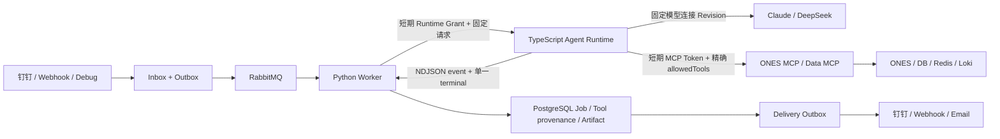

# TypeScript Agent Runtime 切换与运维手册

## 当前基线与门禁

本手册对应以下版本基线与约束：

| 组件 | 版本 / 约束 |
| --- | --- |
| Runtime | `typescript-v1` / `0.1.0` |
| Node.js | `22.x` / Debian 13（`node:22-trixie-slim`） |
| `@anthropic-ai/claude-agent-sdk` | `0.3.226` |
| Claude CLI | `2.1.226`（由 SDK 平台包携带） |
| Runtime protocol | `1.0` / `AgentExecutionRequestV1` |
| MCP Server SDK | Python MCP `2.0.0` |

已实现代码和本地测试不等于环境切换完成。真实 canary、生产维护窗口、观察期、旧 Python Runtime 删除和生产门禁关闭仍需独立验收；不得因为单元测试通过自动切换生产。

## 架构与数据链路



状态所有权保持不变：Python Worker claim Job、签发短期凭据、决定 retry、持久化事件和终态、创建 Delivery；TypeScript Runtime 只执行一次冻结 invocation。RabbitMQ 只传输稳定 ID，PostgreSQL 是事实源。

## Secret、网络和配置边界

| 服务 | Master Key | Provider egress | MCP Token | Runtime Grant |
| --- | --- | --- | --- | --- |
| `api-server` | 只读挂载 | 无 | 无 | 无 |
| `agent-worker` | **不得挂载** | **不得连接** | 签发短期 Token | 私钥签发 |
| `agent-runtime` | 只读挂载 | 允许固定 host | 只接收短期 Token | 公钥验签 |
| ONES/Data MCP | 只读挂载 | 仅各自固定依赖 | 验证短期 Token | 无 |
| 前端 | 不可见 | 无 | 不可见 | 不可见 |

部署配置只允许以下 Runtime 入口：

- `DATABASE_URL`：`agent_runtime_reader` 最小 PostgreSQL 身份；
- `APP_CONFIG_MASTER_KEY_FILE`：仓库外只读 `0400/0600` 文件；
- `RUNTIME_GRANT_PUBLIC_KEY_FILE`：Runtime Grant 公钥；
- `MODEL_PROBE_AUTH_TOKEN_FILE`：Runtime 模型探针服务认证；
- `MODEL_PROVIDER_ALLOWED_HOSTS`：只含 host，不含 scheme、端口或路径；
- `MCP_SERVER_ALLOWED_HOSTS`：只含受控 MCP 服务 host；
- `AGENT_RUNTIME_CLI_VERSION=2.1.226`：禁止 `latest` 和浮动版本。

模型 Key、数据库密码、MCP Authorization 和连接字符串不得进入 Prompt、RabbitMQ、Job payload、事件、ledger、日志、浏览器响应或前端状态。

## 部署前预检

静态构建预检：

```bash
cd agent-runtime
npm ci
npm run check:contracts
npm run preflight:static
npm run lint
npm run typecheck
npm test
npm run build
```

真实部署预检必须在与 Runtime 相同的 service identity、Secret mount 和网络环境内运行：

```bash
cd /opt/agent-runtime
npm run preflight
```

该命令失败关闭并检查：Node/SDK/CLI/协议精确版本、lockfile、Compose 版本、Master Key/探针 Token 文件权限、Runtime Grant 公钥可读性，以及数据库逐列 SELECT 和 terminal ledger 最小写权限。输出只含状态和版本，不输出 DSN、路径内容或 Secret。

同时执行：

```bash
docker compose config --quiet
docker compose run --rm migrator
curl --fail --silent http://agent-runtime:8090/version
curl --fail --silent http://agent-runtime:8090/ready
curl --fail --silent http://api-server:8000/api/ready
```

`/health`、`/ready` 和 `/version` 都不得调用模型或业务 MCP Tool。

## 可丢弃环境 canary

### 前置条件

1. 使用与目标环境相同的 migration、服务角色和镜像 digest；
2. 至少存在两个 Agent、两个 Application，且 MCP Tool/Resource 子集不同；
3. 模型连接使用固定 ready Revision，不能引用 `latest`；
4. 所有入口可暂停，Job、Outbox、Delivery 和 Runtime ledger 可按 correlation ID 查询；
5. 已声明观察窗口、回滚负责人和禁止自动 fallback。

### 显式选择

只选择 canary Application Publication，不修改其它 Publication：

```env
AGENT_RUNTIME_TYPESCRIPT_ENVIRONMENTS=test
AGENT_RUNTIME_TYPESCRIPT_APPLICATION_PUBLICATIONS=<canary-publication-id>
```

重建 `api-server`、`agent-worker` 和 `agent-runtime` 前先停止新入口。单次 attempt 在创建时冻结 Runtime；retry 不得从 TypeScript 自动回落 Python，也不得在同一 Job 中跨 Runtime。

### 验证矩阵

- 正常文本回答；
- ONES 与 DB/Redis/Loki 不同只读 Tool 子集；
- timeout、最大轮次、最大 Tool Call；
- 用户取消、Worker 断线、Runtime 重启和终态后断线重取；
- Runtime/MCP Token 过期，MCP 401/403，模型 401/429/5xx；
- Tool/Resource/主体/模型连接撤销后失败关闭；
- Delivery retry 不重新运行 Agent；
- 数据库、RabbitMQ、日志、trace、API、ledger 与 provenance 敏感值扫描。

验证 `DingTalk Runtime → Inbox → Outbox → RabbitMQ → Python Worker → TypeScript Runtime → MCP → Result → Delivery` 时必须保存业务链证据，不能只保存容器健康。

## 在途 Job、取消与失败恢复

- 暂停入口后等待 `PENDING/RUNNING/RETRY_WAIT` Job 达到终态或明确取消；
- 切换配置不会改写已创建 Job 的 Publication、Runtime 或模型连接 Revision；
- 用户取消由 Worker 调 Runtime cancel，Runtime 通过 `AbortController` 传播；重复取消必须幂等；
- Runtime 已写 terminal、Worker 在持久化前断线时，由相同 invocation ID + digest 重取 terminal；
- 相同 invocation ID 不同 digest 必须冲突，不能重新执行；
- Worker/Runtime 重启后不允许生成第二个 terminal 或第二次 Delivery。

## 回滚

回滚只影响**新 Job**：

1. 暂停入口；
2. 停止选择更多 Application Publication；
3. 等待或取消在途 TypeScript Job；
4. 将 canary Publication 从 `AGENT_RUNTIME_TYPESCRIPT_APPLICATION_PUBLICATIONS` 移除并重建服务；
5. 核对新 Job 使用预期 Runtime，旧 Job 的 provenance 不被改写；
6. 重新开放小流量并观察。

严禁在同一 attempt 遇到错误后自动调用旧 Python Runtime。若 Python Worker 镜像已按本基线移除 Node/Claude CLI，则回滚必须使用仍保留旧 Runtime 的已验证历史镜像，而不是在运行容器中安装依赖。

## 生产窗口

生产切换前必须由用户明确确认维护与观察窗口，并满足：

- 可丢弃环境和测试环境真实 E2E、安全门禁全部通过；
- 版本、镜像 digest、migration head、DB grants 和 Secret 权限留档；
- 入口暂停、在途 Job、取消和 Delivery 策略已演练；
- 告警包含 Runtime 不可达、协议错误、认证拒绝、模型 429/5xx、MCP DENIED、ledger 冲突和 Delivery backlog；
- 回滚镜像和配置已验证，负责人在线。

观察期结束并由用户验收前，不得删除 Python adapter/依赖/测试替身，也不得归档 OpenSpec 变更。

## 排障

| 现象 | 优先证据 |
| --- | --- |
| Runtime `/ready` 503 | DB 最小角色、Master Key 文件权限、schema head |
| `runtime_sdk_version_mismatch` | package、lockfile、镜像缓存和 `preflight:static` |
| `runtime_grant_*` | audience/azp、Job/invocation/digest、expiry/JTI；不记录 Token |
| 模型连接不可用 | 固定 Revision 状态、Secret active version、Provider host allowlist |
| MCP Tool 不可见 | Agent 最大集合 ∩ Application 子集 ∩ 主体/Resource/Server scope |
| MCP `DENIED` | Tool provenance attempts 中的稳定 reason code |
| 重复执行 | invocation ID/digest、terminal ledger、RabbitMQ delivery ID |
| 有结果无回复 | Delivery Outbox、attempt、chunk 和 adapter response |

## 升级

SDK/CLI 升级必须是独立变更：

1. 从官方 npm registry 解析最新非 prerelease SDK；
2. 同时更新 `package.json`、lockfile、`EXPECTED_SDK_VERSION`、协议 schema 常量和 golden fixtures；
3. 读取 SDK 自带平台 CLI 版本并更新 `EXPECTED_CLI_VERSION` 与 Compose；
4. 重新生成跨语言 contract；
5. 跑 Python golden 与 TypeScript contract/security/HTTP 全量测试；
6. 构建非 root、只读 Runtime 镜像并运行 deployment preflight；
7. 重新走 canary 和观察窗口。

禁止只改环境变量、只改 lockfile、使用 prerelease 或浮动 `latest`。
