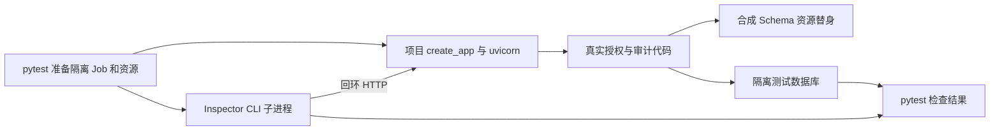

## Context

本变更承接 [proposal.md](proposal.md)，只增加开发与 CI 测试能力。

当前已核对的代码事实：

| 位置 | 已有能力 | 本次使用方式 |
| --- | --- | --- |
| `backend/app/services/tool_mcp.py` | `create_app`、标准 Streamable HTTP、受信 Job Header、工具快照与审计 | 原样启动项目服务 |
| `backend/tests/test_tool_mcp.py` | 调试应用、Job claim、资源发布、HTTP 调用与审计断言 | 抽取确有复用需求的夹具，保留旧用例 |
| `backend/tests/support/runtime.py` | 隔离测试 Container；默认存在 direct-job 权限替身 | 新夹具显式使用 `allow_direct_jobs=False` |
| `backend/tests/test_mcp_meta_fidelity.py` | 真实 SDK/CLI 对模拟服务的合同验证 | 保留；Inspector 不能证明 SDK 元数据传播 |
| `backend/tests/test_suite_tiers.toml`、Makefile、CI | 唯一测试分层、快速与完整测试、独立 Runtime 门禁 | 登记新测试并增加独立 Inspector 门禁 |

规范依据是 `platform-operations` 的测试分层、覆盖保留和验收边界，以及 `builtin-tool-resource` 的固定 Server、实时授权、冻结工具合同和审计要求。本变更只向前者增加要求。

## Goals / Non-Goals

**目标：**

- 编码 Agent 和开发者能用一个显式命令，重复验证实际启动的 `tool-mcp`。
- 通过独立官方客户端和真实 TCP/HTTP 路径验证工具声明、成功调用、拒绝路径及审计关联。
- 新增依赖与夹具仅存在于开发和测试范围，结果能进入现有 pytest/CI 报告。
- 用实际覆盖差异和耗时评价收益，不预设准确率提升比例。

**非目标：**

- 不改生产 MCP 业务实现、Schema、鉴权模式、工具发布或 Job 生命周期。
- 不删除、批量改写旧测试，不替代 SDK/Runtime、事务、并发、恢复和写操作确认测试。
- 不扩展 ONES、钉钉或 File MCP，不访问真实 Provider，不创建通用多服务测试框架。
- 不部署 Inspector Web 常驻服务，不改 Compose，不接入 OTel，不进行生产验收。

## Decisions

### 1. 由 pytest 管理测试，Inspector 只负责 MCP 客户端调用

服务可在 pytest 管理的 uvicorn 线程中运行，Inspector 是独立 Node 子进程。服务绑定 `127.0.0.1` 的预绑定随机端口，使用原 `create_app` 的显式 `allowed_hosts` 参数接受该测试地址；不关闭 DNS rebinding 防护、不修改默认生产 Host 配置。测试必须经过真实 socket，不能用 TestClient 响应冒充 Inspector 的输入。

选择该方式可以复用 Python 夹具和数据库断言。另建 Node 测试框架或 YAML 用例语言会重复现有能力；改写 MCP Server 以适配测试没有必要。

### 2. 第一组场景固定为 tool-mcp 与 get_schema_directory

采用现有 `get_schema_directory` 合同和少量合成表，例如 `orders_001` 与固定列。复用 Published Resource、调试应用发布、角色授权、调试 Job 创建及 claim 流程，生成 RUNNING Job 和真实冻结工具快照。

新夹具必须显式关闭 `container()` 默认 direct-job 权限替身，保留生产 PermissionService、快照校验、资源解析和 McpAuditCoordinator。仅在数据库 Schema 读取等外部资源边界使用 `FakeSchemaInspector`、测试 Secret 和现有测试资源验证替身；不得用“总是允许”替身替换治理链。旧测试即使复用抽出的辅助函数，其原有设置与断言仍保持。

`tools/list` 的期望是当前测试 Job 授权且属于 `tool-mcp` 的集合，不是全局 Manifest 的全部工具。用现有 schema hash 函数核对返回的 `inputSchema`、代码 Manifest 和冻结快照；不要求当前接口没有承诺的 `outputSchema` 字段。业务结果通过既有结果合同和已知合成数据断言。

本期不用 Principal JWT，原因是 `tool-mcp` 的现有合同是受信执行上下文 Header；不得套用 ONES/File MCP 的 Bearer 方式。后续业务 MCP 的短时 Principal 接入应单独设计。

### 3. 固定开发依赖，测试执行阶段不联网安装

在 `tools/mcp-inspector/package.json` 固定 `@modelcontextprotocol/inspector` 为 `2.7.0`，提交相应 `package-lock.json`；本地入口读取 `engines.node` 并按数值版本校验正式版 Node `>=22.19.0`，允许更高 patch、minor 和 major。CI 仍使用 `.node-version` 指定的精确版本 `22.19.0`，其 pin 不作为本地版本相等约束。版本要求依据官方 [2.7.0 package.json](https://github.com/modelcontextprotocol/inspector/blob/2.7.0/package.json)；安装、兼容性与平台验收状态另见本 change 的 `evidence.md`。

安装由显式 `npm ci --prefix tools/mcp-inspector` 完成，pytest 调用本地已安装 CLI，不使用会动态解析 latest 或交互安装的 `npx`。辅助函数检查安装版本与锁定版本；安装失败、版本不符或命令缺失时给出稳定中文诊断。Python 环境沿用项目并安装 `.[dev,tool-mcp]` 等夹具实际需要的依赖。

Inspector 子进程只继承必要运行环境，使用测试生成的临时配置及独立状态目录；按所选版本同时设置存储与 OAuth 状态路径，并关闭自动打开浏览器。测试不加载用户 MCP 配置、OAuth 状态、真实 `.env` 或生产凭据。正常用例不携带 Authorization，非法 Header 用例只使用固定假值。

### 4. 轻量调用辅助函数保留退出码与业务断言

辅助函数使用参数数组启动 CLI，固定 HTTP transport、JSON 输出与有界连接超时；业务参数整体 JSON 序列化，避免字符串 ID 被隐式转换成数字。stdout 与 stderr 分别收集，不通过 shell 管道掩盖退出码。

初始执行边界为服务就绪等待 10 秒、CLI 连接 10 秒、单次子进程总时限 30 秒、清理等待 5 秒；CI job 设置总超时。超时、取消和失败必须在 finally 中回收 CLI、停止 uvicorn、关闭数据库并删除临时状态。禁止用自动重试掩盖失败。

按固定版本的实际输出区分连接失败、客户端拒绝、协议错误、MCP `isError` 和业务断言失败。负向用例必须命中预期错误类别，并在可取得的响应中核对项目稳定错误码；任意非零退出码不能算作“权限拒绝成功”。客户端预先拒绝参数或工具时，只报告客户端拒绝，不冒充服务端验证；至少使用缺少执行 Header 的用例证明服务端调用拒绝，原有低层 HTTP 测试继续覆盖服务端完整拒绝合同。

辅助函数只负责现有一组测试需要的启动、调用和结果解析，不增加插件系统、通用适配器或每工具客户端。

### 5. 场景与证据矩阵

| 场景 | Inspector / 结果断言 | 项目侧核验 |
| --- | --- | --- |
| 连接 | 协议连接成功，Server 身份符合当前服务 | 真实 HTTP 服务已经完成 lifespan |
| 工具列表 | 名称集合精确匹配授权子集，inputSchema hash 匹配 | 对照本 Job 快照和代码 Manifest，禁止只检查“非空” |
| 成功调用 | `get_schema_directory` 成功，内容与合成表列一致 | 资源替身确实被调用；工具与 MCP 审计关联一致 |
| 连续同名调用 | 两次均成功且关联标识不同 | 两次 Tool Call 各自关联其 MCP 审计，不能串联 |
| 非法参数 | 已知错误类别，不能是连接故障 | 外部资源替身零调用；区分客户端与服务端拒绝 |
| 快照外工具 | 不出现在 tools/list，调用不能成功 | 不扩大发布或快照；资源替身零调用，记录拒绝发生位置 |
| 缺执行上下文 | 保留 Job Header，仅移除调用所需身份 Header；服务端返回 `tool_mcp_context_missing` | 已到达调用校验，资源替身零调用 |
| 非法 Authorization | 固定假 Authorization 触发拒绝 | 不进入工具或资源执行；不能把 server unreachable 当拒绝 |

工具成功时核对 `enterprise-agent/mcp-call-id` 和 `enterprise-agent/agent-tool-call-id` 与本 Job 数据库记录一致。非法参数和未授权工具的低层 HTTP 细节仍由现有 TestClient 测试覆盖；Inspector 用例关注同一业务约束在独立客户端上的可见结果。

另外用测试环境中的故意错误期望、不可达地址或缺依赖验证测试入口会失败；这是校验门禁，不修改生产实现制造缺陷。正常运行不能依赖这些故障开关。

### 6. 测试层级与 CI

- 新测试文件为 `backend/tests/test_mcp_inspector_smoke.py`，唯一登记到 `integration`。
- 本地入口计划为 `make test-mcp-inspector`，显式设置 `RUN_MCP_INSPECTOR_SMOKE=1` 并执行该文件。入口只运行预装依赖，不隐式安装。
- 普通 `test-fast` 继续只选择 unit/contract。普通 `test-full` 未显式启用 Inspector 时通过 `-rs` 报告“Inspector 集成测试未启用”的跳过原因；专用入口显式启用后，缺依赖、无用例、全部跳过或任一必需场景未执行必须失败。直接选择单个 pytest 用例只用于诊断，不代表完成专用门禁。
- CI 新增 `mcp-inspector` job，在 PR 和工作流当前覆盖的 push 事件中安装固定 Node、Python extras 与 npm 锁定依赖，再执行同一本地入口。该 job 禁止 continue-on-error，不以可选环境变量默认跳过。
- 将新 job 纳入 `runtime-images` 的依赖和成功条件，保留所有旧门禁。本变更不修改远端分支保护设置；仓库外 required-check 配置如果未检查，证据必须明确注明。

选择独立 job 可以清楚区分 Inspector 依赖故障与快速 Python 测试失败，也避免所有 Python 单元测试都承担 Node 安装成本。

### 7. 保留覆盖与衡量收益

首次实现不删除旧测试。夹具抽取前后对同一受影响测试集记录 collected、passed、skipped、耗时和场景差异；新增 Inspector 套件单独报告版本、场景数与结果。只增加重复测试且没有证明真实 HTTP/独立客户端路径时，不算完成目标。

开发说明提供“修改工具 → 跑受影响旧测试 → 跑 Inspector → 按错误定位 → 修复重跑”的入口；新增工具优先增加参数和断言，不增加适配器。后续若要删除重复用例，需要逐条证明断言与故障覆盖等价，并另行评审。

### 8. 文件落点与范围

| 文件 | 计划内容 |
| --- | --- |
| `tools/mcp-inspector/package.json`、`package-lock.json` | 仅开发使用的固定 Inspector 依赖 |
| `backend/tests/support/tool_mcp.py` | 被旧 HTTP 测试与新测试共用的上下文夹具 |
| `backend/tests/support/mcp_inspector.py` | 本地 CLI 调用、实际 HTTP 服务生命周期与安全结果摘要 |
| `backend/tests/test_mcp_inspector_smoke.py` | 代表性场景及结果断言 |
| `backend/tests/test_mcp_inspector_runner.py` | 入口失败关闭、清理、环境隔离与 CI 接线的合同验证 |
| `backend/tests/test_tool_mcp.py` | 只调整复用夹具，保留场景与断言 |
| `backend/tests/test_suite_tiers.toml`、Makefile、`.github/workflows/ci.yml` | 分层、本地入口和 CI 门禁 |
| `docs/development/mcp-inspector.md` | 命令、范围、排障、新增工具步骤与证据边界 |

现有 Git 忽略规则排除 `node_modules/`，Docker 构建白名单不包含 `tools/` 与 `backend/tests/`；无需改变生产构建规则。实现结果以代码与 `evidence.md` 为准。

## Risks / Trade-offs

- **测试夹具默认放宽权限** → 新 Inspector 夹具显式禁用 direct-job 替身，并通过缺上下文和快照外工具验证边界；不复用“允许一切”的 fixture 结果作为授权证据。
- **客户端提前校验使请求没有到达服务端** → 报告拒绝层次；保留 TestClient 服务端负向测试，使用明确服务端错误码的场景核验实际调用路径。
- **Node/npm 安装或原生依赖在平台间不同** → 固定 Inspector 完整版本及锁文件、固定 CI Node，本地允许满足最低要求的 Node 正式版；分别记录实际版本和本地 macOS / Linux CI 结果，安装问题不能标记为 MCP 业务失败。
- **真实 HTTP 跨线程使用测试数据库** → 复用项目数据库接口，不直接跨线程共享裸连接；先证明夹具隔离和生命周期安全，再进入场景测试。
- **工具 Schema 与原协议版本的兼容性未知** → 实现第一步运行固定版本能力探针；若需更换 Inspector 精确版本，更新锁文件、说明和证据，不通过修改生产 Schema 迁就客户端。
- **误将通过解释成生产可用** → 报告固定注明“项目 MCP 实现 + 回环 HTTP + 合成资源”；当前不证明镜像、生产网络、真实数据库、ONES/钉钉或模型工具选择。
- **新增维护与执行成本** → 一期仅一个服务、一组代表性场景；记录耗时，不建设无当前调用者的扩展框架。

## Migration Plan

1. 固定 Inspector 与 CI Node 版本、校验本地 Node 最低要求，证明 CLI 能在预装环境运行。
2. 抽取需要复用的测试夹具，保留旧测试结果；启用严格权限的新夹具。
3. 启动原项目 HTTP 应用，完成 Inspector 场景与故障判定。
4. 接入本地入口、测试层级和 CI，完成受影响旧测试及新套件验证。
5. 写开发说明和验收证据，明确真实环境未验收项。

无数据库或生产部署迁移。回退时移除新增开发依赖、Inspector 用例及其 Make/CI 接线，已有测试继续运行；回退不能删除旧覆盖或隐藏已发现的生产缺陷。

## Open Questions

没有阻塞计划的产品规格问题。`2.7.0` 的本地安装、CLI 错误输出及严格夹具跨线程调用已经验证，Linux CI 仍需实际运行。若探针暴露生产协议或参数行为差异，记录最小复现和规范差异，生产修复单独定范围；本期不得静默扩大到修改 MCP 业务合同。

官方参考：[Inspector CLI 冒烟指南](https://github.com/modelcontextprotocol/inspector/blob/main/docs/cli-smoke-testing.md)、[服务配置](https://github.com/modelcontextprotocol/inspector/blob/main/docs/mcp-server-configuration.md)。具体参数与退出码以实际锁定版本实测为准。
